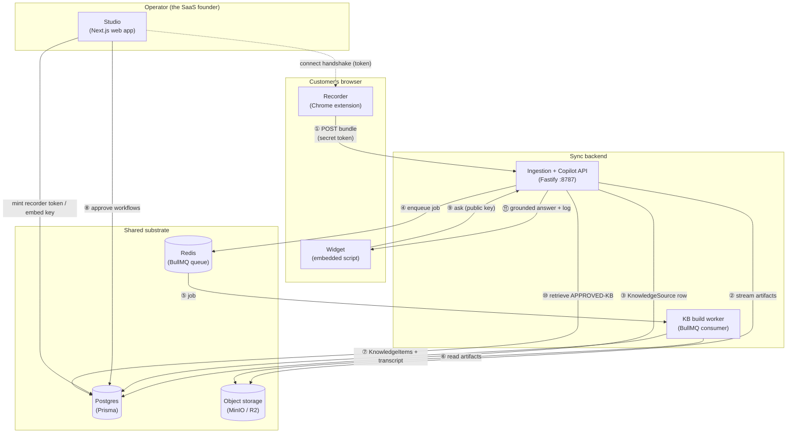

# Sync — Internals (how the black box actually works)

> **What this folder is.** A low-level, engineering-first tour of the running system: what each
> module does, **how it works inside**, what data flows in and out of it, and how the modules are
> wired together. It is the counterpart to the product docs in [`../`](../) — those explain *what
> Sync is and why* (copilot-first, the 3-module model, the roadmap); **these explain *how it runs*.**
>
> No code walkthroughs — these describe **mechanics and data flow** so you can reason about the
> system without reading source. Where a detail maps to a specific file, the file is linked so you
> can drop into the code when you want to.

---

## How to read this

Start with **[connections.md](connections.md)** — it's the spine. It shows the end-to-end path a
recording takes from a click in the browser to an answer in an embedded widget, the three identities
(keys) that gate each hop, and the async/storage boundaries between modules. Once you have the spine,
each module doc below zooms into one piece.

| Doc | The module | One-line role |
|---|---|---|
| **[connections.md](connections.md)** | *(the wiring)* | End-to-end flow · the 3 auth boundaries · the queue & storage seams · the cross-module contracts. **Read first.** |
| [recorder-capture.md](recorder-capture.md) | **Recorder** (Chrome extension) | Turn a narrated screen session into a raw capture bundle (events + DOM fingerprints + screenshots + audio) and upload it. |
| [ingestion-api.md](ingestion-api.md) | **Ingestion API** (Fastify) | Authenticate the upload, stream artifacts to object storage, validate the manifest, persist the source record, enqueue the build job. |
| [knowledge-base.md](knowledge-base.md) | **Knowledge Base build** (worker + synthesis) | Turn the raw bundle into clean, per-workflow steps: transcribe → align → clean → segment → distill → persist. |
| [copilot.md](copilot.md) | **Copilot** (answer engine) | Retrieve **approved** KB, ground an answer, cite-or-decline, log the Q&A. The trust gate lives here. |
| [widget.md](widget.md) | **Widget** (embeddable `<script>`) | The shadow-DOM chat panel a customer drops into their app; talks to the copilot endpoint with a public key. |
| [studio.md](studio.md) | **Studio** (Next.js web app) | The operator console: connect the recorder, browse recordings/KB, **approve workflows**, configure the embed, read analytics. |
| [data-model-and-storage.md](data-model-and-storage.md) | **Data substrate** | The Postgres schema, the object-storage layout, and the Redis queue every module reads/writes. |

Every module doc follows the same template:

1. **Purpose** — what it's for, in one paragraph.
2. **Where it lives** — package + key files.
3. **Inputs / Outputs** — what comes in, what goes out (and in what shape).
4. **Internal mechanics** — the step-by-step of how it actually works. *(The meat.)*
5. **Data it reads / writes** — DB tables, storage keys, queue messages.
6. **Failure modes & edge cases** — what can go wrong and how it's handled.
7. **Connections** — how it hands off to its neighbors (links into the other docs).

---

## The system in one diagram

The numbers ①–⑪ are the happy path, traced step by step in [connections.md](connections.md).

---

## Quick orientation (if you only read one box)

- **One direction, then a fan-out.** Data flows **capture → ingestion → KB** in a strict line, then
  the KB **fans out** to the copilot (and, in Phase 2, to the help portal rendering approved workflows). Nothing flows
  backward — the copilot never writes to the KB.
- **The async seam is the queue.** The API accepts an upload and returns immediately; the expensive
  AI work (transcription, segmentation, distillation) happens later in the **worker**, decoupled by a
  Redis/BullMQ job. A recording's lifecycle is tracked by `KnowledgeSource.status`
  (`uploaded → processing → ready | error`).
- **The trust gate is one row.** The copilot can only answer from workflows the operator explicitly
  **approved** — represented by a `CopilotApproval` row keyed by `(sourceId, segmentIndex)`. Retrieval
  filters through it; that's the single "no-leak" enforcement point.
- **Three keys, three audiences.** A secret **recorder token** (operator's machine → ingestion), a
  public **embed key** (customer's browser → copilot), and the **Studio login** (operator → console)
  are distinct and never interchangeable. See [connections.md](connections.md) §"Three identities".
- **One logger across the Node services (cross-cutting, since 2026-07-08).** `api` (incl. the worker),
  `synthesis`, and `web` server-side all log through **`@sync/logger`** (Pino — `createLogger('<service>')`,
  env-driven level, JSON in prod / pretty in dev, secret redaction); Fastify is wired to it via
  `loggerInstance`. Browser surfaces (widget/extension/web-client) use tiny local console loggers.
  It's infrastructure, not a module, so it has no doc of its own — canonical reference:
  [`../dev-setup.md`](../dev-setup.md) §7.

---

*Last synced to the code: 2026-07-08 (branch `dev`). Since the initial 2026-06-28 sync these docs
have tracked: retrieval consolidated into `synthesis/retrieval.ts` + **hybrid keyword∪pgvector (P1-M3)**,
the **Approach-B real-widget preview** (one answer path), **live-served widget appearance**
(`GET /v1/copilot/config`), the recorder **v0.3.0** stop→upload resilience + R12/R13, the **Phase-2
sweep** (the `Article`/`Step` tables are gone), and **`@sync/logger`**. If a mechanic here disagrees
with the source, the source wins — please update the doc.*
