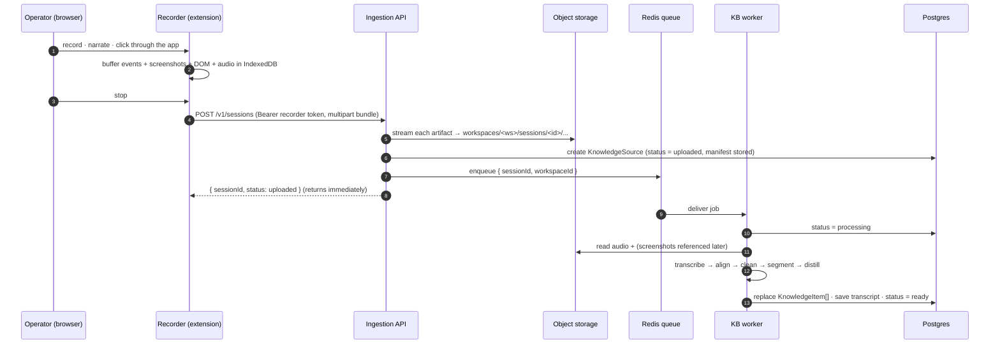
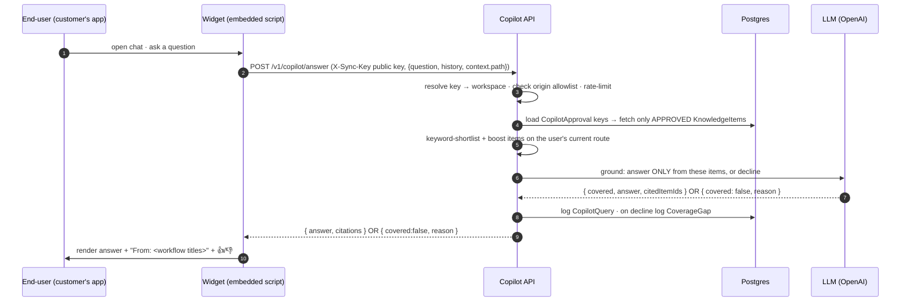
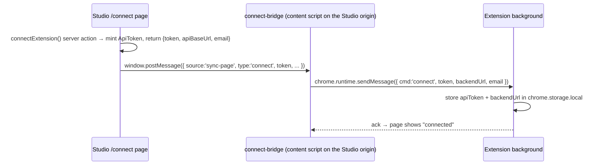
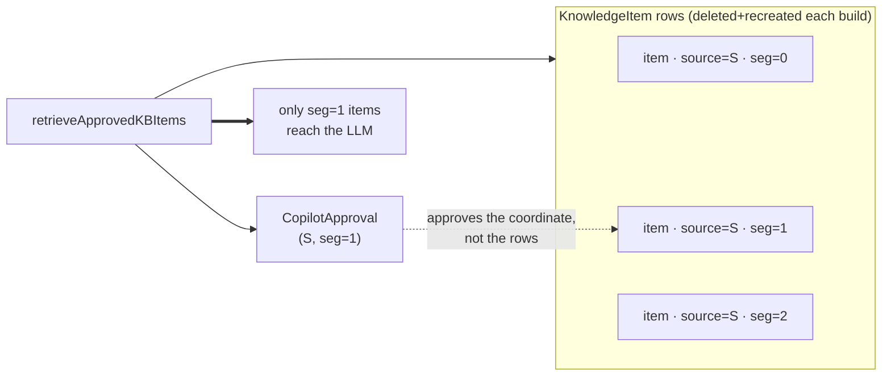

# Connections — how the modules wire together

> **Read this first.** Each module doc explains one piece in depth; this one explains the **seams**
> between them — the exact data that crosses each boundary, the identity that gates it, and whether
> the hop is synchronous or deferred. If you understand this page, every other doc is a zoom-in.

---

## 1. The cast

Seven runtime pieces and one shared substrate:

| # | Piece | Process / surface | Doc |
|---|---|---|---|
| 1 | **Recorder** | Chrome extension in the operator's browser | [recorder-capture.md](recorder-capture.md) |
| 2 | **Ingestion API** | Fastify HTTP service (`:8787`) | [ingestion-api.md](ingestion-api.md) |
| 3 | **KB build worker** | BullMQ consumer (same `api` package, separate entrypoint) | [knowledge-base.md](knowledge-base.md) |
| 4 | **Copilot endpoints** | Routes on the same Fastify service | [copilot.md](copilot.md) |
| 5 | **Widget** | `<script>` embedded in the customer's app | [widget.md](widget.md) |
| 6 | **Studio** | Next.js web app, the operator console | [studio.md](studio.md) |
| 7 | **Synthesis engine** | A library (`@sync/synthesis`), not a process — called by the worker (KB) and the API (copilot) | covered inside (3) and (4) |
| — | **Substrate** | Postgres + object storage + Redis | [data-model-and-storage.md](data-model-and-storage.md) |

A subtle but important point: **#2, #3, and #4 are all the `api` package.** The HTTP service
([`server.ts`](../../packages/api/src/server.ts)) and the worker
([`worker.ts`](../../packages/api/src/worker.ts)) are two entrypoints of the same codebase; the
copilot routes live *in* the HTTP service. They're separate **modules** conceptually (and separate
processes at runtime — `pnpm --filter @sync/api dev` vs `... worker`), but they share the data layer
and the `@sync/synthesis` library.

---

## 2. The end-to-end happy path

This traces the numbered hops from the master diagram in the [README](README.md). Two timelines:
the **build path** (a recording becomes knowledge) and the **answer path** (a question becomes an
answer). They meet at the **approval gate**.

### Build path — capture to knowledge

The key property: **the API response does not wait for AI processing.** The operator gets
`sessionId` back in well under a second; the worker grinds asynchronously. Studio polls
`KnowledgeSource.status` (or just re-renders) to show when a recording flips from *processing* to
*ready*.

### Trust gate — the operator approves

Between the two paths sits a human decision. In Studio, the operator reviews the distilled workflows
for a recording and flips an **"approve for copilot"** toggle per workflow. That writes (or deletes)
a single `CopilotApproval` row. **Until a workflow is approved, the copilot cannot see it.**

### Answer path — question to grounded answer

---

## 3. The three identities (auth boundaries)

Every hop above is gated by exactly one of **three distinct credentials**. Confusing them is the
most common way to misread the system, so here they are side by side:

| Identity | Who holds it | Crosses which boundary | Shape & storage | Enforced by |
|---|---|---|---|---|
| **Recorder token** (secret) | The operator's machine (extension) | Recorder → Ingestion API | `sync_<48 hex>`; **only the SHA-256 hash is stored** (`ApiToken.hashedToken`); plaintext shown once | [`auth.ts`](../../packages/api/src/auth.ts) — Bearer header → hash → workspace |
| **Embed key** (public) | The customer's web page (widget) | Widget → Copilot API | `pk_<48 hex>`; stored **in plaintext** (`Workspace.copilotPublicKey`, unique) — it's meant to be visible in client HTML | [`copilot-auth.ts`](../../packages/api/src/copilot-auth.ts) — key → workspace + origin allowlist + rate limit |
| **Studio session** | The operator (logged-in human) | Browser → Studio (Next.js) | NextAuth session cookie; credentials provider (email + password hash) | [`auth.ts`](../../packages/web/auth.ts) + `getCurrentWorkspace` |

Why two API keys instead of one? Because they protect different things from different threats:

- The **recorder token is secret** because it can *write* to the KB (upload recordings). It never
  leaves the operator's machine. It's hashed at rest so a DB leak can't replay it.
- The **embed key is public by design** because it ships inside the customer's page HTML, where
  anyone can read it. It can only *read approved answers*, never write, and it's fenced with an
  **origin allowlist** (only configured domains may call) and a **rate limit** (30 requests / 60 s
  per key, in-memory) so a leaked key can't be abused at scale.

The **Studio session** is a third thing entirely: it authorizes the operator to *configure* the
workspace — mint recorder tokens, mint the embed key, and flip approvals. It never touches the API
service; its server actions hit Postgres directly (and, for recordings management, Redis + object
storage).

### The connect handshake (how the recorder gets its token)

The operator never copy-pastes a token. Instead:

The bridge ([`connect-bridge.ts`](../../packages/extension/src/connect-bridge.ts)) only runs on the
Studio origin and only relays same-origin messages, so a random site can't inject a token. Details in
[studio.md](studio.md) §"Connecting the recorder" and [recorder-capture.md](recorder-capture.md)
§"Getting connected".

---

## 4. The seams (what crosses each boundary)

### Seam A — Recorder → Ingestion API (HTTP, synchronous)

- **Transport:** `POST /v1/sessions`, `multipart/form-data`, up to 300 MB.
- **Payload:** one `manifest` JSON field (the [capture contract](#6-the-cross-module-contracts)) plus
  N binary files (screenshots, DOM snapshots, audio). **Each file's relative path rides on the
  multipart *field name*** — because multipart strips directory components from filenames, the path
  (`shots/<id>.png`) is preserved as the field name and reconstructed server-side.
- **Gate:** recorder token (Bearer).
- **Result:** `{ sessionId, status: "uploaded" }` — and a queued job. Nothing is processed yet.

### Seam B — Ingestion API → Object storage (S3 API, synchronous)

- **Transport:** S3 `PutObject` to MinIO (dev) or Cloudflare R2 (prod) — same code, different
  endpoint ([`storage.ts`](../../packages/api/src/storage.ts)).
- **Key layout:** `workspaces/<workspaceId>/sessions/<sessionId>/<relative-path>`. The relative path
  is sanitized (`..` stripped) before it becomes a key.
- This is where the *bulk* lives. Postgres only stores the manifest JSON + metadata, never the
  binaries.

### Seam C — Ingestion API → Worker (Redis/BullMQ, asynchronous) ⭐ the decoupling point

- **Transport:** a BullMQ job on the `synthesis` queue (`SYNTHESIS_QUEUE` constant in
  [`@sync/shared/jobs`](../../packages/shared/src/jobs.ts)).
- **Message:** `{ sessionId, workspaceId }` — *just pointers.* The worker re-reads the manifest from
  Postgres and the artifacts from object storage. The job carries no payload of its own.
- **Why it matters:** this is the only async boundary in the system. It's what lets the upload return
  instantly while transcription/segmentation/distillation (seconds to minutes, several LLM calls)
  happen out of band. The worker runs at `concurrency: 2`.

### Seam D — Worker → Postgres (Prisma, the handoff to everything downstream)

The worker's output *is* the KB. It writes three things for a source:

1. `KnowledgeSource.transcript` — the persisted, PII-scrubbed transcript.
2. `KnowledgeItem[]` — the distilled steps, **grouped by workflow** via `segmentIndex` /
   `segmentTitle`. It **deletes and recreates** these on every (re)process (idempotent rebuild).
3. `KnowledgeSource.status = ready` (or `error` with a message).

Everything downstream — Studio's KB browser, the approval gate, the copilot — reads these rows.

### Seam E — Studio → Postgres (server actions, the approval gate)

Studio writes the **trust gate**: `setCopilotApproval` upserts/deletes a `CopilotApproval` row keyed
by `(sourceId, segmentIndex)`. It also mints `ApiToken`s and the `Workspace.copilotPublicKey`. All
via Next.js server actions hitting Prisma directly — Studio never calls the API service.

### Seam F — Widget → Copilot API (HTTP, synchronous)

- **Transport:** `POST /v1/copilot/answer` and `/v1/copilot/feedback`, JSON.
- **Payload:** `{ question, history, context: { path, title } }` with the **embed key** in the
  `X-Sync-Key` header.
- **Gate:** embed key + origin allowlist + rate limit.
- **Result:** a grounded answer with citations, or an honest decline.

### Seam G — Copilot API → Postgres (the read-only side of the gate)

Retrieval reads `CopilotApproval` to compute the set of allowed `(sourceId, segmentIndex)` keys, then
fetches **only** matching `KnowledgeItem`s. It also *writes* analytics: every question logs a
`CopilotQuery`; every decline logs a `CoverageGap`. It never touches the KB items themselves.

---

## 5. The approval gate as a contract

The single most important wiring detail in the whole system: **why approval is keyed by
`(sourceId, segmentIndex)` and not by `KnowledgeItem.id`.**

The worker **deletes and recreates** all `KnowledgeItem` rows for a source every time it (re)processes
a recording. If approval were a flag on the item rows, reprocessing would silently wipe it. So
approval is stored *separately*, keyed by the **stable coordinates of a workflow** — which source it
came from (`sourceId`) and which workflow within that source (`segmentIndex`, a contiguous 0..n index
assigned at distill time). Those coordinates survive a rebuild; the item rows under them are
disposable.

This is enforced at exactly **one seam**: retrieval
([`copilot.ts → retrieveApprovedKBItems`](../../packages/api/src/copilot.ts)) filters items through
the approved-key set, mirroring Studio's
[`copilot-approvals.ts → listApprovedItems`](../../packages/web/lib/copilot-approvals.ts). If you
ever add a second path that reads the KB for the copilot, it **must** go through the same filter or
the no-leak guarantee breaks.

---

## 6. The cross-module contracts

Three data shapes travel between modules. They're the actual "API" of the system's internals:

| Contract | Defined in | Producer → Consumer | What it carries |
|---|---|---|---|
| **`SessionManifest`** (the capture contract) | [`@sync/shared/capture.ts`](../../packages/shared/src/capture.ts) + zod in [`schemas.ts`](../../packages/shared/src/schemas.ts) | Recorder → Ingestion → Worker | The whole raw recording: `app` meta, `events[]` (each with DOM-fingerprint `target`, `route`, `screenshot`/`dom` file refs, `postAction` settle), `markers[]`, `audio` ref. File refs are **relative paths**, resolved to object-storage keys server-side. |
| **`DistilledStep`** (the KB step) | [`@sync/synthesis/distill.ts`](../../packages/synthesis/src/distill.ts) | Worker → `KnowledgeItem.data` → Studio & Copilot | `{ instruction, detail?, route, narration, screenshotFile, bbox }` — a clean, user-facing step with one curated screenshot. **Raw events are not persisted here.** |
| **`CopilotKBItem`** | [`@sync/synthesis/copilot.ts`](../../packages/synthesis/src/copilot.ts) | Retrieval → answer engine | `{ id, sourceId, segmentIndex, segmentTitle, text, narration }` — the slimmed item shape the LLM grounds on and that becomes a citation. |

The capture contract is specced in prose in [`../phase-1-copilot.md`](../phase-1-copilot.md) §6; the
distillation contract in [`../kb-step-distillation.md`](../kb-step-distillation.md).

---

## 7. Tenancy — the thread through everything

Every row in every app table carries a `workspaceId`, and **every read is scoped to it.** A
workspace is one customer (Phase 1 is single-user = single-workspace —
[`workspace.ts`](../../packages/web/lib/workspace.ts) auto-creates one workspace per signup). The
three identities all resolve *to* a workspace:

- recorder token → `ApiToken.workspaceId`
- embed key → `Workspace.id` (via `copilotPublicKey`)
- Studio session → `Workspace` via `ownerId`

So tenancy isn't a separate subsystem — it's the `workspaceId` that rides every credential and keys
every query. Object-storage keys are workspace-prefixed too. Cross-tenant access would require a
forged credential resolving to the wrong workspace, which none of the three resolvers permit.

---

## 8. What does *not* connect (deliberate boundaries)

- **The copilot never writes to the KB.** It only reads approved items and writes analytics
  (`CopilotQuery`, `CoverageGap`). Knowledge flows one way.
- **Studio never calls the API service.** It reads/writes **Postgres** directly via server actions —
  and, for recordings management, **enqueues re-process jobs to Redis** (`lib/queue.ts`) and **deletes
  artifacts from object storage** (`deleteSessionPrefix`) directly too. All of it **bypasses** the API
  service, which is for the recorder and the widget only.
- **The worker never talks to the widget or Studio.** It's a pure queue consumer; its only output is
  Postgres rows. Surfaces discover its work by reading `status`.
- **Phase-2 article authoring is parked.** The synthesis engine still contains `buildKB` (raw 1:1
  items), `segmentItems`, and `generateArticleForSegment`, and the schema still has `Article`/`Step`,
  but **no live path writes them** — the worker runs only the distilled `buildWorkflowKB`. Don't wire
  these up unless resuming Phase 2 ([`../phase-2-portal.md`](../phase-2-portal.md) §6).

---

## Where to go next

- The raw input: [recorder-capture.md](recorder-capture.md)
- The boundary that accepts it: [ingestion-api.md](ingestion-api.md)
- The pipeline that makes knowledge: [knowledge-base.md](knowledge-base.md)
- The gate + the answer: [studio.md](studio.md) (approval) → [copilot.md](copilot.md) (answer) →
  [widget.md](widget.md) (surface)
- The tables and keys behind all of it: [data-model-and-storage.md](data-model-and-storage.md)
