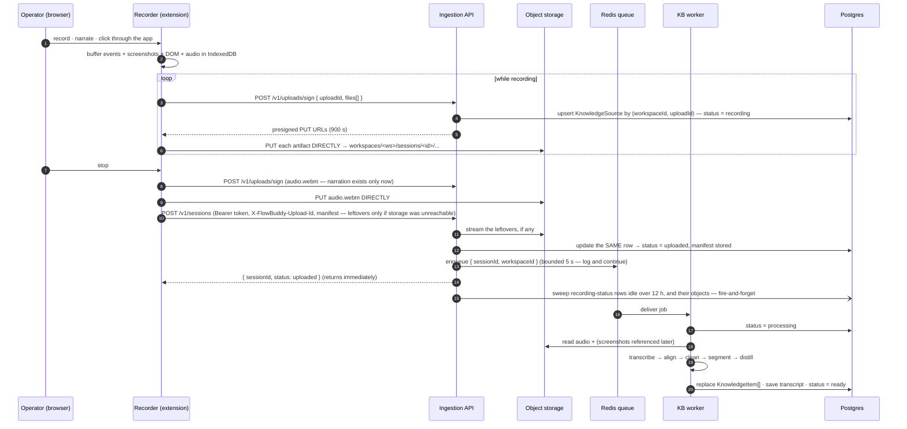
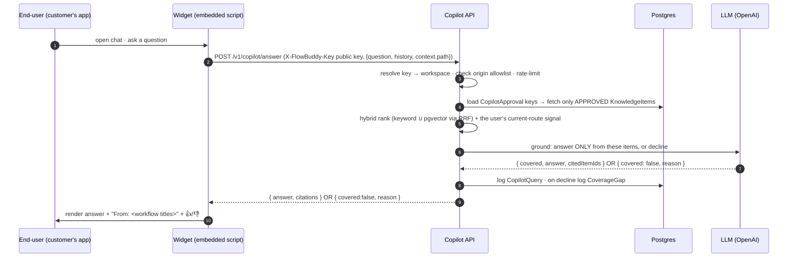
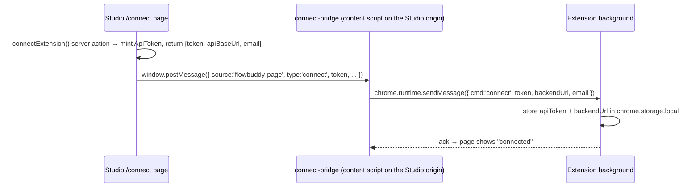
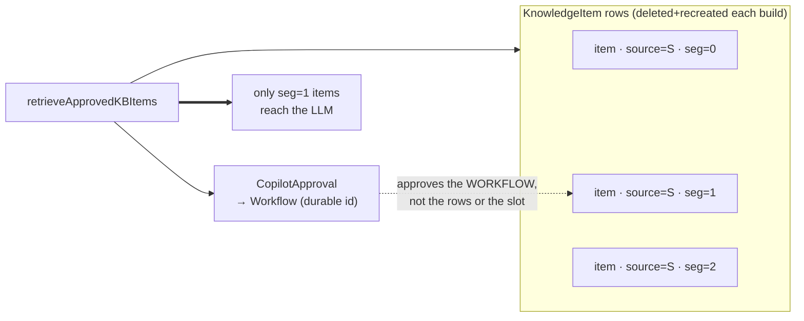

# Connections — how the modules wire together

> **Read this first.** Each module doc explains one piece in depth; this one explains the **seams**
> between them — the exact data that crosses each boundary, the identity that gates it, and whether
> the hop is synchronous or deferred. If you understand this page, every other doc is a zoom-in.

---

## 1. The cast

Seven runtime pieces and one shared substrate:

| # | Piece | Process / surface | Doc |
|---|---|---|---|
| 1 | **Recorder** | Chrome extension in the operator's browser | [recorder-capture.md](recorder-capture.md) |
| 2 | **Ingestion API** | Fastify HTTP service (`:8787`) | [ingestion-api.md](ingestion-api.md) |
| 3 | **KB build worker** | BullMQ consumer (same `api` package, separate entrypoint) | [knowledge-base.md](knowledge-base.md) |
| 4 | **Copilot endpoints** | Routes on the same Fastify service | [copilot.md](copilot.md) |
| 5 | **Widget** | `<script>` embedded in the customer's app | [widget.md](widget.md) |
| 6 | **Studio** | Next.js web app, the operator console | [studio.md](studio.md) |
| 7 | **Synthesis engine** | A library (`@flowbuddy/synthesis`), not a process — called by the worker (KB) and the API (copilot) | covered inside (3) and (4) |
| — | **Substrate** | Postgres + object storage + Redis | [data.md](data.md) |

A subtle but important point: **#2, #3, and #4 are all the `api` package.** The HTTP service
([`server.ts`](../../packages/api/src/server.ts)) and the worker
([`worker.ts`](../../packages/api/src/worker.ts)) are two entrypoints of the same codebase; the
copilot routes live *in* the HTTP service. They're separate **modules** conceptually (and separate
processes at runtime — `pnpm --filter @flowbuddy/api dev` vs `... worker`), but they share the data layer
and the `@flowbuddy/synthesis` library.

---

## 2. The end-to-end happy path

This traces the numbered hops from the master diagram in the [README](README.md). Three timelines:
the **build path** (a recording becomes knowledge), the **answer path** (a question becomes an
answer), and the **acting path** (an outcome becomes a completed run). They meet at the **approval
gate** — which the third one passes through twice.

### Build path — capture to knowledge

```mermaid
sequenceDiagram
    autonumber
    participant U as Operator (browser)
    participant R as Recorder (extension)
    participant A as Ingestion API
    participant O as Object storage
    participant Q as Redis queue
    participant W as KB worker
    participant P as Postgres

    U->>R: record · narrate · click through the app
    R->>R: buffer events + screenshots + DOM + audio in IndexedDB
    loop while recording
        R->>A: POST /v1/uploads/sign { uploadId, files[] }
        A->>P: upsert KnowledgeSource by (workspaceId, uploadId) — status = recording
        A-->>R: presigned PUT URLs (900 s)
        R->>O: PUT each artifact DIRECTLY → workspaces/<ws>/sessions/<id>/...
    end
    U->>R: stop
    R->>A: POST /v1/uploads/sign (audio.webm — narration exists only now)
    R->>O: PUT audio.webm DIRECTLY
    R->>A: POST /v1/sessions (Bearer token, X-FlowBuddy-Upload-Id, manifest — leftovers only if storage was unreachable)
    A->>O: stream the leftovers, if any
    A->>P: update the SAME row → status = uploaded, manifest stored
    A->>Q: enqueue { sessionId, workspaceId }   (bounded 5 s — log and continue)
    A-->>R: { sessionId, status: uploaded }   (returns immediately)
    A-)P: sweep recording-status rows idle over 12 h, and their objects — fire-and-forget
    Q->>W: deliver job
    W->>P: status = processing
    W->>O: read audio + (screenshots referenced later)
    W->>W: transcribe → align → clean → segment → distill
    W->>P: replace KnowledgeItem[] · save transcript · status = ready
```

The key property: **the API response does not wait for AI processing.** The operator gets
`sessionId` back in well under a second; the worker grinds asynchronously. Studio polls
`KnowledgeSource.status` (or just re-renders) to show when a recording flips from *processing* to
*ready*.

### Trust gate — the operator approves

Between the two paths sits a human decision. In Studio, the operator reviews the distilled workflows
for a recording and flips an **"approve for copilot"** toggle per workflow. That writes (or deletes)
a single `CopilotApproval` row. **Until a workflow is approved, the copilot cannot see it.**

**A second, narrower decision sits beside it.** Approving lets the copilot ANSWER from a workflow; a
separate per-workflow switch lets the agent RUN it — and that one compiles an `ExecutionPlan` on the
spot and refuses when the recording cannot be driven (unrecoverable locators, cross-origin frames,
foreign-origin navigations, unsupported verbs, navigation into a specific record). Eligibility is
decided while the founder is looking at it, never discovered mid-run.

### Answer path — question to grounded answer

```mermaid
sequenceDiagram
    autonumber
    participant E as End-user (customer's app)
    participant W as Widget (embedded script)
    participant A as Copilot API
    participant P as Postgres
    participant L as LLM (OpenAI)

    E->>W: open chat · ask a question
    W->>A: POST /v1/copilot/answer  (X-FlowBuddy-Key public key, {question, history, context.path})
    A->>A: resolve key → workspace · check origin allowlist · rate-limit
    A->>P: load CopilotApproval keys → fetch only APPROVED KnowledgeItems
    A->>A: hybrid rank (keyword ∪ pgvector via RRF) + the user's current-route signal
    A->>L: ground: answer ONLY from these items, or decline
    L-->>A: { covered, answer, citedItemIds }  OR  { covered: false, reason }
    A->>P: log CopilotQuery · on decline log CoverageGap
    A-->>W: { answer, citations }  OR  { covered:false, reason }
    W->>E: render answer + "From: <workflow titles>" + 👍/👎
```

### Acting path — outcome to completed run

```mermaid
sequenceDiagram
    autonumber
    participant E as End-user (customer's app)
    participant H as The host page
    participant W as Widget (embedded script)
    participant A as Copilot API
    participant P as Postgres

    E->>W: ask for an OUTCOME ("create a project for me")
    W->>A: POST /v1/copilot/answer  (an ordinary question)
    A-->>W: answer — plus, only where the mode may act, a typed run OFFER
    W->>E: consent sheet — what runs, where it starts, the founder's own description, the values it will use, what it will ask for, what confirms first
    E->>W: "Run it"  ⟵ THIS is the consent moment
    W->>A: POST /v1/copilot/run { start, workflow key, the plan hash consented to }
    A->>A: re-verify mode · liveness · the acting flag · the plan hash (409 if it moved)
    A->>P: ExecutionRun — the consent moment + the pinned hash
    A-->>W: { runId }
    W->>A: GET /v1/copilot/execution-plan?workflow=…  (mode-gated; 404 unless live + acting-enabled)
    A-->>W: the compiled plan (the widget re-checks the hash; anything else, no run)
    loop each compiled step
        W->>H: resolve → act → verify   (no model call per step)
        W->>E: narrate into the chat · ask for a missing value there · pause on a sensitive field or a commit
        W->>A: POST /v1/copilot/run { step, outcome, the input's SOURCE — never its value }
    end
    W->>A: POST /v1/copilot/run { completed · aborted · safe_stop }
    A->>P: append the terminal outcome
```

One property makes this a **seam** rather than a feature: **the server holds no run state between
boundary calls.** The widget carries the position, `start` is where the gate is re-verified from
rows, and everything after it is an audit append — which is why a full-page navigation the run itself
caused can resume from the widget's own session store rather than by reconnecting to anything. What
that costs and where a mid-run retirement actually stops the run: [copilot.md](copilot.md) §3.

---

## 3. The three identities (auth boundaries)

Every hop above is gated by exactly one of **three distinct credentials**. Confusing them is the
most common way to misread the system, so here they are side by side:

| Identity | Who holds it | Crosses which boundary | Shape & storage | Enforced by |
|---|---|---|---|---|
| **Recorder token** (secret) | The operator's machine (extension) | Recorder → Ingestion API | `sync_<48 hex>`; **only the SHA-256 hash is stored** (`ApiToken.hashedToken`); plaintext shown once | [`auth.ts`](../../packages/api/src/auth.ts) — Bearer header → hash → workspace |
| **Embed key** (public) | The customer's web page (widget) | Widget → Copilot API | `pk_<48 hex>`; stored **in plaintext** (`Workspace.copilotPublicKey`, unique) — it's meant to be visible in client HTML | [`copilot-auth.ts`](../../packages/api/src/copilot-auth.ts) — key → workspace + origin allowlist + rate limit |
| **Studio session** | The operator (logged-in human) | Browser → Studio (Next.js) | NextAuth session cookie; credentials provider (email + password hash) | [`auth.ts`](../../packages/web/auth.ts) + `getCurrentWorkspace` |

Why two API keys instead of one? Because they protect different things from different threats:

- The **recorder token is secret** because it can *write* to the KB (upload recordings). It never
  leaves the operator's machine. It's hashed at rest so a DB leak can't replay it.
- The **embed key is public by design** because it ships inside the customer's page HTML, where
  anyone can read it. It can only *read approved answers*, never write, and it's fenced with an
  **origin allowlist** (only configured domains may call) and a **rate limit** (30 requests / 60 s
  per key, in-memory) so a leaked key can't be abused at scale.

The **Studio session** is a third thing entirely: it authorizes the operator to *configure* the
workspace — mint recorder tokens, mint the embed key, and flip approvals. It never touches the API
service; its server actions hit Postgres directly (and, for recordings management, Redis + object
storage).

### The connect handshake (how the recorder gets its token)

The operator never copy-pastes a token. Instead:

```mermaid
sequenceDiagram
    participant S as Studio /connect page
    participant B as connect-bridge (content script on the Studio origin)
    participant X as Extension background

    S->>S: connectExtension() server action → mint ApiToken, return {token, apiBaseUrl, email}
    S->>B: window.postMessage({ source:'flowbuddy-page', type:'connect', token, ... })
    B->>X: chrome.runtime.sendMessage({ cmd:'connect', token, backendUrl, email })
    X->>X: store apiToken + backendUrl in chrome.storage.local
    X-->>B: ack → page shows "connected"
```

The bridge ([`connect-bridge.ts`](../../packages/extension/src/connect-bridge.ts)) only runs on the
Studio origin and only relays same-origin messages, so a random site can't inject a token. Details in
[studio.md](studio.md) §"Connecting the recorder" and [recorder-capture.md](recorder-capture.md)
§"Getting connected".

---

## 4. The seams (what crosses each boundary)

Each entry below is **what crosses the boundary and what gates it**. The mechanism behind each one —
route shapes, validation rules, deployment guards — belongs to the module doc that owns that side,
and the link is the point: a seam entry that grows a mechanism is a second copy waiting to go stale.

### Seam A — Recorder → Ingestion API (HTTP, synchronous)

- **What crosses:** in three hops. (1) `POST /v1/uploads/sign` during recording — a list of relative
  artifact paths in, presigned PUT URLs out (the bytes then go over Seam B, never through here).
  (2) `POST /v1/sessions` at Stop — the `manifest` (the [capture contract](#6-the-cross-module-contracts))
  plus **only the artifacts storage never confirmed**, which on a healthy connection is nothing at
  all. (3) `DELETE /v1/uploads/:uploadId` when a capture is abandoned rather than stopped.
- **Gate:** the recorder token (Bearer) **plus a required `X-FlowBuddy-Upload-Id` header** — the
  recorder's own id for the recording, stable across retries, which is what makes a retry land on the
  same row instead of creating a second recording.
- **Result:** `{ sessionId, status: "uploaded" }` and a queued job. Nothing is processed yet.
- **Mechanism:** [ingestion-api.md](ingestion-api.md) §4.2 (the multipart contract, the artifact
  allowlist, the already-finalized case) and §4.6 (discard, and the sweep that catches what the
  recorder never got to discard).

### Seam B — Recorder / Ingestion API → Object storage (S3 API, synchronous)

- **What crosses:** the bulk — screenshots, DOM snapshots and the audio. Two writers, and the
  distinction is the whole point of the seam: the **recorder PUTs directly** to a presigned
  single-object URL, so the API authorizes the key but never handles the bytes; the **API writes only
  the leftovers** at finalize.
- **Gate:** the presigned URL itself. A signed URL is a write capability, so **the relative path is
  validated against the artifact allowlist before it becomes a key** — in both routes, checked rather
  than merely cleaned.
- **Key layout:** `workspaces/<workspaceId>/sessions/<sessionId>/<relative-path>` — the storage-level
  expression of tenancy (§7).
- **Mechanism:** [ingestion-api.md](ingestion-api.md) §4.4 (including the separate presigning client,
  a bug class that passes locally and fails only on R2) and [data.md](data.md) §4 for the layout.

### Seam C — Ingestion API → Worker (Redis/BullMQ, asynchronous) ⭐ the decoupling point

- **What crosses:** a BullMQ job on the `synthesis` queue whose message is `{ sessionId, workspaceId }`
  — **just pointers.** The worker re-reads the manifest from Postgres and the artifacts from object
  storage; the job carries no payload of its own.
- **Why it matters:** this is **the only async boundary in the system**. It is what lets the upload
  return instantly while transcription, segmentation and distillation — seconds to minutes, several
  LLM calls — happen out of band.
- **The producer is deliberately fragile-tolerant:** the enqueue is bounded, and it logs and
  continues. By that point the recording is already in Postgres and object storage, so a sick Redis
  must not turn a delivered recording into a failed upload; the recovery path is Studio's
  "Stalled → Re-process".
- **Mechanism:** [data.md](data.md) §5 (the two Redis connections and why they cannot be unified) and
  [`deploy.md`](../ops/deploy.md) (worker concurrency and the heap cap — **two guards that only work
  together**, since the worker and the public copilot share one instance).

### Seam D — Worker → Postgres (Prisma, the handoff to everything downstream)

- **What crosses:** the KB itself — `KnowledgeSource.transcript`, the `KnowledgeItem[]` distilled
  steps grouped by workflow, and `status = ready` (or `error`). The items are **deleted and
  recreated** on every (re)process, which is an idempotent rebuild and the reason approval cannot
  live on them (§5).
- Everything downstream — Studio's KB browser, the approval gate, the copilot — reads these rows.
- **Mechanism:** [knowledge-base.md](knowledge-base.md) §6.

### Seam E — Studio → Postgres (server actions, the approval gate)

- **What crosses:** the **trust gate**. `setCopilotApproval` upserts or deletes a `CopilotApproval`
  row naming a durable **workflow identity**; Studio also mints `ApiToken`s and the workspace's
  public embed key.
- **Two invariants hold at this boundary and nowhere else can enforce them:** enabling acting writes
  the flag **and** a compiled `ExecutionPlan` in **one transaction**, so *"enabled ⇒ a plan exists"*
  holds by construction; and selecting AI Agent mode is refused unless an `AgentAcceptance` row for
  the CURRENT terms version exists, the accept and the mode flip being one transaction too.
- All of it via Next.js server actions hitting Prisma directly — Studio never calls the API service
  (§8).
- **Mechanism:** [studio.md](studio.md).

### Seam F — Widget → Copilot API (HTTP, synchronous)

- **What crosses:** the question and its context up, a grounded answer with citations — or an honest
  decline — down. The same key and gate carry the widget's other calls: mount-time appearance and
  behavior flags, the route-sharded sense plan, walkthrough analytics, the compiled execution plan,
  and the run lifecycle whose `start` **is** the consent moment.
- **Gate:** embed key + origin allowlist + rate limit. Both acting routes are additionally
  mode-gated and answer **absence rather than refusal**.
- **Mechanism:** [copilot.md](copilot.md) §3 (every route's exact in/out) and [widget.md](widget.md).

### Seam G — Copilot API → Postgres (the read-only side of the gate)

- **What crosses:** approvals in, approved items out — retrieval resolves the set of live **workflow
  identities** and fetches only matching rows. **It never touches the KB items themselves** (§8).
- Analytics go the other way: every question logs a `CopilotQuery`, every decline a `CoverageGap`,
  and a consented run an `ExecutionRun` — the consent moment, the pinned plan hash, per-step outcomes
  and each input's SOURCE, **never its value**.
- **Mechanism:** [copilot.md](copilot.md) §4 and [data.md](data.md) §12.

---

## 5. The approval gate as a contract

The single most important wiring detail in the whole system: **why approval names a durable WORKFLOW
and not a position or an item id.**

The worker **deletes and recreates** all `KnowledgeItem` rows for a source every time it (re)processes
a recording. If approval were a flag on the item rows, reprocessing would silently wipe it. So
approval is stored *separately*, on a row that names the **workflow itself** — an identity that
outlives both the item rows and the slot the workflow currently occupies. **Position was the FIRST
answer to that, and it was itself the bug:** a coordinate behaves like an identity only while
re-segmentation is deterministic, and once it wasn't, a re-split walked an approval onto content
nobody had reviewed. A reprocess now re-matches identity **by content**, failing closed in both
directions — mechanism in [knowledge-base.md](knowledge-base.md) §6.

This is enforced **on the server, on every read** — never by the model, never by the client. The
RANKING path still has one implementation with one caller:
[`synthesis/retrieval.ts → retrieveApprovedKBItems`](../../packages/synthesis/src/retrieval.ts)
filters items through the approved-key set, called by the public answer route (the old Studio
mirror `listApprovedItems` was retired 2026-07-06, and two days later the Studio preview became the
**real widget** — `copilot-preview-actions.ts` deleted — so the tester reaches retrieval through the
same public `/answer` route end-users hit).

**It is no longer the only reader, and that is the thing to get right when adding one.** Copilot mode
gave the agent two more ways into approved knowledge, and the acting layer three more; all of them
are constrained *at the injection site* rather than by asking the model nicely: `searchKb` is
`retrieveApprovedKBItems` again with the model's own query, and `loadWorkflow` re-checks the requested
key against `CopilotApproval` before returning a single step — an unapproved or unknown key reads back
as *"no such workflow"*, never as *"exists but you may not see it"*. The three acting readers are
three more injection sites constrained the same way, with one extra condition each; and every
missing rung answers with that same absence, never an explanation of what the founder has not
enabled. So the rule is not "one function" but **every path
that reads the KB for the copilot resolves approval server-side, and a caller that cannot prove
approval returns absence.** Break that and the no-leak guarantee breaks with it. The readers
themselves, and the live-only rule every new one must choose on purpose:
[knowledge-base.md](knowledge-base.md) §6.

```mermaid
flowchart LR
    subgraph KB["KnowledgeItem rows (deleted+recreated each build)"]
        I1["item · source=S · seg=0"]
        I2["item · source=S · seg=1"]
        I3["item · source=S · seg=2"]
    end
    AP["CopilotApproval<br/>→ Workflow (durable id)"] -. "approves the WORKFLOW,<br/>not the rows or the slot" .-> I2
    RET["retrieveApprovedKBItems"] --> AP
    RET --> KB
    RET ==> OUT["only seg=1 items<br/>reach the LLM"]
```

---

## 6. The cross-module contracts

Four data shapes travel between modules. They're the actual "API" of the system's internals:

| Contract | Defined in | Producer → Consumer | What it carries |
|---|---|---|---|
| **`SessionManifest`** (the capture contract) | [`@flowbuddy/shared/capture.ts`](../../packages/shared/src/capture.ts) + zod in [`schemas.ts`](../../packages/shared/src/schemas.ts) | Recorder → Ingestion → Worker | The whole raw recording: `app` meta, `events[]` (each with DOM-fingerprint `target`, `route`, `screenshot`/`dom` file refs, `postAction` settle), `markers[]`, `audio` ref. File refs are **relative paths**, resolved to object-storage keys server-side. |
| **`DistilledStep`** (the KB step) | [`@flowbuddy/synthesis/distill.ts`](../../packages/synthesis/src/distill.ts) | Worker → `KnowledgeItem.data` → Studio & Copilot | `{ instruction, detail?, route, narration, screenshotFile, bbox, keyEventId? }` (`keyEventId` since 2026-07-08) — a clean, user-facing step with one curated screenshot. **Raw events are not persisted here.** |
| **`CopilotKBItem`** | [`@flowbuddy/synthesis/copilot.ts`](../../packages/synthesis/src/copilot.ts) | Retrieval → answer engine | `{ id, sourceId, segmentIndex, segmentTitle, text, narration }` — the slimmed item shape the LLM grounds on and that becomes a citation. |
| **`ExecutionStep`** (the acting contract) | the synthesis compiler | Compiler → stored plan → API → widget executor | verb, instruction, route, ranked locators, optional input slot, destructive and user-only flags, optional appearance markers — plus a content hash that PINS consent. The model never authors it: it picks a whole run, and the executor runs the founder's steps. |

The ranked-locator recovery rule the sense plan and the execution plan both need lives once, in
[`shared/event-locators.ts`](../../packages/shared/src/event-locators.ts) — extracted at its second
consumer, because a drift between what the probe can find and what the executor can act on would
surface as "it can see the step but not do it".

The capture contract is specced in prose in [`copilot.md`](../build/copilot.md) §6; the
distillation contract in [`kb-step-distillation.md`](../build/kb-step-distillation.md).

---

## 7. Tenancy — the thread through everything

Every row in every app table carries a `workspaceId`, and **every read is scoped to it.** A
workspace is one customer (Phase 1 is single-user = single-workspace —
[`workspace.ts`](../../packages/web/lib/workspace.ts) auto-creates one workspace per signup). The
three identities all resolve *to* a workspace:

- recorder token → `ApiToken.workspaceId`
- embed key → `Workspace.id` (via `copilotPublicKey`)
- Studio session → `Workspace` via `ownerId`

So tenancy isn't a separate subsystem — it's the `workspaceId` that rides every credential and keys
every query. Object-storage keys are workspace-prefixed too. Cross-tenant access would require a
forged credential resolving to the wrong workspace, which none of the three resolvers permit.

---

## 8. What does *not* connect (deliberate boundaries)

- **The copilot never writes to the KB.** It only reads approved items and writes analytics
  (`CopilotQuery`, `CoverageGap`). Knowledge flows one way.
- **Studio never calls the API service.** It reads/writes **Postgres** directly via server actions —
  and, for recordings management, **enqueues re-process jobs to Redis** (`lib/queue.ts`) and **reads
  and deletes artifacts in object storage** directly too: deletes (`deleteSessionPrefix`) on a
  recording delete, and reads the recorded before/after DOM snapshots when compiling an execution
  plan. All of it **bypasses** the API service, which is for the recorder and the widget only.
- **The worker never talks to the widget or Studio.** It's a pure queue consumer; its only output is
  Postgres rows. Surfaces discover its work by reading `status`.
- **There is exactly one KB path** — the worker's distilled `buildWorkflowKB`. There is no separate
  article engine and no `Article` table, by design: the Version-2 portal *renders* approved distilled
  workflows rather than synthesizing a second artifact ([`portal.md`](../build/portal.md)).
- **The model never chooses a selector.** The acting agent picks among grounded primitives; the
  founder's compiled plan decides every action. Page content cannot alter an action set the model
  never authored.

---

## Where to go next

- The raw input: [recorder-capture.md](recorder-capture.md)
- The boundary that accepts it: [ingestion-api.md](ingestion-api.md)
- The pipeline that makes knowledge: [knowledge-base.md](knowledge-base.md)
- The gate + the answer: [studio.md](studio.md) (approval) → [copilot.md](copilot.md) (answer) →
  [widget.md](widget.md) (surface)
- The tables and keys behind all of it: [data.md](data.md)
