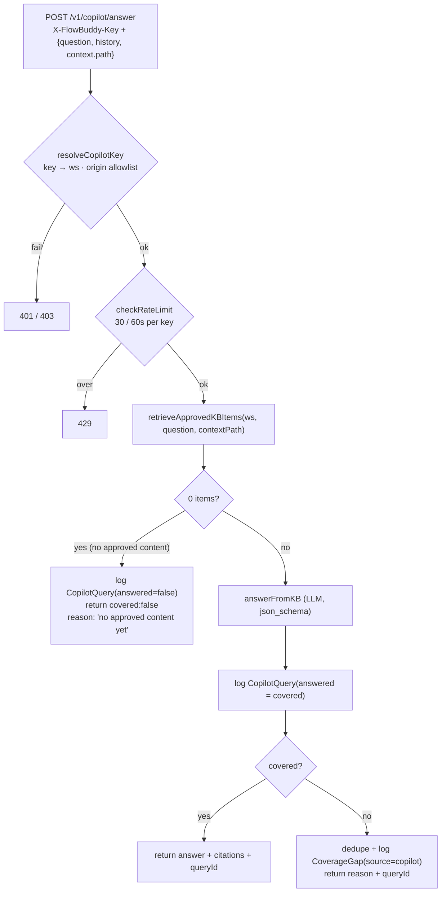

# Copilot (answer engine) — internals

> **Module:** the copilot routes on the Fastify service
> ([`server.ts`](../../packages/api/src/server.ts)) plus
> [`synthesis/retrieval.ts`](../../packages/synthesis/src/retrieval.ts) (retrieval — the single no-leak seam),
> [`copilot-auth.ts`](../../packages/api/src/copilot-auth.ts) (embed auth), and
> [`synthesis/copilot.ts`](../../packages/synthesis/src/copilot.ts) (the grounded answer).
> **Role:** the primary product — answer an end-user's question **only** from **approved** KB, with
> citations and honest declines.

---

## 1. Purpose

A customer's end-user asks a question in the embedded [widget](widget.md). The copilot must answer
**only** from knowledge the operator captured *and approved*, cite which workflow it used, and
**decline honestly** when the approved KB doesn't cover the question — turning that decline into a
"record this next" signal. Two hard guarantees: **no-leak** (never answer from un-approved/raw content
or general model knowledge) and **honest coverage** (a decline is a feature, not a failure).

---

## 2. Where it lives

| File | Layer |
|---|---|
| [`copilot-auth.ts`](../../packages/api/src/copilot-auth.ts) | **Who** — resolve the public embed key → workspace, origin allowlist, rate limit. |
| [`synthesis/retrieval.ts`](../../packages/synthesis/src/retrieval.ts) | **What** — retrieve approved KB items + **hybrid keyword∪vector ranking (RRF)** with the route signal; sanitize history. **The single enforcement seam** — only the API routes call it, and since the Studio preview became the real widget (2026-07-06) every surface reaches it through the same public `/answer` route (Prisma client injected, so `@flowbuddy/synthesis` stays DB-free). |
| [`synthesis/embeddings.ts`](../../packages/synthesis/src/embeddings.ts) | **P1-M3** — the shared embedding half: `embedTexts` (batched `text-embedding-3-small`) + `toVectorLiteral`, used by the worker (KB-build writes) and retrieval (query-time). Model/dims change here + the `vector(1536)` column together. |
| [`synthesis/copilot.ts`](../../packages/synthesis/src/copilot.ts) | **Answer** — the grounded LLM call: cite-or-decline (`temperature 0.2`, `max_completion_tokens 700` — a truncated response degrades to a decline). |
| [`server.ts`](../../packages/api/src/server.ts) | The `/v1/copilot/answer` + `/feedback` + `/seen` + `/config` + `/sense-plan` (P2-M0) + `/walkthrough` (P4-M0) routes: one shared `copilotGate` (auth + per-route rate buckets), input caps, wiring + analytics logging. |

---

## 3. Inputs / Outputs

- **`POST /v1/copilot/answer`**
  - **In:** `X-FlowBuddy-Key: <public embed key>`, body `{ question, history?, context?: { path }, preview? }`.
  - **Out (covered):** `{ covered: true, answer, citations[], queryId }`.
  - **Out (decline):** `{ covered: false, answer: null, citations: [], reason, queryId }`.
  - **`preview: true`** (the Studio real-widget tester) — same engine, but the call skips
    `recordWidgetSeen` and every analytics write (no `CopilotQuery`, no citations, no `CoverageGap`)
    and the response carries **no `queryId`** (so the widget shows no thumbs). Self-declared and safe:
    the flag can only suppress your own workspace's stats.
- **`POST /v1/copilot/feedback`** — `{ queryId, feedback: 'up' | 'down' }` → records the thumb.
- **`GET /v1/copilot/config`** (2026-07-07) — the widget's mount-time appearance fetch: returns the
  workspace's saved accent/title/greeting/position/launcher (nulls = widget defaults) **plus the
  behavior flags** (`sense`/`showMe`/`walkthrough`/`reason`/`reasonImage`/`reasonValues`),
  `no-store` so a Studio save shows on the next page load. Same gate (key + origin allowlist, own
  rate bucket); read-only — writes nothing.
- **`GET /v1/copilot/sense-plan?route=…`** (P2-M0, 2026-07-08) — the ROUTE-SHARDED compiled sense
  plan (approved workflows → steps × ranked locators + routes), gated by `Workspace.senseEnabled`;
  the widget caches per route. Mechanics: [`phase-2-sense.md`](../phase-2-sense.md) §8.
- **`POST /v1/copilot/walkthrough`** (P4-M0, 2026-07-15) — guided-walkthrough run analytics:
  `started` (key re-verified against `CopilotApproval` — no-leak; returns `runId`) then
  `step_advanced`/`completed`/`aborted`/`stalled` update the one `CopilotWalkthrough` row per run
  (workspace-scoped `updateMany`, own rate bucket). Mechanics: [`phase-4-autopilot.md`](../phase-4-autopilot.md) §8.

---

## 4. Internal mechanics

### 4.1 Authentication & rate limiting ([`copilot-auth.ts`](../../packages/api/src/copilot-auth.ts))

`resolveCopilotKey(key, origin)`:

- Looks up `Workspace.copilotPublicKey` (the `pk_…` key, stored in plaintext — it's *meant* to be in
  client HTML) → `workspaceId`.
- **Origin allowlist:** if `copilotAllowedOrigins` is non-empty **and** the browser sent an `Origin`,
  the origin must be in the list (else `403`). An **empty list = allow any** (dev default).
  Server-to-server callers send no `Origin` and aren't blocked here (a page can't spoof "no origin").
- **Rate limit:** `checkRateLimit(bucket)` — an in-memory **fixed window of 30 requests / 60 s**.
  MVP-grade; production would back it with Redis. Over-limit → `429`. **All three copilot routes**
  go through one shared `copilotGate` (server.ts) — `/answer` keeps the bare key as its bucket,
  `/feedback` and `/seen` get per-route buckets (`feedback:key`, `seen:key`) so a chatty host page
  pinging `/seen` can't starve real questions.

These two functions are the **public-facing security boundary**; they're distinct from the secret
recorder-token auth used by ingestion. See [connections.md](connections.md) §3.

### 4.2 Retrieval — the no-leak enforcement seam ([`synthesis/retrieval.ts`](../../packages/synthesis/src/retrieval.ts))

`retrieveApprovedKBItems(db, workspaceId, question, { contextPath })` is **the single point that keeps
the copilot grounded only in approved-KB** — one implementation, one caller (the public answer route;
since 2026-07-06 the Studio tester is the real widget and arrives through that same route), with the
Prisma client injected so `@flowbuddy/synthesis` stays DB-free:

1. **Load the approval set.** Fetch `CopilotApproval` rows for the workspace → a `Set` of
   `"sourceId:segmentIndex"` keys. **If empty, return `[]` immediately** (an un-provisioned copilot).
2. **Fetch candidate items.** All `KnowledgeItem`s for the workspace with a non-null `segmentIndex`,
   ordered by `(sourceId, segmentIndex, orderIndex)`.
3. **Filter to approved.** Keep only items whose `(sourceId, segmentIndex)` is in the approved set.
   *This is the gate* — and since the 2026-07-06 consolidation it exists **once**: the Studio
   preview's former mirror (`listApprovedItems` in `copilot-approvals.ts`) was retired, and the
   preview itself now embeds the real widget, so every surface reaches this function through the
   public answer route. Any new copilot read path must go through it or no-leak breaks.
4. **Vector candidates (P1-M3, 2026-07-07 — best-effort).** The question embed
   (`text-embedding-3-small`, via `embeddings.ts`) **starts before the DB reads** and overlaps
   them, with a **2s timeout + 1 retry** (the SDK default is 600s — a hanging embeddings API must
   never stall an answer). The scan pulls the **top-50 by cosine distance** (`embedding <=> $q`
   through the injected `$queryRaw` — the one raw-SQL touchpoint, since Prisma can't read
   `Unsupported("vector")`) **constrained to the approved `(sourceId, segmentIndex)` keys** — so
   unapproved rows can neither leak nor starve the candidate budget (review hardening 2026-07-07;
   the fused list is additionally re-checked against the approved set as defense-in-depth).
   **Any failure — no `$queryRaw`, no embedding opts, no embedded rows, a failed/slow embed call —
   silently drops to the pure keyword shortlist** (one `console.warn`), so the copilot never errors
   on the vector path.
5. **Keyword scoring.** Tokenize the question (lowercase, drop stop-words and ≤2-char tokens), score
   each item by **term-overlap count** against its `text`.
6. **Fusion (RRF, k=60).** Reciprocal-rank fusion over three signals: the keyword ranking (**matching
   items only** — a zero-overlap item isn't "ranked", it missed; letting arbitrary KB order into the
   list would cancel the vector signal on paraphrases), the vector ranking, and the **route signal
   (P1-M8)** as a **double-weighted** third list (`2/(k+1)` — outranks any single rank-1 signal,
   ties a keyword+vector double-#1, mirroring the fallback's dominant +3). Route matching is exact
   or segment-boundary prefix, never raw substring — a root `contextPath` of `/` carries no screen
   signal and never matches (pre-hardening it matched everything).
   *(In the keyword-only fallback path, the route signal stays the classic +3 score boost.)*
7. **Top-K.** Sort by fused score and return up to **24** items as `CopilotKBItem`s
   (`id, sourceId, segmentIndex, segmentTitle, text, narration`). It **always returns up to the
   limit, even on zero matches** (unmatched items fill the tail in KB order), so the *LLM* judges
   coverage rather than a hard retrieval miss pre-declining.

> Retrieval is **hybrid keyword + vector** as of 2026-07-07 (P1-M3). Embeddings are written by the
> **worker at KB build** (delete+recreate ⇒ re-process re-embeds automatically; an embed failure
> never fails the build — items stay keyword-only and the failure **surfaces as a degraded-build
> notice on the recording**, the §3.3 mechanism). There is **no backfill**: pre-upgrade rows have
> `embedding NULL` and ride the keyword half until re-processed (deliberate — dev data was reset).
> Model/dims live in `synthesis/embeddings.ts` (`DEFAULT_EMBED_MODEL`; `embedTexts` **validates
> every vector against `EMBEDDING_DIMS`** and fails with an actionable message on a wrong-width
> model, instead of a swallowed Postgres dimension error). ⚠️ `EMBED_MODEL` must resolve to the
> SAME model on api and web — a same-width model drift can't be detected from dimensions and would
> compare vectors across incompatible embedding spaces.

`sanitizeHistory` also lives here: it accepts only well-formed `user`/`assistant` turns from the
untrusted request body, keeps the **last 10**, and clips each to **4000 chars**.

### 4.3 Grounding — answer or decline ([`synthesis/copilot.ts`](../../packages/synthesis/src/copilot.ts))

`answerFromKB` makes one LLM call with a **strict JSON schema**
(`{ covered, reason, answer, citedItemIds }`) and a system prompt that is the product's no-leak
contract in words:

- *Use ONLY the knowledge items; never use general knowledge; never invent UI/steps/features.*
- If covered → concise, friendly, step-by-step answer, `covered: true`, and list the **ids actually
  used** in `citedItemIds`.
- If not covered → `covered: false` + a one-sentence reason; **don't guess or partially answer**.
- **Privacy:** the items carry typed placeholders (`[redacted-email]`, …); treat them as opaque, never
  reproduce them, refer to such values generically ("your email"). This affects *phrasing only*, not
  whether something is "covered".

The prompt assembles each item as `- id=<id> [workflow: <title>]: <text>\n narration: "…"`, prepends
sanitized history, and (if present) a context line naming the user's current page. After the call it
**maps `citedItemIds` back** to real items → `CopilotCitation[]` (`itemId, sourceId, segmentIndex,
segmentTitle`), deduped. A response that isn't `covered` or has no `answer` becomes a clean decline.

> **Why let the LLM decide coverage** instead of a similarity threshold? Because grounded helpfulness
> is a judgment ("do these steps actually answer this question?") that keyword scores can't make. The
> retrieval layer's job is to put the *right candidates* in front of the model; the model's job is to
> honestly use or refuse them.

### 4.4 The route handler — wiring + analytics ([`server.ts`](../../packages/api/src/server.ts))

`/v1/copilot/answer` orchestrates: gate (auth + rate-limit) → input caps → retrieve → (zero-items
shortcut) → `answerFromKB` → **log + respond**. Input caps (cost ceiling — the key is public):
**question ≤ 2000 chars** (`400` above it; the widget input additionally caps at 400 via
`maxlength`), `context.path` clipped to 512.

- **Zero approved items** → log `CopilotQuery(answered: false)` and return a distinct reason ("this
  copilot has no approved help content yet") — *not* a coverage gap (nothing was asked-but-missing;
  the copilot just isn't provisioned).
- **Every answered/declined question** logs a `CopilotQuery(answered = covered)` and returns its
  `queryId` (the handle the widget uses for thumbs feedback).
- **A decline** additionally logs a `CoverageGap(source: 'copilot')` — **deduped**: at most one *open*
  gap per distinct question per workspace. This is the "record this next" feed Studio surfaces.

`/v1/copilot/feedback` re-auths, validates `feedback ∈ {up,down}`, and updates the `CopilotQuery`
**scoped to the workspace** (`updateMany({ id, workspaceId })`) so one tenant can't write another's
rows.

---

## 5. Data it reads / writes

| Store | Reads | Writes |
|---|---|---|
| **Postgres** | `Workspace` (key/allowlist), `CopilotApproval` (the gate), `KnowledgeItem` (candidates) | `CopilotQuery` (every Q), `CoverageGap` (on decline), `CopilotQuery.feedback` (thumbs) |
| **OpenAI** | the chat model (`answerFromKB`) | — |
| **In-memory** | the rate-limit buckets | per-key request counts (ephemeral) |

It **never writes the KB** — knowledge flows one way (see [connections.md](connections.md) §8).

---

## 6. Failure modes & edge cases

- **No approved workflows** → friendly "no approved help content yet" (covered:false), logged but **not**
  a coverage gap.
- **`OPENAI_API_KEY` unset** → `500` before any LLM call.
- **LLM returns unparseable JSON** (including output truncated at `max_completion_tokens`) → treated
  as a clean decline ("couldn't find an answer").
- **Oversized question** (> 2000 chars) → `400` before retrieval or any LLM spend.
- **Leaked embed key** → bounded by the origin allowlist + the 30/60s rate limit; it can only read
  *approved* answers, never write or read raw KB.
- **Context path that matches nothing** → no boost; retrieval still returns by keyword score.
- **Empty/whitespace question** → `400`.

---

## 7. Connections

- **Called by →** the [Widget](widget.md) (Seam F) over `/v1/copilot/answer` + `/feedback` (+ `/config` at mount, `/sense-plan` on panel open, `/walkthrough` run events).
- **Gated by →** the approval rows written in [Studio](studio.md) and built by the
  [Knowledge Base](knowledge-base.md) (the `(sourceId, segmentIndex)` contract, [connections.md](connections.md) §5).
- **Feeds back to →** [Studio](studio.md) analytics + "record this next" via `CopilotQuery` /
  `CoverageGap`.
- **Shares its process with →** the [Ingestion API](ingestion-api.md) (same Fastify app).
- **Row shapes →** [data-model-and-storage.md](data-model-and-storage.md).
