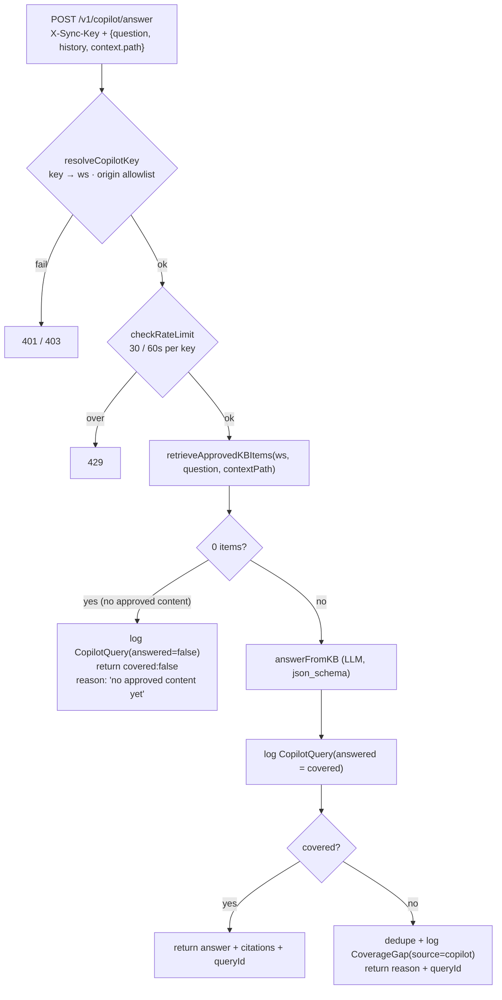

# Copilot (answer engine) — internals

> **Module:** the copilot routes on the Fastify service
> ([`server.ts`](../../packages/api/src/server.ts)) plus
> [`copilot.ts`](../../packages/api/src/copilot.ts) (retrieval),
> [`copilot-auth.ts`](../../packages/api/src/copilot-auth.ts) (embed auth), and
> [`synthesis/copilot.ts`](../../packages/synthesis/src/copilot.ts) (the grounded answer).
> **Role:** the primary product — answer an end-user's question **only** from **approved** KB, with
> citations and honest declines.

---

## 1. Purpose

A customer's end-user asks a question in the embedded [widget](widget.md). The copilot must answer
**only** from knowledge the operator captured *and approved*, cite which workflow it used, and
**decline honestly** when the approved KB doesn't cover the question — turning that decline into a
"record this next" signal. Two hard guarantees: **no-leak** (never answer from un-approved/raw content
or general model knowledge) and **honest coverage** (a decline is a feature, not a failure).

---

## 2. Where it lives

| File | Layer |
|---|---|
| [`copilot-auth.ts`](../../packages/api/src/copilot-auth.ts) | **Who** — resolve the public embed key → workspace, origin allowlist, rate limit. |
| [`copilot.ts`](../../packages/api/src/copilot.ts) | **What** — retrieve approved KB items + keyword/route shortlist; sanitize history. |
| [`synthesis/copilot.ts`](../../packages/synthesis/src/copilot.ts) | **Answer** — the grounded LLM call: cite-or-decline. |
| [`server.ts`](../../packages/api/src/server.ts) | The `/v1/copilot/answer` + `/v1/copilot/feedback` routes that wire the three together and log analytics. |

---

## 3. Inputs / Outputs

- **`POST /v1/copilot/answer`**
  - **In:** `X-Sync-Key: <public embed key>`, body `{ question, history?, context?: { path } }`.
  - **Out (covered):** `{ covered: true, answer, citations[], queryId }`.
  - **Out (decline):** `{ covered: false, answer: null, citations: [], reason, queryId }`.
- **`POST /v1/copilot/feedback`** — `{ queryId, feedback: 'up' | 'down' }` → records the thumb.

---

## 4. Internal mechanics

### 4.1 Authentication & rate limiting ([`copilot-auth.ts`](../../packages/api/src/copilot-auth.ts))

`resolveCopilotKey(key, origin)`:

- Looks up `Workspace.copilotPublicKey` (the `pk_…` key, stored in plaintext — it's *meant* to be in
  client HTML) → `workspaceId`.
- **Origin allowlist:** if `copilotAllowedOrigins` is non-empty **and** the browser sent an `Origin`,
  the origin must be in the list (else `403`). An **empty list = allow any** (dev default).
  Server-to-server callers send no `Origin` and aren't blocked here (a page can't spoof "no origin").
- **Rate limit:** `checkRateLimit(key)` — an in-memory **fixed window of 30 requests / 60 s per key**.
  MVP-grade; production would back it with Redis. Over-limit → `429`.

These two functions are the **public-facing security boundary**; they're distinct from the secret
recorder-token auth used by ingestion. See [connections.md](connections.md) §3.

### 4.2 Retrieval — the no-leak enforcement seam ([`copilot.ts`](../../packages/api/src/copilot.ts))

`retrieveApprovedKBItems(workspaceId, question, { contextPath })` is **the single point that keeps the
copilot grounded only in approved-KB**:

1. **Load the approval set.** Fetch `CopilotApproval` rows for the workspace → a `Set` of
   `"sourceId:segmentIndex"` keys. **If empty, return `[]` immediately** (an un-provisioned copilot).
2. **Fetch candidate items.** All `KnowledgeItem`s for the workspace with a non-null `segmentIndex`,
   ordered by `(sourceId, segmentIndex, orderIndex)`.
3. **Filter to approved.** Keep only items whose `(sourceId, segmentIndex)` is in the approved set.
   *This is the gate.* It **mirrors** Studio's
   [`listApprovedItems`](../../packages/web/lib/copilot-approvals.ts) — the same predicate enforced in
   two places. Any new copilot read path must use this filter or no-leak breaks.
4. **Keyword shortlist.** Tokenize the question (lowercase, drop stop-words and ≤2-char tokens), score
   each item by **term-overlap count** against its `text`.
5. **Context boost (P1-M8).** If a `contextPath` was sent (the host page the user is on) and an item's
   `route` matches it (equal or substring either way), add **+3** to its score — "answer for this
   screen".
6. **Top-K.** Sort by score (ties keep KB order) and return up to **24** items as `CopilotKBItem`s
   (`id, sourceId, segmentIndex, segmentTitle, text, narration`). It **always returns up to the
   limit, even on zero keyword matches**, so the *LLM* judges coverage rather than a hard keyword
   miss pre-declining.

> Retrieval is **keyword-first** today. Swapping in **pgvector embeddings** is the planned P1-M3
> upgrade and slots in at exactly this step — the rest of the module is unaffected.

`sanitizeHistory` also lives here: it accepts only well-formed `user`/`assistant` turns from the
untrusted request body, keeps the **last 10**, and clips each to **4000 chars**.

### 4.3 Grounding — answer or decline ([`synthesis/copilot.ts`](../../packages/synthesis/src/copilot.ts))

`answerFromKB` makes one LLM call with a **strict JSON schema**
(`{ covered, reason, answer, citedItemIds }`) and a system prompt that is the product's no-leak
contract in words:

- *Use ONLY the knowledge items; never use general knowledge; never invent UI/steps/features.*
- If covered → concise, friendly, step-by-step answer, `covered: true`, and list the **ids actually
  used** in `citedItemIds`.
- If not covered → `covered: false` + a one-sentence reason; **don't guess or partially answer**.
- **Privacy:** the items carry typed placeholders (`[redacted-email]`, …); treat them as opaque, never
  reproduce them, refer to such values generically ("your email"). This affects *phrasing only*, not
  whether something is "covered".

The prompt assembles each item as `- id=<id> [workflow: <title>]: <text>\n narration: "…"`, prepends
sanitized history, and (if present) a context line naming the user's current page. After the call it
**maps `citedItemIds` back** to real items → `CopilotCitation[]` (`itemId, sourceId, segmentIndex,
segmentTitle`), deduped. A response that isn't `covered` or has no `answer` becomes a clean decline.

> **Why let the LLM decide coverage** instead of a similarity threshold? Because grounded helpfulness
> is a judgment ("do these steps actually answer this question?") that keyword scores can't make. The
> retrieval layer's job is to put the *right candidates* in front of the model; the model's job is to
> honestly use or refuse them.

### 4.4 The route handler — wiring + analytics ([`server.ts`](../../packages/api/src/server.ts))

`/v1/copilot/answer` orchestrates: auth → rate-limit → retrieve → (zero-items shortcut) → `answerFromKB`
→ **log + respond**:

- **Zero approved items** → log `CopilotQuery(answered: false)` and return a distinct reason ("this
  copilot has no approved help content yet") — *not* a coverage gap (nothing was asked-but-missing;
  the copilot just isn't provisioned).
- **Every answered/declined question** logs a `CopilotQuery(answered = covered)` and returns its
  `queryId` (the handle the widget uses for thumbs feedback).
- **A decline** additionally logs a `CoverageGap(source: 'copilot')` — **deduped**: at most one *open*
  gap per distinct question per workspace. This is the "record this next" feed Studio surfaces.

`/v1/copilot/feedback` re-auths, validates `feedback ∈ {up,down}`, and updates the `CopilotQuery`
**scoped to the workspace** (`updateMany({ id, workspaceId })`) so one tenant can't write another's
rows.

---

## 5. Data it reads / writes

| Store | Reads | Writes |
|---|---|---|
| **Postgres** | `Workspace` (key/allowlist), `CopilotApproval` (the gate), `KnowledgeItem` (candidates) | `CopilotQuery` (every Q), `CoverageGap` (on decline), `CopilotQuery.feedback` (thumbs) |
| **OpenAI** | the chat model (`answerFromKB`) | — |
| **In-memory** | the rate-limit buckets | per-key request counts (ephemeral) |

It **never writes the KB** — knowledge flows one way (see [connections.md](connections.md) §8).

---

## 6. Failure modes & edge cases

- **No approved workflows** → friendly "no approved help content yet" (covered:false), logged but **not**
  a coverage gap.
- **`OPENAI_API_KEY` unset** → `500` before any LLM call.
- **LLM returns unparseable JSON** → treated as a clean decline ("couldn't find an answer").
- **Leaked embed key** → bounded by the origin allowlist + the 30/60s rate limit; it can only read
  *approved* answers, never write or read raw KB.
- **Context path that matches nothing** → no boost; retrieval still returns by keyword score.
- **Empty/whitespace question** → `400`.

---

## 7. Connections

- **Called by →** the [Widget](widget.md) (Seam F) over `/v1/copilot/answer` + `/feedback`.
- **Gated by →** the approval rows written in [Studio](studio.md) and built by the
  [Knowledge Base](knowledge-base.md) (the `(sourceId, segmentIndex)` contract, [connections.md](connections.md) §5).
- **Feeds back to →** [Studio](studio.md) analytics + "record this next" via `CopilotQuery` /
  `CoverageGap`.
- **Shares its process with →** the [Ingestion API](ingestion-api.md) (same Fastify app).
- **Row shapes →** [data-model-and-storage.md](data-model-and-storage.md).
