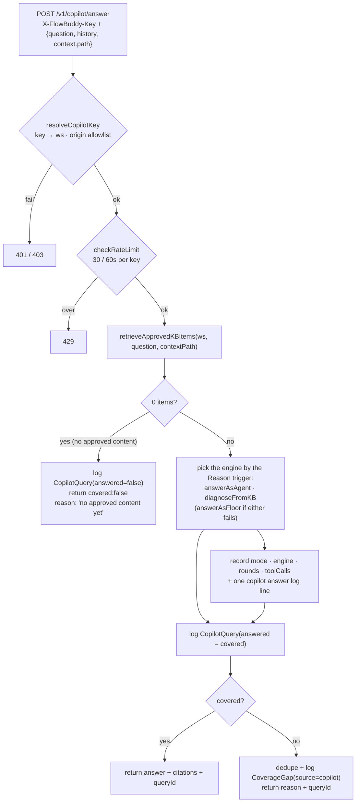

# Copilot (answer engine) — internals

> **Module:** the copilot routes on the Fastify service
> ([`server.ts`](../../packages/api/src/server.ts)) plus
> [`synthesis/retrieval.ts`](../../packages/synthesis/src/retrieval.ts) (retrieval — the single no-leak seam),
> [`copilot-auth.ts`](../../packages/api/src/copilot-auth.ts) (embed auth), and
> [`synthesis/copilot.ts`](../../packages/synthesis/src/copilot.ts) (the grounded answer).
> **Role:** the primary product — answer an end-user's question **only** from **approved** KB, with
> citations and honest declines.

---

## 1. Purpose

A customer's end-user asks a question in the embedded [widget](widget.md). The copilot must answer
**only** from knowledge the operator captured *and approved*, cite which workflow it used, and
**decline honestly** when the approved KB doesn't cover the question — turning that decline into a
"record this next" signal. Two hard guarantees: **no-leak** (never answer from un-approved/raw content
or general model knowledge) and **honest coverage** (a decline is a feature, not a failure).

---

## 2. The pieces, and what each one guarantees

Paths are in `CLAUDE.md` and the source; what matters here is the contract each layer holds.

- **Auth** resolves the public embed key to a workspace, then applies the origin allowlist and a
  per-route rate bucket. **Every** copilot route goes through that one gate — the list is in §4.1.
- **Retrieval is the ranking seam and the no-leak enforcement point.** Approval is checked on every
  read, including the agent's own `search_knowledge` / `get_workflow`, and it is constrained at the
  **injection site**, never by prompt. Since the Studio preview became the real widget, **every
  surface reaches it through the same public `/answer` route**, so there is exactly one answer path
  to audit. The contract a new reader has to satisfy: [connections.md](connections.md) §5.
- **Embeddings** are the shared half used by both the worker (write) and retrieval (query). **The
  model and its dimensions must change together with the `vector(1536)` column** — a width mismatch
  is the failure mode, and `embeddings.ts` is where that rule is enforced rather than hoped for.
- **The shared loop** owns the model call, the bounded tool rounds and the answer shaper. Two
  invariants live in the shaper: **citations resolve only against items we supplied**, and **the
  position step comes from the probe, never from the model**.
- **Copilot mode** is that loop with KB-reading tools — and, in AI Agent mode, the run-scoped acting
  offer. The agent's superset schema disappeared with D11's intent fields — every path now answers
  against the same one. Why the extra rounds are an escalation and not a toll booth on simple
  lookups: [`agent.md`](../build/agent.md) D2.
- **The floor is not a separate pipeline** — it is the same loop with nothing bound (§4.3). It is
  what answers when the loop above it fails, and it is not selectable.
- **The mode vocabulary** — the values, the fail-closed rule and the deliberate separation of the
  product default from the floor — lives in `packages/shared/src/copilot-mode.ts` and is
  test-enforced there. Nothing in this doc restates it.

---

## 3. Inputs / Outputs

- **`POST /v1/copilot/answer`**
  - **In:** `X-FlowBuddy-Key: <public embed key>`, body `{ question, history?, context?: { path }, preview? }`.
  - **In (context, P5-M0 cut 2):** `context.lastCited: [{sourceId, segmentIndex}]` — the workflow
    keys the widget was given with the previous answer, echoed back so a follow-up biases toward the
    workflow under discussion. Untrusted like every context field: shape-checked, capped at 4,
    deduped, and **re-verified against `CopilotApproval`** before it can influence retrieval.
  - **Out (covered):** `{ covered: true, answer, citations[], queryId }`.
    **The `copilotShowCitations` trust setting is a PRESENTATION gate applied here at the response
    boundary**, not inside the answer engines: with it off, each citation's `segmentTitle` is nulled
    (so the widget renders no "Source" pill) while the workflow keys still reach the widget for
    continuity, and the **full citation is still logged** for the founder's own analytics. A
    what-the-end-user-sees preference must not switch off retrieval quality or founder reporting —
    the incident that established that is in [`agent.md`](../build/agent.md).
  - **Out (covered, and only for a workspace whose mode may act): an optional `runOffer`** — the
    typed description of ONE runnable workflow: its key, title, pinned plan hash, step count, the
    input slots it will ask for, how many steps are destructive or the user's own, where it starts,
    the founder's own description, and any values the conversation already supplied. It is
    **server-decided**: the model may *request* one via its acting tool, and a positional answer
    about a runnable workflow gets one deterministically. It is what the widget renders as a consent
    sheet.
  - **Out (decline):** `{ covered: false, answer: null, citations: [], reason, queryId }`.
  - **`preview: true`** (the Studio real-widget tester) — same engine, but the call skips
    `recordWidgetSeen` and every analytics write (no `CopilotQuery`, no citations, no `CoverageGap`)
    and the response carries **no `queryId`** (so the widget shows no thumbs). Self-declared and safe:
    the flag can only suppress your own workspace's stats.
- **`POST /v1/copilot/feedback`** — `{ queryId, feedback: 'up' | 'down' }` → records the thumb.
- **`GET /v1/copilot/config`** — the widget's mount-time appearance fetch: returns the
  workspace's saved accent/title/greeting/position/launcher (nulls = widget defaults) **plus the
  behavior flags** (`sense`/`showMe`/`walkthrough`/`reason`/`reasonImage`/`reasonValues`),
  `no-store` so a Studio save shows on the next page load. Same gate (key + origin allowlist, own
  rate bucket); read-only — writes nothing.
- **`GET /v1/copilot/sense-plan?route=…`** (P2-M0) — the ROUTE-SHARDED compiled sense
  plan (approved workflows → steps × ranked locators + routes), gated by `Workspace.senseEnabled`;
  the widget caches per route — and both the cache key and the `route` it sends are the **pattern**,
  so every record of one shape shares a single shard and no end-user record id reaches the server.
  Each workflow also carries **screen fingerprints** (title + the short visible labels of what the
  founder touched, keyed by a run of consecutive events sharing a route pattern — by WHEN, not
  WHERE, or a one-path app would collapse into a single screen). Workflows the route missed fill the
  shard's **spare slots** so the widget can place a user structurally where the URL says nothing;
  they are dropped again, in the widget, the moment some workflow matches the URL exactly.
  Mechanics: [`sense-and-reason.md`](../build/sense-and-reason.md) Part A.
- **`POST /v1/copilot/walkthrough`** (P4-M0) — guided-walkthrough run analytics:
  `started` (key re-verified against `CopilotApproval` — no-leak; returns `runId`) then
  `step_advanced`/`completed`/`aborted`/`stalled` update the one `CopilotWalkthrough` row per run
  (workspace-scoped `updateMany`, own rate bucket). Mechanics: [`widget.md`](widget.md) §4.9.
- **`GET /v1/copilot/execution-plan`** — the compiled plan for ONE actable workflow: ordered steps
  with verbs, ranked locators, routes, input slots, destructive flags and appearance markers, plus
  the content hash that pins consent. Gated on the acting readers' rule — a LIVE approval whose
  founder enabled acting — **and** on the workspace's mode. Every missing rung is the same `404`:
  absence, not refusal.
- **`POST /v1/copilot/run`** — the run lifecycle. **`start` *is* the consent moment:** it re-verifies
  mode, liveness, the acting flag and the plan hash live, then writes the audit row and returns its
  id; a hash that moved since consent is a `409` ("this just changed — ask again"), never a silent
  run of different steps. `step` and the terminal events (`completed` · `aborted` · `safe_stop`)
  append per-step outcomes and each input's SOURCE — **never a value** — clamped and untrusted like
  the walkthrough's analytics.

---

## 4. Internal mechanics

```mermaid
flowchart TD
    Q["POST /v1/copilot/answer<br/>X-FlowBuddy-Key + {question, history, context.path}"] --> AUTH
    AUTH{"resolveCopilotKey<br/>key → ws · origin allowlist"} -- fail --> E1["401 / 403"]
    AUTH -- ok --> RL{"checkRateLimit<br/>30 / 60s per key"}
    RL -- over --> E2["429"]
    RL -- ok --> RET["retrieveApprovedKBItems(ws, question, contextPath)"]
    RET --> Z{"0 items?"}
    Z -- "yes (no approved content)" --> NP["log CopilotQuery(answered=false)<br/>return covered:false<br/>reason: 'no approved content yet'"]
    Z -- no --> ANS["pick the engine by the Reason trigger:<br/>answerAsAgent · diagnoseFromKB<br/>(answerAsFloor if either fails)"]
    ANS --> LOG["log CopilotQuery(answered = covered)"]
    ANS --> TEL["record mode · engine · rounds · toolCalls<br/>+ one copilot answer log line"]
    TEL --> LOG
    LOG --> C{"covered?"}
    C -- yes --> OK["return answer + citations + queryId"]
    C -- no --> GAP["dedupe + log CoverageGap(source=copilot)<br/>return reason + queryId"]
```

### 4.1 Authentication & rate limiting ([`copilot-auth.ts`](../../packages/api/src/copilot-auth.ts))

`resolveCopilotKey(key, origin)`:

- Looks up `Workspace.copilotPublicKey` (the `pk_…` key, stored in plaintext — it's *meant* to be in
  client HTML) → `workspaceId`.
- **Origin allowlist:** if `copilotAllowedOrigins` is non-empty **and** the browser sent an `Origin`,
  the origin must be in the list (else `403`). An **empty list = allow any** (dev default).
  Server-to-server callers send no `Origin` and aren't blocked here (a page can't spoof "no origin").
- **Rate limit:** `checkRateLimit(bucket)` — an in-memory **fixed window of 30 requests / 60 s**.
  MVP-grade; production would back it with Redis. Over-limit → `429`. **All copilot routes** (`/answer` · `/feedback` · `/seen` · `/config` · `/sense-plan` · `/walkthrough` · `/execution-plan` · `/run`)
  go through one shared `copilotGate` (server.ts) — `/answer` keeps the bare key as its bucket,
  `/feedback` and `/seen` get per-route buckets (`feedback:key`, `seen:key`) so a chatty host page
  pinging `/seen` can't starve real questions — and the two acting routes additionally answer `404`
  unless the workspace's mode may act, so a read-only workspace cannot even enumerate the acting
  surface.

These two functions are the **public-facing security boundary**; they're distinct from the secret
recorder-token auth used by ingestion. See [connections.md](connections.md) §3.

### 4.2 Retrieval — the no-leak enforcement seam ([`synthesis/retrieval.ts`](../../packages/synthesis/src/retrieval.ts))

`retrieveApprovedKBItems(db, workspaceId, question, opts)` is **the single point that keeps the
copilot grounded only in approved knowledge** — one implementation, one caller (the public answer
route; the Studio tester is the real widget and arrives through that same route). In order:

1. **Resolve the gate.** `CopilotApproval` rows for the workspace filtered on
   **`inactiveReason: null`** → the set of live **`workflowId`s**, plus each workflow's plan
   description and its variant group. **The gate is the workflow's durable IDENTITY, never its
   position** — while the ranking signals in step 6 still key on `sourceId:segmentIndex`, because
   that is what the widget reports about where the user is standing. The asymmetry is deliberate and
   is argued in the source header: a wrong signal costs one mediocre answer, a wrong gate leaks.
2. **Fetch the two corpora.** Every `KnowledgeItem` for the workspace, kept only where its
   `workflowId` is live — *this is the gate* — and, since the application-intelligence layer, a
   **second corpus**: live approved `ProductPage` rows, gated by `approvedAt` set **and**
   `inactiveReason` null in their own `WHERE` (the page analog of the same rule; there is no
   per-page approval table to join). A page has no route, no position and no workflow, so the
   context signals below simply never fire for it. **Empty on both sides is the only case that
   returns `[]`** — what the route turns into "no approved help content yet".
3. **One route per goal, chosen BEFORE ranking** (`selectOnePerTask`). Where the founder grouped two
   workflows as two routes to one goal, exactly one survives — preferring the route the user is
   already on, then the one that can be started cold, then the larger. A bias would only reorder the
   pair; the point is that one of them should not be in the window at all.
4. **Vector candidates — best-effort.** The question embed **starts before the DB reads and overlaps
   them**, on a deliberately tight timeout, because a hanging embeddings API must never stall an
   answer. The scan is itself **constrained to the live workflow ids and to the page gate**, so
   unapproved rows can neither leak nor starve the candidate budget. **Any failure of the vector
   half — no raw-SQL client, no embedding config, no embedded rows, a slow or failed embed call —
   drops silently to the keyword shortlist**, so the copilot never errors on the vector path.
5. **Keyword scoring.** Question terms (lowercased, stop-words and ≤2-char tokens dropped), scored
   by term-overlap count against each item's `text`.
6. **Fusion (RRF), plus three context signals** added as extra "lists" where every matching item
   ties at rank 1: **route** (the screen the user is on) · **sense** (the workflow they are standing
   in) · **continuity** (the workflow the PREVIOUS answer cited). The ordering rule is
   **route = sense > continuity**: the first two are measured *now*, continuity only recalls what was
   being discussed a turn ago, and that gap is what lets a user change subject mid-thread. The
   weights themselves are tuning constants and live with them in `retrieval.ts`.

   All three are **biases, never filters** — and since 2026-08-04 that is enforced rather than
   intended: **`RELEVANCE_RESERVE` guarantees 8 of the 24 slots to the top items by keyword/vector
   alone**, which no context signal can evict. Without it a bias applied to enough items IS a
   filter, because the answer model can only overrule context it was still shown. The reserve
   changes **membership only, never ORDER**. The measured eviction that produced it, and why capping
   the boost's reach was rejected instead, are in the constant's own header.

   **Routes are compared as PATTERNS, never as strings**, with exactly one implementation for the
   whole product in
   [`shared/route-pattern.ts`](../../packages/shared/src/route-pattern.ts) — shared by retrieval,
   the sense shard, the execution-plan compiler, and the widget's probe, walkthrough and acting run.
   That header owns the rules and the scar tissue behind them: what counts as a record id and why the
   classifier is narrow, how the root matches, idempotency, and `displayRoute` for anything a human
   is shown.
7. **Top-K.** Sort by fused score and return `CopilotKBItem`s. It **always returns up to the limit,
   even on zero matches** (unmatched items fill the tail in KB order), so the *LLM* judges coverage
   rather than a hard retrieval miss pre-declining.

> Retrieval is **hybrid keyword + vector**. Embeddings are written by the **worker at KB build**
> (delete+recreate ⇒ a reprocess re-embeds automatically; an embed failure never fails the build and
> surfaces as a degraded-build notice on the recording — [knowledge-base.md](knowledge-base.md) §3).
> There is **no backfill**: pre-upgrade rows have `embedding NULL` and ride the keyword half until
> re-processed (deliberate — dev data was reset). ⚠️ **`EMBED_MODEL` must resolve to the SAME model
> on api and web** — a same-width model drift can't be detected from dimensions and would compare
> vectors across incompatible embedding spaces.

`sanitizeHistory` also lives here: it accepts only well-formed `user`/`assistant` turns from the
untrusted request body, capped in count and clipped in length.

### 4.3 Grounding — answer or decline

**Three paths, ONE loop (restructured 2026-07-26).** The engine in
[`engine.ts`](../../packages/synthesis/src/engine.ts) makes the model call, serves any tools the
CALLER bound, and stops. Which path a question takes is decided by the workspace's mode plus the
Reason trigger:

| Path | When | Tools bound | Rounds |
|---|---|---|:---:|
| **Copilot** (`agent.ts`) | non-diagnostic — every mode | `search_knowledge` · `get_workflow` (+ the run offer in AI Agent mode, only when runnable workflows exist) | ≤4 |
| **Diagnostic** (`reason.ts`) | Reason trigger fires | expected screenshot · expected DOM · page image | ≤4 |
| **Floor** (`agent.ts`, `answerAsFloor`) | either of the above failed | **none** | **1** |

**The acting tool is bound by ABSENCE, not by refusal.** It exists in the request only when the
workspace's mode may act *and* the runnable set is non-empty, and its description enumerates the exact
keys it may name — the model picks from a set the server built, and the server re-validates the key it
picks. A Copilot-mode question never resolves the runnable set at all, so it pays nothing. The tool is
deliberately RUN-scoped, not step-scoped: it attaches an offer for one whole workflow, and the
widget's executor owns the steps.

Two properties worth not losing:

- **The floor is the loop with nothing bound**, and with zero tools it makes exactly one call —
  proven byte-identical to the pre-restructure fast path, which is what made retiring the
  single-shot MODE cost nothing. How that is arranged in the request is in `engine.ts`'s header.
- **A final round NEVER serves tools.** A model that calls one anyway is not obeyed: there is no
  round left to use the result, so the call would be pure cost — and in the acting mode, an action
  taken after the loop decided to stop, which nobody observes or verifies. Structural, not advisory.

**The question is labelled as the NEW one.** All three paths end their user message
with `The user's NEW message — this is the one to answer, not anything asked earlier: …` rather than
a bare `Question:`. This is a bug fix, not a style choice. With any earlier turn in the thread the
previous question is a short clean line of its own while the current one sits at the bottom of a
wall of knowledge items — and the model answers the older one. Measured on a two-workflow KB: ask
*"how to login?"*, get a correct answer, then ask *"how to sign up?"* → **declined 10/10 while
holding all six signup steps**; asked *"How much does it cost?"* from the same position it replied
with **the login steps** and marked itself covered. Labelling it: **0/10 → 10/10 in both modes**,
with cold questions, genuine follow-ups (*"and then what?"*) and the must-decline set all unmoved,
and an uncovered-question guard improving 2/6 → 0/10. Two variants were measured and rejected:
leading with the question *and* repeating it, and a neutral "latest message" prefix — both fix the
bug but drop diagnostic-style questions (*"why can't I…"*) to 0/6, because the redundancy makes the
model read the wording too literally. **A prompt RULE does not work here** — "the conversation does
not limit what you may answer", added to both system prompts, moved the failing cell 0/8 → 1/8 and
was reverted. The model did not lack the rule.

> **Known, unshipped:** `covered` is the FIRST property in `ANSWER_SCHEMA`, and structured outputs
> emit fields in declaration order — so the answer-or-decline decision is sampled before a single
> token about the items exists. Permuting the schema so it comes later fixes the same failing cell
> 0/8 → 8/8 with **no text change at all**. A real second lever, deliberately not stacked on the
> first so each stays measurable. (Reordering is safe for the wire: `shapeAnswer` reads named fields
> only, so a model-facing field cannot reach the widget by moving.)

**Sense ships a CANDIDATE LIST, and only its leaders bias retrieval.** Several hypotheses travel —
everything within the widget's tie threshold of the leader — because on a hub page many workflows
tie on DOM evidence alone and only the question can separate them; but only the first couple become
`senseKeys` for retrieval, because a boost applied to the whole list floods the window it exists to
nudge. Order is the widget's and survives validation, so `senseLogFields` can match the model's
chosen `position` against the list and log `senseUsed='used'` with the workflow and step the answer
actually anchored on. The two caps and the measurement behind them are in `CLAUDE.md`'s trap and the
constants in `server.ts`.

**`search_knowledge` carries NO context signals.** The first retrieval answers "what is around this
user?", so route/sense/continuity belong to it; the agent's own search answers "find me X", after it
has read the page context and stated what it wants in its own words — and it only ever sees the top
few results, so a page bias there silently costs it the answer. Nothing positional is lost: round
one's items stay in the prompt and **tool results accumulate rather than replace**.

**Tool de-duplication is keyed on name + ARGUMENTS, not name** — name alone refused the
re-search-with-different-words the prompt itself asks for. The consequence worth recording here is
the one that had not happened yet: it was correct for `reason.ts`, whose tools take no arguments, and
wrong the moment a tool grew a parameter — so the acting tool that shipped, a run offer taking a
workflow key, would have inherited it as a **silently skipped offer**.
The ledger that replaced the name set is also the caller's telemetry, which is why an unknown tool
name no longer burns a slot and the budget is enforced per CALL rather than only between rounds. One
rider is a causal chain worth keeping: **`get_workflow` output is capped at 40 steps because an
uncapped dump against the 700-token output cap truncates the final JSON** — which `shapeAnswer` then
turns into a decline, i.e. a length limit surfacing as "I couldn't find an answer".

**`formatItems` emits the workflow key** beside each item. Without it the only `key=` in the prompt
came from POSITION CONTEXT — the workflow the user is standing *in* — so `get_workflow` could only
ever be aimed at the current screen, while its own description offered "the workflow an item belongs
to". Asked about something recorded elsewhere, the agent could see fragments and had no way to ask
for the rest. (The literal format is pinned by `engine.test.ts`, not by this doc.) The DIAGNOSTIC
path is unaffected: it keeps its own inlined rendering and is the last engine that does — the trap
and its reason are in `CLAUDE.md`.

The mode is resolved server-side from `Workspace.copilotMode` on every call
([`copilot-auth.ts`](../../packages/api/src/copilot-auth.ts)) and **fails closed** — a page holding
the public key can never talk itself into a higher mode. What the values mean, why the product
default and the fail-closed floor are two constants that currently read the same, and what the floor
may never be, all live in `packages/shared/src/copilot-mode.ts` with the test that enforces them.

**The fallback is real, not just documented.** `answerAsAgent` is wrapped in
[`server.ts`](../../packages/api/src/server.ts): any failure — timeout, malformed tool argument,
anything — degrades that question to a single no-tools answer rather than erroring. Retrieval has
already run by then, so the floor sees exactly the items the loop's own first round would have. The
mode setting is untouched: this is per-question, not a demotion.

**Since the retirement it can no longer drift from what it falls back to**, because it *is* that
thing: same prompt, same item rendering, one round, nothing bound. That replaces a property the old
arrangement had and this one doesn't — the floor is no longer exercised by ordinary traffic, so
nothing would notice it rotting. What guards it now is sharing the agent's prompt plus one test
(`agent-prompt.test.ts`) pinning the single way the shared prompt can still be wrong for it: with no
tools bound, an instruction to "search first, then answer" invents a decline at the worst moment.

#### The grounded call ([`synthesis/agent.ts`](../../packages/synthesis/src/agent.ts))

The loop makes its calls with a **strict JSON schema**
(`{ covered, reason, answer, citedItemIds }`) and a system prompt that is the product's no-leak
contract in words:

- *Use ONLY the knowledge items; never use general knowledge; never invent UI/steps/features.*
- If covered → concise, friendly, step-by-step answer, `covered: true`, and list the **ids actually
  used** in `citedItemIds`.
- If not covered → `covered: false` + a one-sentence reason; **don't guess or partially answer**.
- **Privacy:** the items carry typed placeholders (`[redacted-email]`, …); treat them as opaque, never
  reproduce them, refer to such values generically ("your email"). This affects *phrasing only*, not
  whether something is "covered".

The prompt assembles each item as `- id=<id> [workflow: <title>]: <text>\n narration: "…"`, prepends
sanitized history, and (if present) a context line naming the user's current page. After the call it
**maps `citedItemIds` back** to real items → `CopilotCitation[]` (`itemId, sourceId, segmentIndex,
segmentTitle`), deduped. A response that isn't `covered` or has no `answer` becomes a clean decline.

> **Why let the LLM decide coverage** instead of a similarity threshold? Because grounded helpfulness
> is a judgment ("do these steps actually answer this question?") that keyword scores can't make. The
> retrieval layer's job is to put the *right candidates* in front of the model; the model's job is to
> honestly use or refuse them.

### 4.4 The route handler — wiring + analytics ([`server.ts`](../../packages/api/src/server.ts))

`/v1/copilot/answer` orchestrates: gate (auth + rate-limit + **mode**) → input caps → resolve context
(Sense hypotheses **and** P5-M0 continuity keys, in ONE `Promise.all` so neither adds a serial hop) →
retrieve → (zero-items shortcut) → **resolve the RUNNABLE set** (only when the mode may act — live
approvals with acting enabled, joined to their compiled plans; a Copilot workspace skips this
entirely) → **the path for this question** (`diagnoseFromKB` when the widget
shipped page state, else `answerAsAgent`; `answerAsFloor` if either fails) → **decide the run offer**
(the model's pick, validated against that set — the model chooses from it and never defines it — else
deterministically on a positional covered answer about a runnable workflow) → **log + respond**. Input caps (cost ceiling — the key is public):
**question ≤ 2000 chars** (`400` above it; the widget input additionally caps at 400 via
`maxlength`), `context.path` clipped to 512.

- **Zero approved items** → log `CopilotQuery(answered: false)` and return a distinct reason ("this
  copilot has no approved help content yet") — *not* a coverage gap (nothing was asked-but-missing;
  the copilot just isn't provisioned).
- **Every answered/declined question** logs a `CopilotQuery(answered = covered)` and returns its
  `queryId` (the handle the widget uses for thumbs feedback).
  **Since 2026-07-29 the row also records HOW the answer was produced** — `mode` (the workspace
  setting) · `engine` (what actually ran: `agent` | `reason` | `floor`) · `rounds` · `toolCalls`.
  Every engine hands the loop's result back through the same `onLoop` hook, so the floor's
  `rounds: 1, toolCalls: 0` is a recorded fact rather than a claim and one query compares them all.
  `floor` is the value with no matching mode — a run of those rows means something upstream is failing.
- **The row and the log line both carry the EVIDENCE, not just the counts** — the Sense candidate
  list, round one's item ids, and each `search_knowledge` query with what it returned. **One shape,
  built once and written to both**, so a grepped line and a stored row can never disagree about the
  same question. What each field holds, and the two invisible defects that bought it, are on
  `CopilotQuery` in `schema.prisma`. *(What is still NOT stored is the answer TEXT — a separate,
  deliberate deferral; roadmap §9.)*
- **A decline** additionally logs a `CoverageGap(source: 'copilot')` — **deduped**: at most one *open*
  gap per distinct question per workspace. This is the "record this next" feed Studio surfaces.
- **A decline from the AGENT is no longer swapped for a diagnostic one.** The P2-M5
  escalation returns `escalate: true` and logs *nothing*, letting the widget retry once with page
  state — but the retry takes the diagnostic branch, which has no mode guard, so in Copilot mode
  the agent never ran the second time and its `search_knowledge`/`get_workflow` were dropped. The
  guard is keyed on `engineUsed !== 'agent'`, **not** on the workspace mode: when the loop throws,
  the floor answers with no tools while `gate.mode` still reads `copilot`, and *that* decline should
  still escalate. Since the retirement a floor decline is the ONLY way this line is reached, which
  makes it narrower than it was and still exactly right for the case it was written for. A consequence worth knowing: the agent's decline now reaches the `CopilotQuery`
  write, so the coverage gap records what the AGENT said rather than the diagnostic engine's
  page-shaped text.
- **Sense hypotheses carry UUID `sourceId`s, not cuids.** `KnowledgeSource` ids are `randomUUID()`
  values, so they carry **hyphens**, and the wire validation must accept them. Tighten that
  character class and every hypothesis is dropped **silently** — no error, no `429`, nothing in the
  response: Sense degrades to plain route bias and positional answers simply stop happening.
- **The capture posture is the FOUNDER's, re-checked here.** A page image is accepted only when the
  workspace's image tier is on, and unmasked values only when unmasking is on, so a spoofed widget
  can never force a capture posture the founder did not enable.
- **The stored question is PII-scrubbed** — `CopilotQuery.question` and `CoverageGap.prompt` through
  the same `redactText` as KB text. **Storage only**, so retrieval and the model still see the raw
  question and answer quality is unchanged ([data.md](data.md) §19). The one wiring detail: the
  scrub is applied ONCE, before both writes, because the coverage-gap dedupe matches on that text.
- **Citations are logged one row per WORKFLOW, not per cited step.** `shapeAnswer`
  dedupes by `KnowledgeItem` id — correct for grounding — so an answer built from six steps carries
  six citations naming one workflow. `citationRows` collapses them before insert; see
  [data.md §15](data.md) for the analytics distortion this used to cause.

`/v1/copilot/feedback` re-auths, validates `feedback ∈ {up,down}`, and updates the `CopilotQuery`
**scoped to the workspace** (`updateMany({ id, workspaceId })`) so one tenant can't write another's
rows.

---

## 5. Data it reads / writes

| Store | Reads | Writes |
|---|---|---|
| **Postgres** | `Workspace` (key/allowlist), `CopilotApproval` (the gate — **and its acting flag**), `KnowledgeItem` (candidates), `ExecutionPlan` (the compiled plan and its consent-pin hash) | `CopilotQuery` (every Q — question PII-scrubbed), `QueryCitation` (one per cited **workflow**), `CoverageGap` (on decline), `CopilotQuery.feedback` (thumbs), **`ExecutionRun`** (the acting audit — consent moment, pinned plan hash, per-step outcomes and input SOURCES, never values) |
| **OpenAI** | the chat model (the agent loop and its floor) | — |
| **In-memory** | the rate-limit buckets | per-key request counts (ephemeral) |

It **never writes the KB** — knowledge flows one way (see [connections.md](connections.md) §8).

---

## 6. Failure modes & edge cases

- **No approved workflows** → friendly "no approved help content yet" (covered:false), logged but **not**
  a coverage gap.
- **`OPENAI_API_KEY` unset** → `500` before any LLM call.
- **LLM returns unparseable JSON** (including output truncated at `max_completion_tokens`) → treated
  as a clean decline ("couldn't find an answer").
- **Oversized question** (> 2000 chars) → `400` before retrieval or any LLM spend.
- **Leaked embed key** → bounded by the origin allowlist + the 30/60s rate limit; it can only read
  *approved* answers, never write or read raw KB.
- **Context path that matches nothing** → no boost; retrieval still returns by keyword score.
- **Over the diagnostic path's own rate bucket** → the question **silently takes the fast path**
  instead of returning `429`. The expensive path carries a per-key ceiling on top of the answer
  bucket, and going over degrades the answer rather than failing it — so a caller pacing too fast
  gets answers from a different engine than it thinks it is measuring.
- **Empty/whitespace question** → `400`.
- **A workflow that is not runnable** (no live approval · acting not enabled · no compiled plan) →
  the same `404` on both acting routes. The wire never distinguishes them, so it never leaks what the
  founder has not enabled.
- **A workspace whose mode cannot act** → the entire acting surface is that same `404`, so an embed
  cannot enumerate it.
- **The plan changed between consent and start** → `409`, and the run never begins. A run executes
  the exact plan version the user agreed to, or none at all.

---

## 7. Connections

Seams, contracts and who-calls-what: [`connections.md`](connections.md).
