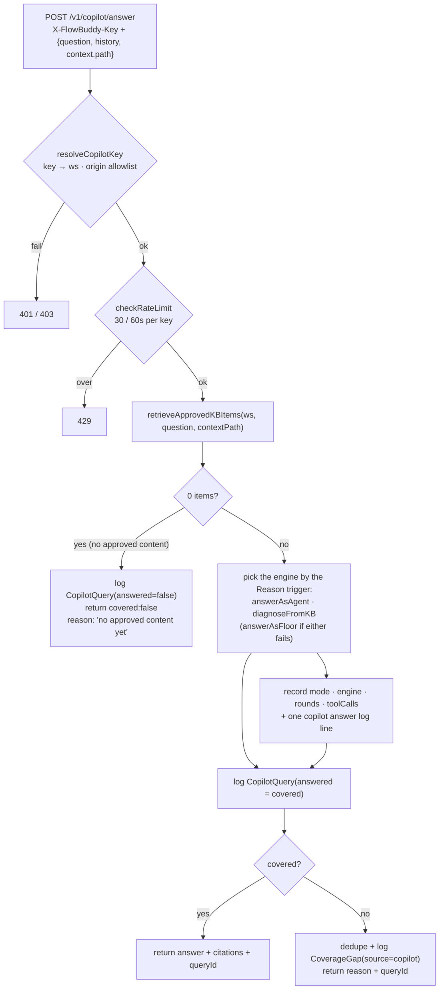

# Copilot (answer engine) — internals

> **Module:** the copilot routes on the Fastify service
> ([`server.ts`](../../packages/api/src/server.ts)) plus
> [`synthesis/retrieval.ts`](../../packages/synthesis/src/retrieval.ts) (retrieval — the single no-leak seam),
> [`copilot-auth.ts`](../../packages/api/src/copilot-auth.ts) (embed auth), and
> [`synthesis/copilot.ts`](../../packages/synthesis/src/copilot.ts) (the grounded answer).
> **Role:** the primary product — answer an end-user's question **only** from **approved** KB, with
> citations and honest declines.

---

## 1. Purpose

A customer's end-user asks a question in the embedded [widget](widget.md). The copilot must answer
**only** from knowledge the operator captured *and approved*, cite which workflow it used, and
**decline honestly** when the approved KB doesn't cover the question — turning that decline into a
"record this next" signal. Two hard guarantees: **no-leak** (never answer from un-approved/raw content
or general model knowledge) and **honest coverage** (a decline is a feature, not a failure).

---

## 2. The pieces, and what each one guarantees

Paths are in `CLAUDE.md` and the source; what matters here is the contract each layer holds.

- **Auth** resolves the public embed key to a workspace, then applies the origin allowlist and a
  per-route rate bucket. Six copilot routes share one gate.
- **Retrieval is the ranking seam and the no-leak enforcement point.** Approval is checked on every
  read, including the agent's own `search_knowledge` / `get_workflow` — constrained at the injection
  site, not by prompt. Since the Studio preview became the real widget, **every surface reaches it
  through the same public `/answer` route**, so there is exactly one answer path to audit. The Prisma
  client is injected, which is what keeps `@flowbuddy/synthesis` DB-free.
- **Embeddings** are the shared half used by both the worker (write) and retrieval (query). The model
  and its dimensions must change together with the `vector(1536)` column — a width mismatch is the
  failure mode.
- **The shared loop** owns the model call, the tool rounds (**capped at 4 rounds / 4 tool calls**) and
  the answer shaper. Two invariants live in the shaper: **citations resolve only against items we
  supplied**, and **the position step comes from the probe, never from the model**.
- **Copilot mode** is that loop with KB-reading tools and a superset schema. **Round one *is* the
  fast path**, so simple lookups cost the same; the extra rounds are escalation.
- **The floor is not a separate pipeline** — it is the SAME loop and the SAME prompt with no tools
  bound and `maxRounds: 1`, so it makes exactly one call and breaks. A truncated response degrades to
  a decline. It is what answers when the loop above it fails, and it is not selectable.
- **The mode vocabulary fails closed** — anything unrecognised resolves to `copilot`, which is now
  both the default and the floor. The floor's rule is "cannot ACT", not "can do least".

---

## 3. Inputs / Outputs

- **`POST /v1/copilot/answer`**
  - **In:** `X-FlowBuddy-Key: <public embed key>`, body `{ question, history?, context?: { path }, preview? }`.
  - **In (context, P5-M0 cut 2):** `context.lastCited: [{sourceId, segmentIndex}]` — the workflow
    keys the widget was given with the previous answer, echoed back so a follow-up biases toward the
    workflow under discussion. Untrusted like every context field: shape-checked, capped at 4,
    deduped, and **re-verified against `CopilotApproval`** before it can influence retrieval.
  - **Out (covered):** `{ covered: true, answer, citations[], queryId }`.
    **The `copilotShowCitations` trust setting is a PRESENTATION gate applied here at the response
    boundary**, not inside the answer engines: with it off, each citation's
    `segmentTitle` is nulled (so the widget renders no "Source" pill) while the workflow keys still
    reach the widget for continuity, and the **full citation is still logged** for the founder's own
    analytics. Previously the engines returned `citations: []` outright, which silently emptied the
    Analytics "top workflows by citations" card for those workspaces and would have disabled
    continuity bias for them too — a what-the-end-user-sees preference must not switch off retrieval
    quality or founder reporting.
  - **Out (decline):** `{ covered: false, answer: null, citations: [], reason, queryId }`.
  - **`preview: true`** (the Studio real-widget tester) — same engine, but the call skips
    `recordWidgetSeen` and every analytics write (no `CopilotQuery`, no citations, no `CoverageGap`)
    and the response carries **no `queryId`** (so the widget shows no thumbs). Self-declared and safe:
    the flag can only suppress your own workspace's stats.
- **`POST /v1/copilot/feedback`** — `{ queryId, feedback: 'up' | 'down' }` → records the thumb.
- **`GET /v1/copilot/config`** — the widget's mount-time appearance fetch: returns the
  workspace's saved accent/title/greeting/position/launcher (nulls = widget defaults) **plus the
  behavior flags** (`sense`/`showMe`/`walkthrough`/`reason`/`reasonImage`/`reasonValues`),
  `no-store` so a Studio save shows on the next page load. Same gate (key + origin allowlist, own
  rate bucket); read-only — writes nothing.
- **`GET /v1/copilot/sense-plan?route=…`** (P2-M0) — the ROUTE-SHARDED compiled sense
  plan (approved workflows → steps × ranked locators + routes), gated by `Workspace.senseEnabled`;
  the widget caches per route — and both the cache key and the `route` it sends are the **pattern**,
  so every record of one shape shares a single shard and no end-user record id reaches the server.
  Each workflow also carries **screen fingerprints** (title + the short visible labels of what the
  founder touched, keyed by a run of consecutive events sharing a route pattern — by WHEN, not
  WHERE, or a one-path app would collapse into a single screen). Workflows the route missed fill the
  shard's **spare slots** so the widget can place a user structurally where the URL says nothing;
  they are dropped again, in the widget, the moment some workflow matches the URL exactly.
  Mechanics: [`sense-and-reason.md`](../build/sense-and-reason.md) Part A.
- **`POST /v1/copilot/walkthrough`** (P4-M0) — guided-walkthrough run analytics:
  `started` (key re-verified against `CopilotApproval` — no-leak; returns `runId`) then
  `step_advanced`/`completed`/`aborted`/`stalled` update the one `CopilotWalkthrough` row per run
  (workspace-scoped `updateMany`, own rate bucket). Mechanics: [`agent.md`](../build/agent.md) §A8.

---

## 4. Internal mechanics

```mermaid
flowchart TD
    Q["POST /v1/copilot/answer<br/>X-FlowBuddy-Key + {question, history, context.path}"] --> AUTH
    AUTH{"resolveCopilotKey<br/>key → ws · origin allowlist"} -- fail --> E1["401 / 403"]
    AUTH -- ok --> RL{"checkRateLimit<br/>30 / 60s per key"}
    RL -- over --> E2["429"]
    RL -- ok --> RET["retrieveApprovedKBItems(ws, question, contextPath)"]
    RET --> Z{"0 items?"}
    Z -- "yes (no approved content)" --> NP["log CopilotQuery(answered=false)<br/>return covered:false<br/>reason: 'no approved content yet'"]
    Z -- no --> ANS["pick the engine by the Reason trigger:<br/>answerAsAgent · diagnoseFromKB<br/>(answerAsFloor if either fails)"]
    ANS --> LOG["log CopilotQuery(answered = covered)"]
    ANS --> TEL["record mode · engine · rounds · toolCalls<br/>+ one copilot answer log line"]
    TEL --> LOG
    LOG --> C{"covered?"}
    C -- yes --> OK["return answer + citations + queryId"]
    C -- no --> GAP["dedupe + log CoverageGap(source=copilot)<br/>return reason + queryId"]
```

### 4.1 Authentication & rate limiting ([`copilot-auth.ts`](../../packages/api/src/copilot-auth.ts))

`resolveCopilotKey(key, origin)`:

- Looks up `Workspace.copilotPublicKey` (the `pk_…` key, stored in plaintext — it's *meant* to be in
  client HTML) → `workspaceId`.
- **Origin allowlist:** if `copilotAllowedOrigins` is non-empty **and** the browser sent an `Origin`,
  the origin must be in the list (else `403`). An **empty list = allow any** (dev default).
  Server-to-server callers send no `Origin` and aren't blocked here (a page can't spoof "no origin").
- **Rate limit:** `checkRateLimit(bucket)` — an in-memory **fixed window of 30 requests / 60 s**.
  MVP-grade; production would back it with Redis. Over-limit → `429`. **All copilot routes** (`/answer` · `/feedback` · `/seen` · `/config` · `/sense-plan` · `/walkthrough`)
  go through one shared `copilotGate` (server.ts) — `/answer` keeps the bare key as its bucket,
  `/feedback` and `/seen` get per-route buckets (`feedback:key`, `seen:key`) so a chatty host page
  pinging `/seen` can't starve real questions.

These two functions are the **public-facing security boundary**; they're distinct from the secret
recorder-token auth used by ingestion. See [connections.md](connections.md) §3.

### 4.2 Retrieval — the no-leak enforcement seam ([`synthesis/retrieval.ts`](../../packages/synthesis/src/retrieval.ts))

`retrieveApprovedKBItems(db, workspaceId, question, { contextPath })` is **the single point that keeps
the copilot grounded only in approved-KB** — one implementation, one caller (the public answer route;
since 2026-07-08 the Studio tester is the real widget and arrives through that same route), with the
Prisma client injected so `@flowbuddy/synthesis` stays DB-free:

1. **Load the approval set.** Fetch `CopilotApproval` rows for the workspace → a `Set` of
   `"sourceId:segmentIndex"` keys. **If empty, return `[]` immediately** (an un-provisioned copilot).
2. **Fetch candidate items.** All `KnowledgeItem`s for the workspace with a non-null `segmentIndex`,
   ordered by `(sourceId, segmentIndex, orderIndex)`.
3. **Filter to approved.** Keep only items whose `(sourceId, segmentIndex)` is in the approved set.
   *This is the gate* — and since the 2026-07-06 consolidation it exists **once**: the Studio
   preview's former mirror (`listApprovedItems` in `copilot-approvals.ts`) was retired, and the
   preview itself now embeds the real widget, so every surface reaches this function through the
   public answer route. Any new copilot read path must go through it or no-leak breaks.
4. **Vector candidates (P1-M3 — best-effort).** The question embed
   (`text-embedding-3-small`, via `embeddings.ts`) **starts before the DB reads** and overlaps
   them, with a **2s timeout + 1 retry** (the SDK default is 600s — a hanging embeddings API must
   never stall an answer). The scan pulls the **top-50 by cosine distance** (`embedding <=> $q`
   through the injected `$queryRaw` — the one raw-SQL touchpoint, since Prisma can't read
   `Unsupported("vector")`) **constrained to the approved `(sourceId, segmentIndex)` keys** — so
   unapproved rows can neither leak nor starve the candidate budget (review hardening 2026-07-07;
   the fused list is additionally re-checked against the approved set as defense-in-depth).
   **Any failure — no `$queryRaw`, no embedding opts, no embedded rows, a failed/slow embed call —
   silently drops to the pure keyword shortlist** (one `console.warn`), so the copilot never errors
   on the vector path.
5. **Keyword scoring.** Tokenize the question (lowercase, drop stop-words and ≤2-char tokens), score
   each item by **term-overlap count** against its `text`.
6. **Fusion (RRF, k=60).** Reciprocal-rank fusion over the keyword ranking (**matching items only**
   — a zero-overlap item isn't "ranked", it missed; letting arbitrary KB order into the list would
   cancel the vector signal on paraphrases), the vector ranking, and three weighted context signals
   added as extra "lists" where every matching item ties at rank 1:

   | Signal | Fusion weight | Keyword-fallback boost | What it means |
   |---|:---:|:---:|---|
   | **Route** (P1-M8) | `2/(k+1)` | `+3` | the screen the user is on |
   | **Sense** (P2-M1) | `2/(k+1)` | `+3` | the workflow they're standing in |
   | **Continuity** (P5-M0 cut 2) | `1/(k+1)` | `+2` | the workflow the PREVIOUS answer cited |

   Route and sense are double-weighted — each outranks any single rank-1 signal and ties a
   keyword+vector double-#1. **Continuity is deliberately half that:** route and sense are measured
   *now*, continuity only recalls what was being discussed a turn ago, and the gap is what lets a
   user change subject mid-thread. All three are **biases, never filters** — and since 2026-08-04
   that is enforced rather than intended. **8 of the 24 slots are reserved for pure relevance**
   (`RELEVANCE_RESERVE`): the top items by keyword/vector alone cannot be evicted by any context
   signal. Without it a bias applied to enough items IS a filter, because the answer model can only
   overrule context it was still shown — measured on a real workspace, a hub page holding 23 of 46
   items evicted the single step that answered the question, and the copilot declined honestly on
   evidence it never saw. The reserve changes membership only, never ORDER: promoting reserved items
   would put keyword noise above what a positional question needs.

   **Routes are compared as PATTERNS, not strings** — one rule in `shared/route-pattern.ts`, used
   here, by the sense shard, and by the widget's probe + walkthrough. Segments that identify a
   *record* (digits · UUID · long hex · long separator-free mixed token) stand in for each other, so
   a workflow recorded inside one record localizes on every record of that shape; everything else is
   compared exactly, at segment boundaries, never as a raw substring, and a root path carries no
   screen signal and matches nothing. The classifier is deliberately narrow because the two failure
   directions differ in cost: a missed id is only a signal that doesn't fire, while a false positive
   would declare two different screens identical — so slug-shaped segments (anything carrying `-` or
   `_`) are never ids, at the price of missing separator-carrying tokens. The same rule decides
   `coldStartScore`'s "you must already be inside something" and, in the widget, what an end-user is
   allowed to be SHOWN: the recorded route is the founder's own URL, so any id in it is elided
   before it reaches a stranger.
7. **Top-K.** Sort by fused score and return up to **24** items as `CopilotKBItem`s
   (`id, sourceId, segmentIndex, segmentTitle, text, narration`). It **always returns up to the
   limit, even on zero matches** (unmatched items fill the tail in KB order), so the *LLM* judges
   coverage rather than a hard retrieval miss pre-declining.

> Retrieval is **hybrid keyword + vector** as of 2026-07-07 (P1-M3). Embeddings are written by the
> **worker at KB build** (delete+recreate ⇒ re-process re-embeds automatically; an embed failure
> never fails the build — items stay keyword-only and the failure **surfaces as a degraded-build
> notice on the recording**, the §3.3 mechanism). There is **no backfill**: pre-upgrade rows have
> `embedding NULL` and ride the keyword half until re-processed (deliberate — dev data was reset).
> Model/dims live in `synthesis/embeddings.ts` (`DEFAULT_EMBED_MODEL`; `embedTexts` **validates
> every vector against `EMBEDDING_DIMS`** and fails with an actionable message on a wrong-width
> model, instead of a swallowed Postgres dimension error). ⚠️ `EMBED_MODEL` must resolve to the
> SAME model on api and web — a same-width model drift can't be detected from dimensions and would
> compare vectors across incompatible embedding spaces.

`sanitizeHistory` also lives here: it accepts only well-formed `user`/`assistant` turns from the
untrusted request body, keeps the **last 10**, and clips each to **4000 chars**.

### 4.3 Grounding — answer or decline

**Three paths, ONE loop (restructured 2026-07-26).** The engine in
[`engine.ts`](../../packages/synthesis/src/engine.ts) makes the model call, serves any tools the
CALLER bound, and stops. Which path a question takes is decided by the workspace's mode plus the
Reason trigger:

| Path | When | Tools bound | Rounds |
|---|---|---|:---:|
| **Copilot** (`agent.ts`) | non-diagnostic — every mode | `search_knowledge` · `get_workflow` | ≤4 |
| **Diagnostic** (`reason.ts`) | Reason trigger fires | expected screenshot · expected DOM · page image | ≤4 |
| **Floor** (`agent.ts`, `answerAsFloor`) | either of the above failed | **none** | **1** |

Two properties worth not losing:

- **The floor is the loop with nothing bound.** With zero tools the `tools`/`tool_choice` keys are
  omitted from the request entirely, `finalRound` is true immediately, and exactly one call is made
  — byte-identical to the pre-restructure fast path (proven by re-running the answer baseline: no
  decision-level change). **This is what made retiring the single-shot MODE cost nothing in 2026-08:**
  the engine did not need porting anywhere, because the fallback is this same configuration.
- **A final round NEVER serves tools.** `tool_choice: 'none'` asks the model not to call any, but a
  model that does anyway is not obeyed: there is no round left to use the result, so the call would
  be pure cost — and in a future acting mode, an action taken after the loop decided to stop, which
  nobody observes or verifies. Structural, not advisory.

**The question is labelled as the NEW one.** All three paths end their user message
with `The user's NEW message — this is the one to answer, not anything asked earlier: …` rather than
a bare `Question:`. This is a bug fix, not a style choice. With any earlier turn in the thread the
previous question is a short clean line of its own while the current one sits at the bottom of a
wall of knowledge items — and the model answers the older one. Measured on a two-workflow KB: ask
*"how to login?"*, get a correct answer, then ask *"how to sign up?"* → **declined 10/10 while
holding all six signup steps**; asked *"How much does it cost?"* from the same position it replied
with **the login steps** and marked itself covered. Labelling it: **0/10 → 10/10 in both modes**,
with cold questions, genuine follow-ups (*"and then what?"*) and the must-decline set all unmoved,
and an uncovered-question guard improving 2/6 → 0/10. Two variants were measured and rejected:
leading with the question *and* repeating it, and a neutral "latest message" prefix — both fix the
bug but drop diagnostic-style questions (*"why can't I…"*) to 0/6, because the redundancy makes the
model read the wording too literally. **A prompt RULE does not work here** — "the conversation does
not limit what you may answer", added to both system prompts, moved the failing cell 0/8 → 1/8 and
was reverted. The model did not lack the rule.

> **Known, unshipped:** `covered` is the FIRST property in `ANSWER_SCHEMA`, and structured outputs
> emit fields in declaration order — so the answer-or-decline decision is sampled before a single
> token about the items exists. Permuting the schema so it comes later fixes the same failing cell
> 0/8 → 8/8 with **no text change at all**. A real second lever, deliberately not stacked on the
> first so each stays measurable. (Reordering is safe for the wire: `shapeAnswer` reads named fields
> only, so a model-facing field cannot reach the widget by moving.)

**Sense ships a CANDIDATE LIST, and only its leaders bias retrieval** (2026-08-04). Up to
`MAX_SENSE_HYPOTHESES` = 6 hypotheses travel — everything within the widget's tie threshold of the
leader — because on a hub page many workflows tie on DOM evidence alone and only the question can
separate them. Order is the widget's and survives validation, so the first `MAX_SENSE_BOOST_KEYS` =
2 are the ones that become `senseKeys` for retrieval. Sending two of eight tied candidates used to
make the choice arbitrary; boosting all six would flood the window the boost exists to nudge.
`senseLogFields` already matched the model's chosen `position` against the list, so a correct pick
logs `senseUsed='used'` with the workflow and step the answer actually anchored on.

**`search_knowledge` carries NO context signals** (2026-08-04). The first retrieval answers "what is
around this user?", so route/sense/continuity belong to it; the agent's own search answers "find me
X", after it has read the page context and decided what it wants in its own words. Biasing that query
back toward the current screen overrides the one judgment in the loop made WITH the question in
hand — and the agent only ever sees the top `MAX_SEARCH_RESULTS` of what comes back, so on a crowded
page every slot went to on-screen items and it declined on a workflow the KB plainly held. Nothing
positional is lost: round one's items stay in the prompt and tool results **accumulate** rather than
replace.

**Tool de-duplication is keyed on name + arguments.** The loop used to remember tool
NAMES only, so `search_knowledge("create a project")` and `search_knowledge("new project setup")`
were the same request and the second was refused — while `AGENT_SYSTEM` was busy instructing the
model to *"re-search with different words rather than declining on the first miss."* Correct for
`reason.ts`, whose three tools take `NO_ARGS`; wrong the moment a tool grew a parameter, and an
acting mode's `execute_step(workflowId, k, inputs)` would have inherited it as a **skipped action**.
The `Set<string>` is now a `ToolCallRecord[]` ledger — one structure serving as both the de-dup key
and the caller's telemetry. Three riders: an unknown tool name no longer burns the slot (a typo cost
the model a tool it hadn't used); the budget is enforced **per call, not only between rounds** (the
old name-keyed de-dup capped executions at "one per tool, ever" *by accident*, and widening the key
removed that ceiling); and `get_workflow` output is capped at 40 steps, because an uncapped dump
against the 700-token output cap truncates the final JSON — which `shapeAnswer` turns into a decline.

**`formatItems` emits the workflow key.** Every item now renders as
`- id=… [workflow: Title · key=sourceId:segmentIndex]: text`. Without it the only `key=` in the
prompt came from POSITION CONTEXT — the workflow the user is standing *in* — so `get_workflow` could
only ever be aimed at the current screen, while its own description offered "the workflow an item
belongs to". Asked about something recorded elsewhere, the agent could see fragments and had no way
to ask for the rest. The DIAGNOSTIC path is unaffected: `reason.ts` keeps its own inlined rendering, so its prompt is
byte-identical. It is the last engine that does — `copilot.ts`'s copy went with AI Chatbot, and the
floor now shares the agent's.

The mode is resolved server-side from `Workspace.copilotMode` on every call
([`copilot-auth.ts`](../../packages/api/src/copilot-auth.ts)) and **fails closed** — a page holding
the public key can never talk itself into a higher mode.

**Default vs. floor.** Workspaces are created as `copilot` (`@default("copilot")` on the column,
mirrored by `NEW_WORKSPACE_MODE`), and `parseCopilotMode` resolves anything unrecognised to the same
value (`DEFAULT_COPILOT_MODE`). **They read identically and are still two constants on purpose:** the
product default may climb the ladder as modes prove out, the fail-closed floor may only descend —
and the day the default becomes `agent`, a single constant would take every typo with it. Since AI
Chatbot's retirement the floor's rule is that it may never be a mode where `modeCanAct` is true;
`copilot-mode.test.ts` enforces exactly that, and a pre-retirement `chatbot` row reads forward
through this same fail-closed path with no special case. Note the
Prisma client — not the column — is what a `create` actually applies, since it bakes scalar defaults
in at `prisma generate` time; the migration keeps the column in step for direct SQL.

**The fallback is real, not just documented.** `answerAsAgent` is wrapped in
[`server.ts`](../../packages/api/src/server.ts): any failure — timeout, malformed tool argument,
anything — degrades that question to a single no-tools answer rather than erroring. Retrieval has
already run by then, so the floor sees exactly the items the loop's own first round would have. The
mode setting is untouched: this is per-question, not a demotion.

**Since the retirement it can no longer drift from what it falls back to**, because it *is* that
thing: same prompt, same item rendering, one round, nothing bound. That replaces a property the old
arrangement had and this one doesn't — the floor is no longer exercised by ordinary traffic, so
nothing would notice it rotting. What guards it now is sharing the agent's prompt plus one test
(`agent-prompt.test.ts`) pinning the single way the shared prompt can still be wrong for it: with no
tools bound, an instruction to "search first, then answer" invents a decline at the worst moment.

#### The grounded call ([`synthesis/agent.ts`](../../packages/synthesis/src/agent.ts))

The loop makes its calls with a **strict JSON schema**
(`{ covered, reason, answer, citedItemIds }`) and a system prompt that is the product's no-leak
contract in words:

- *Use ONLY the knowledge items; never use general knowledge; never invent UI/steps/features.*
- If covered → concise, friendly, step-by-step answer, `covered: true`, and list the **ids actually
  used** in `citedItemIds`.
- If not covered → `covered: false` + a one-sentence reason; **don't guess or partially answer**.
- **Privacy:** the items carry typed placeholders (`[redacted-email]`, …); treat them as opaque, never
  reproduce them, refer to such values generically ("your email"). This affects *phrasing only*, not
  whether something is "covered".

The prompt assembles each item as `- id=<id> [workflow: <title>]: <text>\n narration: "…"`, prepends
sanitized history, and (if present) a context line naming the user's current page. After the call it
**maps `citedItemIds` back** to real items → `CopilotCitation[]` (`itemId, sourceId, segmentIndex,
segmentTitle`), deduped. A response that isn't `covered` or has no `answer` becomes a clean decline.

> **Why let the LLM decide coverage** instead of a similarity threshold? Because grounded helpfulness
> is a judgment ("do these steps actually answer this question?") that keyword scores can't make. The
> retrieval layer's job is to put the *right candidates* in front of the model; the model's job is to
> honestly use or refuse them.

### 4.4 The route handler — wiring + analytics ([`server.ts`](../../packages/api/src/server.ts))

`/v1/copilot/answer` orchestrates: gate (auth + rate-limit + **mode**) → input caps → resolve context
(Sense hypotheses **and** P5-M0 continuity keys, in ONE `Promise.all` so neither adds a serial hop) →
retrieve → (zero-items shortcut) → **the path for this question** (`diagnoseFromKB` when the widget
shipped page state, else `answerAsAgent`; `answerAsFloor` if either fails) → **log + respond**. Input caps (cost ceiling — the key is public):
**question ≤ 2000 chars** (`400` above it; the widget input additionally caps at 400 via
`maxlength`), `context.path` clipped to 512.

- **Zero approved items** → log `CopilotQuery(answered: false)` and return a distinct reason ("this
  copilot has no approved help content yet") — *not* a coverage gap (nothing was asked-but-missing;
  the copilot just isn't provisioned).
- **Every answered/declined question** logs a `CopilotQuery(answered = covered)` and returns its
  `queryId` (the handle the widget uses for thumbs feedback).
  **Since 2026-07-29 the row also records HOW the answer was produced** — `mode` (the workspace
  setting) · `engine` (what actually ran: `agent` | `reason` | `floor`) · `rounds` · `toolCalls`.
  Every engine hands the loop's result back through the same `onLoop` hook, so the floor's
  `rounds: 1, toolCalls: 0` is a recorded fact rather than a claim and one query compares them all.
  `floor` is the value with no matching mode — a run of those rows means something upstream is failing.
- **The row and the log line both carry the EVIDENCE, not just the counts** (2026-08-04).
  `senseCandidates` (every Sense hypothesis with its step and confidence — *the whole list*, because
  a wrong winner is only diagnosable when the alternatives can be seen; which one the answer took is
  already in the `sense*` columns) · `evidence` (round one's item ids for joining back to
  `KnowledgeItem`, **plus the distinct workflow titles, because ids do not survive a reprocess** and
  a row whose ids have all dangled would otherwise say nothing) · `searches` (each
  `search_knowledge` query **with what it returned** — `toolCalls` counts them and the loop's `tools`
  field records the query; only this says whether the search found the thing). **One shape, built
  once and written to both**, so a grepped line and a stored row can never disagree about the same
  question. Capped on write (4 searches, 12 ids each) and the query is `redactText`-scrubbed like
  `question` — it is the model's wording of the user's words, so it carries the same risk.
  Added after two real defects — a workflow evicted from the window by a context boost, and a
  position picked arbitrarily from eight tied candidates — were invisible in a row, and
  reconstructing each meant re-running retrieval against a live database and trusting it hadn't
  changed since. *(What is still NOT stored is the answer TEXT — a separate, deliberate deferral;
  roadmap §9.)*
- **A decline** additionally logs a `CoverageGap(source: 'copilot')` — **deduped**: at most one *open*
  gap per distinct question per workspace. This is the "record this next" feed Studio surfaces.
- **A decline from the AGENT is no longer swapped for a diagnostic one.** The P2-M5
  escalation returns `escalate: true` and logs *nothing*, letting the widget retry once with page
  state — but the retry takes the diagnostic branch, which has no mode guard, so in Copilot mode
  the agent never ran the second time and its `search_knowledge`/`get_workflow` were dropped. The
  guard is keyed on `engineUsed !== 'agent'`, **not** on the workspace mode: when the loop throws,
  the floor answers with no tools while `gate.mode` still reads `copilot`, and *that* decline should
  still escalate. Since the retirement a floor decline is the ONLY way this line is reached, which
  makes it narrower than it was and still exactly right for the case it was written for. A consequence worth knowing: the agent's decline now reaches the `CopilotQuery`
  write, so the coverage gap records what the AGENT said rather than the diagnostic engine's
  page-shaped text.
- **The stored question is PII-scrubbed.** `CopilotQuery.question` and
  `CoverageGap.prompt` go through the same `redactText` as KB text and narration — it was the one
  stored text path that didn't, and the founder reads it back verbatim in Studio. **Storage only:**
  retrieval and the model still see the raw question, so answer quality is unchanged. The scrub is
  applied ONCE, before both writes, because the coverage-gap dedupe matches on that text.
- **Citations are logged one row per WORKFLOW, not per cited step.** `shapeAnswer`
  dedupes by `KnowledgeItem` id — correct for grounding — so an answer built from six steps carries
  six citations naming one workflow. `citationRows` collapses them before insert; see
  [data.md §15](data.md) for the analytics distortion this used to cause.

`/v1/copilot/feedback` re-auths, validates `feedback ∈ {up,down}`, and updates the `CopilotQuery`
**scoped to the workspace** (`updateMany({ id, workspaceId })`) so one tenant can't write another's
rows.

---

## 5. Data it reads / writes

| Store | Reads | Writes |
|---|---|---|
| **Postgres** | `Workspace` (key/allowlist), `CopilotApproval` (the gate), `KnowledgeItem` (candidates) | `CopilotQuery` (every Q — question PII-scrubbed), `QueryCitation` (one per cited **workflow**), `CoverageGap` (on decline), `CopilotQuery.feedback` (thumbs) |
| **OpenAI** | the chat model (the agent loop and its floor) | — |
| **In-memory** | the rate-limit buckets | per-key request counts (ephemeral) |

It **never writes the KB** — knowledge flows one way (see [connections.md](connections.md) §8).

---

## 6. Failure modes & edge cases

- **No approved workflows** → friendly "no approved help content yet" (covered:false), logged but **not**
  a coverage gap.
- **`OPENAI_API_KEY` unset** → `500` before any LLM call.
- **LLM returns unparseable JSON** (including output truncated at `max_completion_tokens`) → treated
  as a clean decline ("couldn't find an answer").
- **Oversized question** (> 2000 chars) → `400` before retrieval or any LLM spend.
- **Leaked embed key** → bounded by the origin allowlist + the 30/60s rate limit; it can only read
  *approved* answers, never write or read raw KB.
- **Context path that matches nothing** → no boost; retrieval still returns by keyword score.
- **Empty/whitespace question** → `400`.

---

## 7. Connections

Seams, contracts and who-calls-what: [`connections.md`](connections.md).
