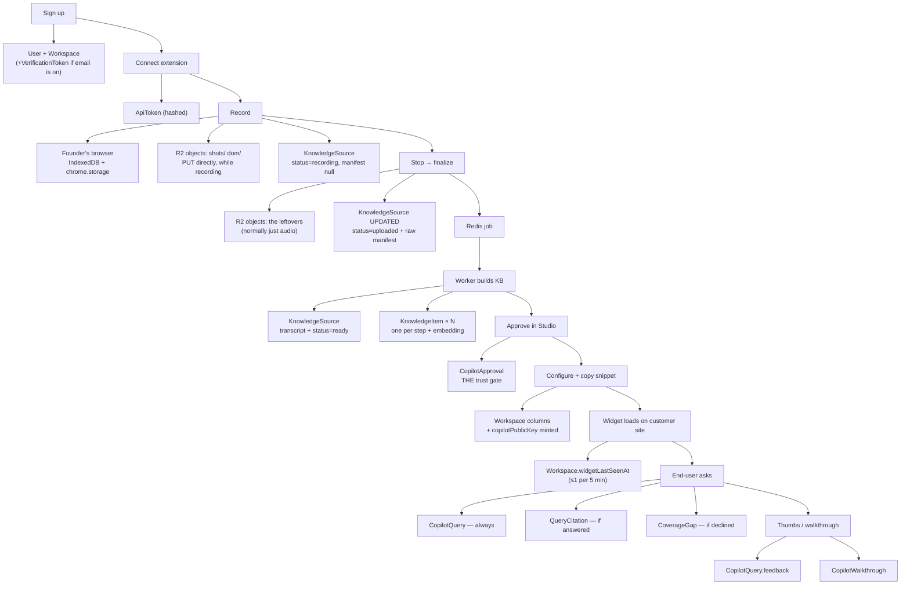

# The data journey — what we store, when, and where

> **What this doc is.** A **step-by-step walk through the whole product**, from a founder signing up
> to an end-user asking the embedded copilot a question — and at every step: *what data gets written,
> at what exact moment, and into which table.* Plain language, no jargon.
>
> **How it differs from its neighbour.** [`data-model-and-storage.md`](data-model-and-storage.md)
> describes the schema **by concern** (here are the auth tables, here are the KB tables). This doc
> describes it **by moment in time** — walk the journey and watch rows appear. Same facts, opposite axis.
>
> *Verified against the code on 2026-07-28 (branch `dev`). If a detail here disagrees with the source,
> the source wins.*

---

## 0. First, the five places data can live

Before the journey, know the shelves. Only two of them are ours; three are on somebody's laptop.

| # | Where | What it holds | Who writes it | Lifetime |
|---|---|---|---|---|
| **1** | **Postgres** (13 tables) | Every queryable fact: accounts, workspaces, recordings, knowledge steps, approvals, questions, analytics | Studio, Ingestion API, worker | **Permanent** until deleted |
| **2** | **Object storage** (MinIO local / Cloudflare R2 prod) | The heavy bytes of a recording: screenshots, page HTML snapshots, the audio file | **The recorder directly** (presigned PUT — screenshots and page snapshots while recording, the audio at Stop) + the Ingestion API (only what never got through) | **Permanent** until the recording is deleted — *except* a recording that was never finished, which is cleaned up (§5) |
| **3** | **Redis** | One job message: *"go build the KB for recording X"* | Ingestion API | **Seconds** — consumed and gone |
| **4** | **The founder's Chrome** (extension storage + IndexedDB) | A recording *in progress*, before it's uploaded | The recorder extension | Until upload succeeds |
| **5** | **The end-user's browser tab** (`sessionStorage`) | The open chat thread + any live walkthrough | The widget | **30 minutes**, and gone when the tab closes |

**The rule of thumb:** Postgres holds anything we need to *query*. Object storage holds anything
*big*. Neither Redis nor either browser store is a source of truth — losing any of the three loses at
most one in-flight action.

---

## 1. Sign up → **2 tables written**

The founder fills in email + password at `/signup`.

**One database call creates two rows** ([`web/lib/workspace.ts:28`](../../packages/web/lib/workspace.ts#L28)):

| Table | What's stored | Notes |
|---|---|---|
| **`User`** | `email`, `passwordHash`, `emailVerified`, `createdAt` | The password is **bcrypt-hashed** — the plaintext is never stored, not even briefly. |
| **`Workspace`** | `name` (`"himanshu's workspace"`), `slug` (`himanshu-a4f2q`), `ownerId`, **plus ~18 default settings** | Auto-created — one user = one workspace. The founder never chooses to make one. |

**The settings that get baked in at this moment** (nobody set them — these are the column defaults, and
they decide what the copilot *is* before the founder has touched anything):

| Column | Default | Means |
|---|---|---|
| `copilotMode` | `"copilot"` | **The workspace arrives as a read-only agent**, not a simple chatbot (changed 2026-07-27) |
| `senseEnabled` | `true` | The copilot may figure out where the user is on the page |
| `copilotShowMe` | `true` | It may highlight things on the page |
| `copilotWalkthrough` | `true` | It may offer a guided step-by-step |
| `reasonEnabled` / `reasonImageEnabled` | `true` / `true` | It may diagnose from page state, and may look at a rendered page image |
| `reasonIncludeValues` | `false` | …but typed-in field values stay masked |
| `copilotShowCitations` | `true` | Show "Source: <workflow>" under answers |
| `copilotAllowedOrigins` | `[]` (empty) | No domain lock yet — any site can use the key until the founder sets one |
| `copilotPublicKey` | **`null`** | **Not minted yet** — see step 6 |

**Also written, but only if email sending is switched on** (`RESEND_API_KEY` present):

| Table | What's stored |
|---|---|
| **`VerificationToken`** | `identifier` = `"verify:email@x.com"`, `token` = **SHA-256 of** the emailed token, `expires` = +24h |

If email sending is *off* (local dev), no token row exists — `emailVerified` is stamped immediately
at signup instead.

---

## 2. Verify email / reset password → **1 table touched, 1 row deleted**

| Action | What happens |
|---|---|
| Clicking the verify link | Look up the hashed token → **delete the `VerificationToken` row** (single use) → set `User.emailVerified` |
| "Forgot password" | **New `VerificationToken`** row, `identifier` = `"reset:email@x.com"`, expires in **1 hour** |
| Setting the new password | Token row deleted, `User.passwordHash` updated, and `emailVerified` stamped too (proving inbox control counts as verification) |

Only the **hash** of the emailed token is ever in the database. The real token exists only inside the
email link — a database leak hands an attacker nothing usable.

---

## 3. Sign in → **nothing is written**

This surprises people, so it's worth stating plainly:

**Signing in writes zero database rows.** FlowBuddy uses **JWT sessions** — the login proof is a
signed cookie in the browser, not a row on our side ([`web/auth.ts`](../../packages/web/auth.ts)).

Consequences worth knowing:

- The **`Session`** and **`Account`** tables exist in the schema (they ship with Auth.js) but **are
  never written to**. They're empty in every environment.
- There is no "active sessions" list and no server-side logout — signing out just drops the cookie.
- Failed-login throttling is **in memory** in the web process, not in the database. A restart clears it.

---

## 4. Connect the recorder extension → **1 row per click**

The founder opens Studio → `/connect` and clicks **Connect**
([`web/lib/connect-actions.ts:29`](../../packages/web/lib/connect-actions.ts#L29)).

| Table | What's stored |
|---|---|
| **`ApiToken`** | `workspaceId`, `hashedToken` (**SHA-256 of** `sync_<48 hex chars>`), `label` = `"FlowBuddy Recorder extension"` |

The **plaintext token is returned once** to the page, handed to the extension, and never stored on our
side. The extension keeps it in `chrome.storage.local`.

⚠️ **Two things to know here:**
1. **Every click mints a new row.** Old tokens are never revoked or deleted — connecting three times
   leaves three valid tokens on the workspace. There is no UI to list or revoke them.
2. The token prefix is still `sync_` — a leftover from the pre-FlowBuddy name. Cosmetic, but visible
   to any founder who looks at their token.

---

## 5. Recording a workflow → **a row + artifacts start landing while you record**

While the founder records, most of the recording is **already on its way to us**. After every captured
step the recorder asks the API to sign short-lived (900 s) PUT URLs (`POST /v1/uploads/sign`) and
pushes that step's screenshot + page HTML **straight to object storage** — the API never touches those
bytes. The first signing call also creates the recording's row in Postgres with `status: "recording"`,
so Studio shows the capture while it is still being made. Everything is still buffered in Chrome as
well, and anything storage never confirmed simply rides the Stop bundle exactly as it used to:

| Browser store | What's in it |
|---|---|
| `chrome.storage.local` | The API token, the backend URL, connected email/org, the recorder `phase`, a coarse upload marker (in flight / accepted — there is no percentage any more), last upload result |
| `chrome.storage.session` | The active recording's live state |
| **IndexedDB** (`flowbuddy-recorder`) | **The recording itself** — every captured event, every screenshot, every page HTML snapshot, the audio. Buffered here so a crash or a tab close doesn't lose the session. |

**What gets captured per user action** ([`shared/src/capture.ts`](../../packages/shared/src/capture.ts)):
the event type (click/input/submit/nav/scroll/hover), a timestamp, the target element's
role/name/text/tag/attributes + a **ranked list of ways to find it again** (test-id → id → aria →
name → placeholder → text → css → xpath), its on-screen box, the page URL/path/title, a JPEG
screenshot, and a snapshot of the page HTML (scripts and styles stripped, capped at 400 KB).

**The first privacy line is here, before anything leaves the browser:** typed values in password
fields, fields matching sensitive patterns, and anything the host app marks `data-flowbuddy-redact`
are replaced with `••••••` at capture time
([`extension/src/content.ts:428`](../../packages/extension/src/content.ts#L428)).

**What if the recording is never finished?** Writing before Stop means a row and its objects can
outlive a capture nobody wanted, so both are removed again. The recorder asks the server to **discard**
them (`DELETE /v1/uploads/:uploadId`) whenever a capture is thrown away — "Start fresh", or simply
starting a new recording while an old unsent one is still buffered. Anything that never gets that call
(browser closed for good) is caught by a **server-side sweep of `recording` rows idle more than 12
hours**, which runs fire-and-forget whenever some other recording in the workspace finalizes. The
threshold is deliberately generous: a *paused* capture looks identical from the server's side, and a
false positive costs only a re-upload — the recorder's local buffer is never cleared until an upload
actually succeeds. Only rows still at `status: "recording"` are eligible; once a recording finalizes,
deleting it is the founder's decision in Studio.

---

## 6. Stop → finalize → **3 stores written, in this order**

The founder hits stop. The extension does one last artifact flush — **which now includes the narration
audio**, over the same signed-URL path as everything else — then POSTs to `/v1/sessions`
([`api/src/server.ts`](../../packages/api/src/server.ts)) **only what storage has not already
confirmed**, which on a healthy connection is **nothing: the manifest and no files at all**. It
carries the recording's stable identity in an `X-FlowBuddy-Upload-Id` header (the request is rejected
with `400` without it), and that header is what makes a retry land on the same recording instead of
creating a second one. The old all-in-one multipart bundle still works and is still the fallback: a
browser that can't reach object storage directly sends every artifact here, exactly as before.

**Order matters** — each step only happens if the one before it succeeded:

| # | Store | What's written |
|---|---|---|
| 1 | **Object storage** | Whatever did **not** already upload directly — normally nothing — **streamed** (never held in memory) under the key `workspaces/<workspaceId>/sessions/<sessionId>/…`. Caps: 300 MB per file, 500 MB per finalize request; note these caps cover only the leftovers, not the artifacts that came in over signed URLs. |
| 2 | **`KnowledgeSource`** (table name in the DB is still `RecSession`) | The row already exists (created at the first signed artifact with `uploadId`, `status: "recording"`, `manifest: null`). Finalize **updates** it: `status: "uploaded"`, `appBaseUrl`, `error: null`, and **`manifest`** — the entire raw capture JSON: every event, every target fingerprint, every file reference, the markers, the browser/viewport metadata |
| 3 | **Redis** | One BullMQ job: `{ sessionId, workspaceId }` — **best-effort**, given 5 seconds and then stepped over. The recording is already safe in the two stores above, so an unreachable Redis must not turn a delivered recording into a failed upload; the job is recovered from Studio's "Stalled → Re-process". |

**If finalize fails, nothing is deleted** — and that reversal is deliberate. Artifacts uploaded during
recording live under that prefix and the recorder cannot re-send them, so wiping the prefix on a bad
manifest would destroy the recording. The retry re-uses the same `uploadId`, overwrites the same keys,
and updates the same row.

📌 **The `manifest` column is the biggest single thing we store, and it is permanent.** It holds the
complete raw capture forever — not just what the KB later distills from it. That's deliberate (it's
what makes re-processing possible, and it's the raw material Phase 3 replay and the acting agent will
need), but it means a recording's full event trail lives in Postgres indefinitely.

---

## 7. The worker builds the knowledge base → **2 tables, 4 writes**

The worker picks up the job ([`api/src/worker.ts`](../../packages/api/src/worker.ts)) and runs:
transcribe the audio → align narration to events → clean → segment into workflows → distill each step.

The writes, in order:

| # | When | Table | What's written |
|---|---|---|---|
| 1 | Immediately on pickup | `KnowledgeSource` | `status: "processing"` |
| 2 | After transcription | `KnowledgeSource` | **`transcript`** — the full narration text + timed segments (**PII-scrubbed** first) |
| 3 | After distillation | `KnowledgeItem` | **Delete every existing row for this recording, then insert the fresh ones** |
| 4 | After embedding | `KnowledgeItem.embedding` | A 1536-dimension vector per row, written via raw SQL |
| 5 | Finally | `KnowledgeSource` | `status: "ready"` (+ an `error` string if the build was *degraded* but succeeded) |

**One `KnowledgeItem` row = one step of one workflow:**

| Column | Holds |
|---|---|
| `segmentIndex` / `segmentTitle` | **Which workflow** this step belongs to, and its name |
| `orderIndex` | The step's position *within* that workflow |
| `text` | The searchable blob: instruction + detail + narration, folded into one string |
| `data` | The step itself: `{ instruction, detail, route, narration, screenshotFile, bbox }` |
| `embedding` | The vector for semantic search (nullable — a failed embed just means keyword-only) |

**The second privacy line is here.** Before this text is stored, `redactText` scrubs high-confidence
structured PII — emails, US SSNs, Luhn-valid card numbers, phone numbers — replacing them with typed
placeholders like `[redacted-email]` ([`synthesis/src/redact.ts`](../../packages/synthesis/src/redact.ts)).
Prices, dates, order IDs and version numbers are deliberately left alone.

⚠️ **What is *not* scrubbed:** the screenshots and the DOM HTML in object storage. Those are raw. If
the founder's product showed a real customer's email on screen during recording, that pixel and that
HTML are stored as-is. (Screenshot/DOM redaction is a known deferred item.)

**Two behaviours worth internalising:**
- **Re-processing is destructive and idempotent.** Step 3 deletes and recreates. Anything attached to
  a *step row* would be lost on every reprocess — which is exactly why approval is **not** stored on
  the step (see next section).
- **A degraded build still lands `ready`.** If transcription or embedding failed, the recording is
  usable and the reason goes in the `error` column as a *notice*, not a failure.

---

## 8. Review and approve in Studio → **1 tiny table, and it's the whole trust model**

The founder browses the built workflows and flips **Approve**
([`web/lib/copilot-actions.ts:30`](../../packages/web/lib/copilot-actions.ts#L30)).

| Table | What's stored |
|---|---|
| **`CopilotApproval`** | `workspaceId`, `sourceId`, `segmentIndex`, `segmentTitle` (a snapshot at approval time), `approvedById`, `createdAt` |

**This is the single most important row in the product.** Four things about it:

1. **Absence = not approved.** There is no `approved: false`. Un-approving **deletes** the row.
2. **It is keyed by `(recording, workflow)` — not by step.** That's why it survives the delete-and-
   recreate of step 7. A founder's approvals don't evaporate when they reprocess a recording.
3. **Every read path filters through it.** Retrieval, the sense plan, walkthrough logging — all of
   them re-check approval server-side. Nothing the browser claims is trusted.
4. **The stored `segmentTitle` is the display truth.** When the widget sends a workflow title over the
   wire, the server ignores it and uses this snapshot instead.

**Other Studio actions on this screen:**

| Action | Table | What changes |
|---|---|---|
| Rename a recording | `KnowledgeSource` | `title` (capped at 120 chars; empty clears it) |
| Re-process | `KnowledgeSource` | `status → "uploaded"`, `error → null`, then a new Redis job |
| Delete a recording | Object storage **first**, then `KnowledgeSource` | The row delete **cascades** to all its `KnowledgeItem` and `CopilotApproval` rows |

---

## 9. Configure the copilot → **all `Workspace` columns, no new tables**

Every switch on Copilot → Settings updates one column on the existing `Workspace` row
([`web/lib/copilot-settings-actions.ts`](../../packages/web/lib/copilot-settings-actions.ts)):

| What the founder does | Column written |
|---|---|
| **First visit to the Copilot page** | **`copilotPublicKey` = `pk_<48 hex>`** — minted lazily, on read, the first time the page is opened |
| Pick an operating mode | `copilotMode` (`chatbot` \| `copilot` \| `agent`) |
| Lock the embed to their domains | `copilotAllowedOrigins` (string array; empty = allow any) |
| Change colours/title/greeting/position/launcher | `copilotAccent`, `copilotTitle`, `copilotGreeting`, `copilotPosition`, `copilotLauncherStyle`, `copilotLauncherText` |
| Toggle citations | `copilotShowCitations` |
| The five ability switches | `senseEnabled`, `copilotShowMe`, `copilotWalkthrough`, `reasonEnabled`, `reasonImageEnabled`, `reasonIncludeValues` |
| Regenerate the key | `copilotPublicKey` (overwritten — every existing embed breaks instantly) |

**The two keys, side by side** — the contrast *is* the security model:

| | Recorder token | Embed key |
|---|---|---|
| Looks like | `sync_<48 hex>` | `pk_<48 hex>` |
| Stored as | **SHA-256 hash**, in `ApiToken` | **Plaintext**, on `Workspace` |
| Why | Secret — it can upload data | Public — it's meant to sit in a customer's page source |
| Guarded by | Being unguessable | The origin allowlist + rate limits + the approval gate |

---

## 10. Drop the `<script>` on the customer's site → **still nothing written**

Copying the snippet writes nothing. The snippet carries only three things: the script src, the API
URL, and the public key. **Appearance is never baked into it** — the widget fetches that live, so a
Studio change reaches every embed without customers re-copying anything.

---

## 11. The widget loads on a real page → **1 column, throttled**

On mount the widget makes read-only calls (`GET /v1/copilot/config`, `GET /v1/copilot/sense-plan`) and
one write ping (`POST /v1/copilot/seen`):

| Table | What's written | When |
|---|---|---|
| **`Workspace`** | `widgetLastSeenAt`, `widgetLastSeenOrigin` | **At most once per 5 minutes per key** — the throttle is in memory in the API process |

This is what powers "Copilot is live" in Studio. It's also stamped by any answered question, so a
privacy blocker eating the ping doesn't make a live copilot look dead.

**Server-side caches that are *not* stored:** the compiled sense plan is held in memory per workspace
for **60 seconds** (which is why an approval flip takes up to a minute to reach the widget), and the
rate-limit buckets are in-memory too.

---

## 12. An end-user asks a question → **the busiest moment in the system**

`POST /v1/copilot/answer` ([`api/src/server.ts:546`](../../packages/api/src/server.ts#L546)).

**What the widget *sends* us (and what happens to it):**

| Sent | Stored? |
|---|---|
| The question text | ✅ **Yes** — `CopilotQuery.question` |
| The page path (e.g. `/settings`) | ✅ Yes — `CopilotQuery.contextPath`, capped at 512 chars |
| Where it thinks the user is (workflow + step guesses) | ⚠️ **Partly** — the *outcome* is stored, the raw guesses are not |
| The previous answer's cited workflows | ❌ No — used to bias retrieval, then discarded |
| The chat history | ❌ **No** — used in the prompt, never persisted server-side |
| Page state for diagnosis (masked field structure) | ❌ **No** — only a *flag* saying diagnosis ran |
| A rendered image of the page | ❌ **No** — only a `true`/`false` that one rode along |

**What gets written, in order:**

| # | Table | When | What |
|---|---|---|---|
| 1 | `Workspace` | Every answer | The `widgetLastSeenAt` heartbeat (same 5-min throttle) |
| 2 | **`CopilotQuery`** | Always (one row per question) | See the breakdown below |
| 3 | **`QueryCitation`** | Only on a grounded answer | **One row per cited workflow** — `sourceId`, `segmentIndex`, `segmentTitle` snapshot. Created in the same call, nested under the query. |
| 4 | **`CoverageGap`** | Only on a decline | `prompt` = the question, `reason` = why it declined, `source: "copilot"`, `status: "open"` — **deduped**: if an open gap with the identical question exists, no new row |

**Inside one `CopilotQuery` row:**

| Column | Holds |
|---|---|
| `question` | The end-user's raw question |
| `answered` | `true` = grounded answer given, `false` = declined |
| `contextPath` | The page they were on |
| `feedback` | `null` for now — filled in by step 13 |
| `senseSourceId` / `senseSegmentIndex` / `senseStep` / `senseConfidence` | **Where we located the user** — workflow, step number, confidence |
| `senseUsed` | `used` (the answer was about that position) \| `ignored` (we located them, answered about something else) \| `none` (we looked, found nothing) \| `null` (never looked) |
| `reasonTrigger` | Why diagnosis fired: `intent` (they used diagnostic words) \| `blocked` (the step's button was disabled) \| `escalation` (the fast path declined, the widget retried with evidence) |
| `reasonImage` | Whether a page image rode along |

**Three behaviours that trip people up:**

1. **The Studio preview writes nothing.** A founder testing their own copilot sends `preview: true` —
   same engine, same answer, but **zero** analytics writes and no `queryId` (so no thumbs).
2. **An escalation writes nothing on the first pass.** When the fast path declines and the widget is
   about to retry with page evidence, we return `escalate: true` and log *nothing* — the retry logs
   the real outcome, so one question never becomes two rows or a phantom coverage gap.
3. **"No approved content at all" is logged as a decline but not as a gap.** An un-provisioned copilot
   isn't a knowledge gap, so `CopilotQuery` gets a row and `CoverageGap` doesn't.

**In the end-user's browser**, meanwhile: the conversation is written to `sessionStorage` so it
survives a full-page navigation — **max 20 messages, 30-minute TTL, tab-scoped, gone when the tab
closes** ([`widget/src/session.ts`](../../packages/widget/src/session.ts)). An **allowlist of message
kinds** decides what may be persisted; anything not on the list (future sensitive-value messages) is
never written, by construction.

---

## 13. Thumbs up / down → **1 column**

| Table | What's written |
|---|---|
| **`CopilotQuery`** | `feedback` = `"up"` \| `"down"`, on the row named by `queryId` |

The update is scoped to the workspace, so a spoofed ID from another tenant matches nothing.

---

## 14. "Walk me through it" → **1 row per run, updated as they go**

`POST /v1/copilot/walkthrough` — one **`CopilotWalkthrough`** row per *run* (not per question).

| Event | What's written |
|---|---|
| `started` | **The workflow key is checked against `CopilotApproval` first** — unapproved = 404, nothing logged. Then: `sourceId`, `segmentIndex`, `segmentTitle` (from the approval snapshot, never the wire), `queryId` (only if it names *this* workspace's query), `startStep`, `totalSteps`, `lastStep` |
| `step_advanced` | `lastStep` bumped, and **`autoAdvances` or `manualAdvances` incremented** — the split measures how good our automatic progress detection is |
| `completed` / `aborted` | `outcome` set |
| `stalled` | `outcome: "stalled"` + `stalledAtStep` (and advancing past it flips back to `active` — a recovery, not a terminal state) |

**A run left `active` past the 30-minute browser TTL reads as abandoned.** There's no sweeper job by
design — "still active and old" *is* the abandoned signal.

---

## 15. The founder reads Analytics → **nothing written, and this is the payoff**

Everything in step 12 exists **for this moment**. Storing the questions isn't bookkeeping — *"what are
my users actually stuck on?"* is one of the things the founder is buying. Analytics is entirely reads
over `CopilotQuery`, `QueryCitation`, `CoverageGap`, and `CopilotWalkthrough`. The one write:
dismissing a gap sets `CoverageGap.status = "resolved"` (the row is kept, never deleted).

**What the founder actually sees, and which stored data it comes from:**

| Where in Studio | What it shows | Reads |
|---|---|---|
| **Home** | The **last 5 questions**, verbatim, answered or not | `CopilotQuery` |
| **Copilot** tab | The **last 8 questions**, verbatim | `CopilotQuery` |
| **Analytics → Questions** (`/dashboard/analytics/questions`) | **The full log** — every question ever asked, newest first: search (question text *or* page path), filter (all / answered / declined / 👍 / 👎), range incl. **all time**, 25 per page. Each row shows the question, answered-or-declined, the workflows it cited, the page, the thumbs, and when. | `CopilotQuery` + `QueryCitation` |
| **Analytics** → *Questions & answer rate* | Answered vs declined per day over 7/30/90 days | `CopilotQuery.answered` + `createdAt` |
| **Analytics** → *Resolved without a human* | "≈ N questions your team didn't have to touch" | `CopilotQuery.answered` |
| **Analytics** → **Coverage gaps — record this next** | Unanswered questions **ranked by how often they were asked** ("asked 14×"), with the copilot's reason for declining, and a dismiss button | `CoverageGap` joined to a count of matching declined `CopilotQuery` rows |
| **Analytics** → *Recent declines* | The last 5 questions we couldn't answer **+ the page they were asked on** | `CopilotQuery` where `answered = false` |
| **Analytics** → **Where users get stuck** | Ranked *(workflow, step)* pairs — the exact step people ask for help at, with that step's instruction | `CopilotQuery.senseSourceId/senseSegmentIndex/senseStep` where `senseUsed = 'used'` |
| **Analytics** → *Top workflows by citations* | Which approved recordings are carrying the answers | `QueryCitation` grouped by workflow |
| **KB** → a workflow's detail page | That workflow's all-time cited count, last-cited date, and 👍/👎 tally | `QueryCitation` + the parent query's `feedback` |

**The two "record this next" signals are the product's feedback loop**, and they're different questions:

- **Coverage gaps** = *"you have no content for this at all"* → go record it.
- **Where users get stuck** = *"you have content, and people still need help at step 4"* → that step
  is unclear, or the product is.

**Still not surfaced:** there's no CSV/API export — the log is a reading surface only. Deliberate for
now (built 2026-07-27); the in-UI search was the actual need.

**Fixed 2026-07-27 — `QueryCitation` used to count one row per cited STEP, not per workflow.** The
answer engine dedupes citations by `KnowledgeItem` id (right for grounding — an answer built from
six steps legitimately cites six items), and that list was persisted one-to-one, so **six rows all
named the same workflow**. Every reader counted rows, so *"Top workflows by citations"* ranked
workflows by **how many steps they have rather than how often they were used**, and one 👍 on a
six-step answer added **six** to that workflow's helpful score. The end-user never saw it — the
widget dedupes citation titles before rendering the "Source" pill, which is why it survived.

The fix has two halves, because a writer fix alone would leave every existing row wrong:
- **Writer** (`api` `citationRows`) collapses to one row per `(sourceId, segmentIndex)`, so the
  stored shape finally matches this table's own schema comment.
- **Readers** (`web/lib/analytics.ts`) count **distinct `queryId`**, not rows — which is the metric
  the cards actually mean ("how many questions did this workflow answer?") and is correct for the
  old duplicated rows and the new clean ones alike. **No backfill, nothing deleted.** On the dev
  workspace this took the count from an inflated **43 → 11**, matching the real question count.

> **If you add a reader of `QueryCitation`: count distinct questions, not rows.**

---

## 16. The whole thing on one page

---

## 17. Cheat sheet — every table, one line each

| Table | Written when | Written by | Rows per… |
|---|---|---|---|
| **`User`** | Sign up; password reset; email verify | Studio | 1 per person |
| **`Workspace`** | Sign up (auto); every settings change; widget heartbeat | Studio + API | 1 per person |
| **`Account`** | **Never** | — | Always empty (JWT sessions) |
| **`Session`** | **Never** | — | Always empty (JWT sessions) |
| **`VerificationToken`** | Verify-email + password-reset requests | Studio | 1 per pending request, deleted on use |
| **`ApiToken`** | Every click of "Connect extension" | Studio | 1 per click (never revoked) |
| **`KnowledgeSource`** | Upload; then 4 status updates during the build; rename/reprocess | API + worker | 1 per recording |
| **`KnowledgeItem`** | KB build — **wiped and recreated** every process | Worker | 1 per step of every workflow |
| **`CopilotApproval`** | Founder approves (deleted on un-approve) | Studio | 1 per approved workflow |
| **`CopilotQuery`** | Every end-user question (except Studio preview) | API | 1 per question |
| **`QueryCitation`** | Alongside a grounded answer | API | 1 per cited workflow per answer |
| **`CoverageGap`** | A decline (deduped) or a Studio prompt-to-article miss | API + Studio | 1 per distinct unanswered question |
| **`CopilotWalkthrough`** | A guided run starts, then updated per step | API | 1 per run |

---

## 18. What we deliberately **don't** store

Worth knowing as clearly as what we do:

| Not stored | Where it exists instead |
|---|---|
| Plaintext passwords | Only bcrypt hashes |
| Plaintext recorder tokens | Only SHA-256 hashes; the real one lives in the founder's extension |
| Plaintext email verify/reset tokens | Only SHA-256 hashes; the real one lives in the email |
| Login sessions | A signed JWT cookie in the browser |
| The end-user's chat history | Their own tab's `sessionStorage`, 30 min, then gone |
| The diagnostic page-state capture | Sent at ask time, used in the prompt, dropped — only a trigger label survives |
| The rendered page image | Same — only a `true`/`false` survives |
| Sensitive typed values from recordings | Masked to `••••••` in the founder's browser before upload |
| Rate-limit counters, heartbeat throttles, sense-plan cache | In memory in the API process; reset on restart |

---

## 19. Known gaps in what we store

Three, in the order they'd bite:

1. ~~**`CopilotQuery.question` is stored raw.**~~ **Fixed 2026-07-27.** *Storing the question is the
   feature* (§15) — the gap was that it was the **only text path with no PII scrub**. The question
   now goes through the same `redactText` as KB text and narration before being written to
   `CopilotQuery.question` **and** `CoverageGap.prompt`, so
   *"card 4242 4242 4242 4242 declined, order #A-9931, mail me@corp.com"* stores as
   *"card [redacted-card] declined, order #A-9931, mail [redacted-email]"* — the order id, prices and
   dates survive, because `redactText` is high-precision by design.
   **Storage only:** retrieval and the model still see the raw question, so answer quality is
   unchanged. **Not backfilled** — rows written before this keep their original text. One knock-on:
   a repeat of a PII-bearing question no longer matches its pre-fix `CoverageGap` row, so it opens a
   second gap once; self-corrects thereafter.
   **Residual limit:** the phone pattern needs a 3-digit area group, so international formats like
   `+91 98765-43210` are *not* caught — deliberate (false-negatives over false-positives), but real.

2. **`CopilotQuery` records nothing about *how* the answer was produced.** No mode, no round count, no
   tool calls. So the founder can't see which mode is actually serving their users, and the question
   "is the simple chatbot mode still worth keeping?" **cannot be measured** with the data we have.

3. **Screenshots and DOM snapshots in object storage are unredacted.** The masking ladder covers typed
   values and text, not pixels or raw HTML. A recording made against real customer data stores that
   data as-is.

One more, from direct artifact upload: **signed PUT URLs carry no size ceiling** —
`MAX_BUNDLE_BYTES` bounds only the finalize request, so the artifact path is limited by nothing but
the 900 s URL lifetime and the allowlisted key. **Deferred by decision** (2026-07-28); the reasoning
and the eventual fix live in [`../roadmap.md`](../roadmap.md) §9.
*(Its sibling — abandoned recordings piling up as orphaned rows and objects — is **closed**: they are
discarded explicitly, and swept after 12 hours. See §5.)*

Plus the two older ones: **recorder tokens accumulate and can't be revoked** (§4), and **the raw
`manifest` is kept forever** (§6) — intentional, but it's the largest permanent per-recording payload
we hold.

---

*Sibling docs: [`data-model-and-storage.md`](data-model-and-storage.md) for the schema by concern ·
[`connections.md`](connections.md) for the end-to-end wiring and the three identities ·
[`../e2e-testing.md`](../e2e-testing.md) to walk this journey by hand.*
