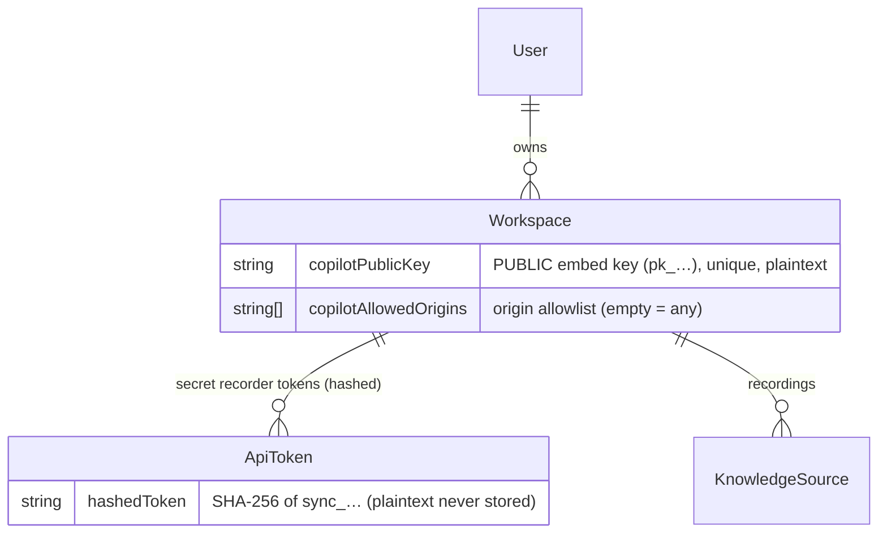
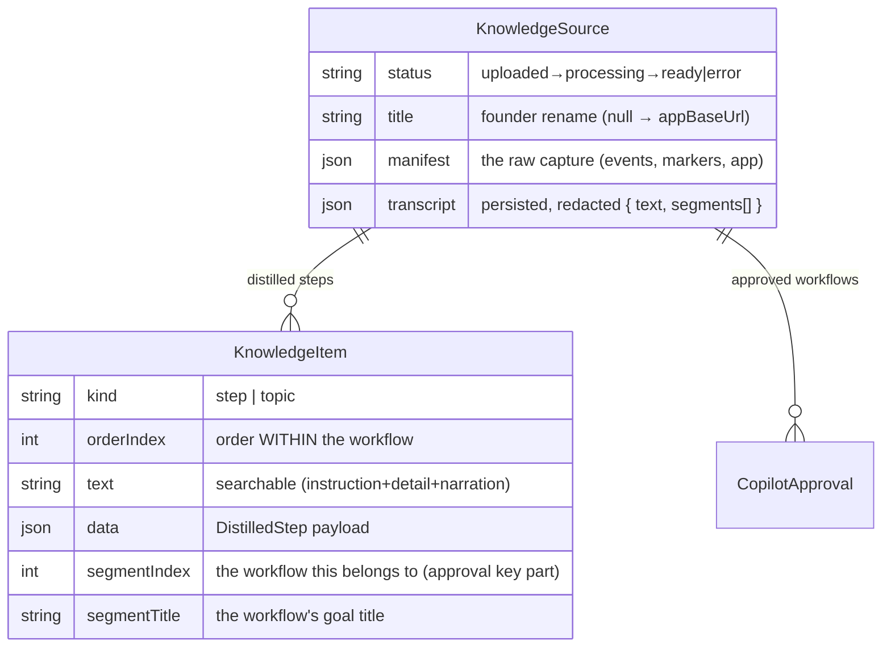

# Data model & storage — internals

> **Module:** the shared substrate — Postgres ([`packages/db/`](../../packages/db/)), object storage,
> and Redis — that **every other module** reads and writes. **Role:** the connective tissue. The
> [Studio](studio.md), [Ingestion API](ingestion-api.md), [worker](knowledge-base.md), and
> [copilot](copilot.md) coordinate *entirely* through these rows, objects, and queue messages — there
> are no other shared in-memory channels.

---

## 1. The three stores

| Store | Tech | Holds | Written by | Read by |
|---|---|---|---|---|
| **Postgres** | Prisma client ([`schema.prisma`](../../packages/db/prisma/schema.prisma)) | All structured state: tenants, tokens, sources, KB items, approvals, queries, gaps | API, worker, Studio | everyone |
| **Object storage** | S3-compatible — **MinIO** (dev) / **Cloudflare R2** (prod) | Heavy binaries: screenshots, DOM snapshots, audio | API (on upload) | worker (`ArtifactReader`) |
| **Redis** | BullMQ | The `synthesis` job queue (ephemeral) | API (producer) | worker (consumer) |

The split is deliberate: **Postgres for queryable truth, object storage for bulk bytes, Redis for the
async hand-off.** Postgres stores the manifest *JSON* but never the binaries it references.

---

## 2. The Postgres schema (by concern)

Full definitions in [`schema.prisma`](../../packages/db/prisma/schema.prisma). Grouped by what they're
for:

### 2.1 Auth.js (NextAuth) core

`User`, `Account`, `Session`, `VerificationToken` — standard NextAuth tables. `User.passwordHash`
backs the credentials provider. Used only by [Studio](studio.md).

### 2.2 Tenancy & keys



- **`Workspace`** is the tenant. It carries the two copilot-embed fields (`copilotPublicKey`,
  `copilotAllowedOrigins`) *and* owns the recorder tokens — i.e. **both API keys hang off the
  workspace**, which is how every credential resolves to a tenant ([connections.md](connections.md) §7).
- **`ApiToken`** stores only the **hash** of the secret recorder token; the public embed key is a
  plaintext column on `Workspace` (it's meant to be visible). The contrast is the whole security model
  in one schema diff.

### 2.3 Capture & Knowledge Base



- **`KnowledgeSource`** = one recording. The Prisma model is `KnowledgeSource` but the **table is kept
  as `RecSession`** via `@@map` so historical data survives the rename. `manifest` is the whole raw
  capture; `transcript` is added by the worker; `status` is the lifecycle state machine; `title` is the
  founder's optional rename (null falls back to `appBaseUrl`), settable from the Recordings page.
- **`KnowledgeItem`** = one **distilled step**. `data` holds the
  [`DistilledStep`](../../packages/synthesis/src/distill.ts)
  (`instruction, detail, route, narration, screenshotFile, bbox`). `segmentIndex`/`segmentTitle` group
  items into workflows. The schema comment still mentions the old `{ event, narration }` shape — that's
  the **legacy pre-distillation** shape (old rows only); the live worker writes the distilled shape. Indexed on `workspaceId` and
  `sourceId`.

### 2.4 Copilot — gate, analytics, gaps

| Table | Purpose | Key detail |
|---|---|---|
| **`CopilotApproval`** | The trust gate — one row = one approved workflow. | **`@@unique([sourceId, segmentIndex])`** — keyed by the workflow *coordinate*, not item ids, so it **survives the worker's delete+recreate of items**. Absence = not approved. |
| **`CopilotQuery`** | Every end-user question (analytics + feedback target). | `answered` (covered vs. declined), `feedback` (`up`/`down`/null); P2 added the `sense*` localization-outcome columns + `reasonTrigger`/`reasonImage`. |
| **`CopilotWalkthrough`** (P4-M0, 2026-07-15) | One row per guided-walkthrough RUN (a session, not a query; optional `queryId` joins the originating question). | `startStep`/`lastStep`/`totalSteps`, `autoAdvances` (detection-confirmed Nexts) vs `manualAdvances` (override Nexts), `outcome` `active\|completed\|aborted\|stalled` (+`stalledAtStep`); `active` past the widget's 30-min session TTL reads as abandoned — no sweeper by design. |
| **`CoverageGap`** | A question the KB couldn't cover → "record this next". | `source` = `copilot` (live) or `prompt` (historical — written by the removed article path; old rows only); `status` `open`/`resolved`. |

### 2.5 Phase-2 articles — REMOVED (2026-07-07)

The `Article` + `Step` tables (the parked Phase-2 article model) were **dropped** with the
workflows-as-articles decision: Phase 2 will render **approved distilled workflows** as help
articles instead of maintaining a parallel article store. Decision + rebuild notes:
[`../phase-2-portal.md`](../phase-2-portal.md) §7.

---

## 3. The status state machine

`KnowledgeSource.status` is the single signal every surface uses to know where a recording is:

```
uploaded ──(worker picks up)──▶ processing ──(KB built)──▶ ready
   │                                 │
   └──────────────── error ◀─────────┘   (any thrown error, message in .error)
```

(`done` is a tolerated legacy value for pre-KB-layer rows.) Defined as `RecSessionStatus` in
[`@sync/shared/jobs.ts`](../../packages/shared/src/jobs.ts). `ready` means *KB built + segmented,
workflows available to approve* — there are no articles in the copilot-first product.

---

## 4. Object storage layout

One bucket (`sync-artifacts` by default). Keys are **workspace- and session-prefixed**:

```
workspaces/<workspaceId>/sessions/<sessionId>/<relative-path>
                                              ├── shots/<eventId>.jpg
                                              ├── shots/<eventId>-post.jpg
                                              ├── dom/<eventId>.html
                                              ├── dom/<eventId>-post.html
                                              └── audio.webm
```

- Written by the [API](ingestion-api.md) during upload (`putObject` + `sessionKey`), with the relative
  path **sanitized** (`..` stripped) before it becomes a key.
- Read by the [worker](knowledge-base.md) through an **`ArtifactReader`** —
  `sessionArtifactReader(ws, id)` returns a `(relPath) => Promise<Buffer|null>` bound to one session;
  a miss returns `null` (the pipeline tolerates missing artifacts).
- `screenshotFile` on a `DistilledStep` is a **relative path** (e.g. `shots/<id>.jpg`); resolving it to
  a URL/object means re-applying the `workspaces/<ws>/sessions/<id>/` prefix.

The workspace prefix is the storage-level expression of tenancy — one customer's bytes are never under
another's prefix.

---

## 5. Redis / the queue

A single BullMQ queue, name **`synthesis`** (`SYNTHESIS_QUEUE` in
[`@sync/shared/jobs.ts`](../../packages/shared/src/jobs.ts)). Job body:
`{ sessionId, workspaceId }` — pointers only ([connections.md](connections.md) Seam C). The
[API](ingestion-api.md) is the producer; the [worker](knowledge-base.md) is the consumer
(`concurrency: 2`). The connection is built from `REDIS_URL` (TLS auto-enabled for `rediss:`). Redis
holds **no durable app state** — only in-flight/queued jobs.

---

## 6. The three identities, in schema terms

| Identity | Column / table | Stored as | Resolves to |
|---|---|---|---|
| Recorder token (secret) | `ApiToken.hashedToken` | SHA-256 hash | `workspaceId` |
| Embed key (public) | `Workspace.copilotPublicKey` | plaintext, unique | `workspaceId` |
| Studio session | `Session` / `User` (NextAuth) | session token | `User` → owned `Workspace` |

All three converge on a `workspaceId`, which scopes every query. This is the whole tenancy model — see
[connections.md](connections.md) §7.

---

## 7. Migrations (the schema's history)

Prisma migrations in [`packages/db/prisma/migrations/`](../../packages/db/prisma/migrations/), in
order: `init` → `add_step_highlight` → `kb_layer` (the `KnowledgeSource`/`KnowledgeItem` split) →
`kb_item_segment` (segmentation tags) → `article_segment_link` → `coverage_gap` →
`copilot_approval` (the trust gate) → `copilot_embed_key` (public key + allowlist) →
`copilot_query` (analytics). Each migration name maps cleanly to a module milestone above.

Commands: `pnpm db:migrate` (apply), `pnpm db:generate` (regen client), `pnpm db:validate`,
`pnpm --filter @sync/db exec prisma studio` (browse). See [`../dev-setup.md`](../dev-setup.md).

---

## 8. Connections

- **Written by →** [Ingestion API](ingestion-api.md) (sources, artifacts, jobs),
  [worker](knowledge-base.md) (items, transcript, status), [Studio](studio.md) (tokens, keys,
  approvals), [copilot](copilot.md) (queries, gaps).
- **Read by →** all of them. This module *is* the wiring described in
  [connections.md](connections.md).
- **The two contracts that ride these stores →** the `SessionManifest`
  ([`shared/capture.ts`](../../packages/shared/src/capture.ts)) in `KnowledgeSource.manifest`, and the
  `DistilledStep` ([`synthesis/distill.ts`](../../packages/synthesis/src/distill.ts)) in
  `KnowledgeItem.data`.
