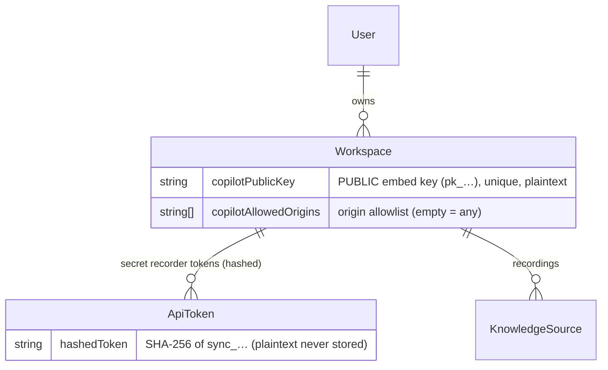
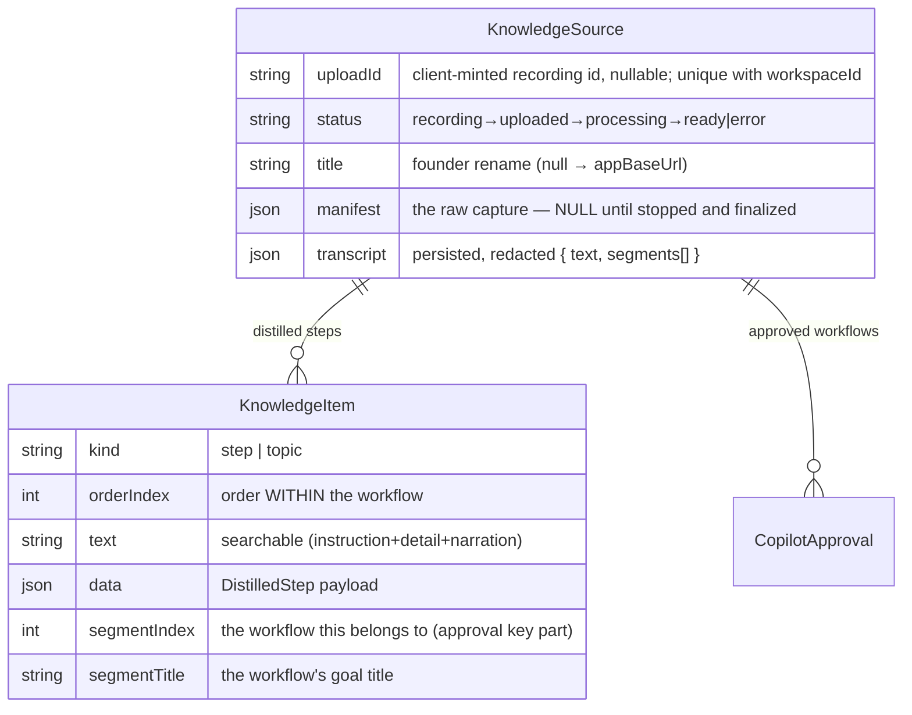

# Data model & storage — internals

> **Module:** the shared substrate — Postgres ([`packages/db/`](../../packages/db/)), object storage,
> and Redis — that **every other module** reads and writes. **Role:** the connective tissue. The
> [Studio](studio.md), [Ingestion API](ingestion-api.md), [worker](knowledge-base.md), and
> [copilot](copilot.md) coordinate *entirely* through these rows, objects, and queue messages — there
> are no other shared in-memory channels.

---

## 1. The three stores

| Store | Tech | Holds | Written by | Read by |
|---|---|---|---|---|
| **Postgres** | Prisma client ([`schema.prisma`](../../packages/db/prisma/schema.prisma)) | All structured state: tenants, tokens, sources, KB items, approvals, queries, gaps | API, worker, Studio | everyone |
| **Object storage** | S3-compatible — **MinIO** (dev) / **Cloudflare R2** (prod) | Heavy binaries: screenshots, DOM snapshots, audio | **Recorder** (directly, presigned PUT, during recording) + API (leftovers at finalize) | worker (`ArtifactReader`) |
| **Redis** | BullMQ | The `synthesis` job queue (ephemeral) | API (producer) | worker (consumer) |

The split is deliberate: **Postgres for queryable truth, object storage for bulk bytes, Redis for the
async hand-off.** Postgres stores the manifest *JSON* but never the binaries it references.

---

## 2. The Postgres schema (by concern)

Full definitions in [`schema.prisma`](../../packages/db/prisma/schema.prisma). Grouped by what they're
for:

### 2.1 Auth.js (NextAuth) core

`User`, `Account`, `Session`, `VerificationToken` — standard NextAuth tables. `User.passwordHash`
backs the credentials provider. Used only by [Studio](studio.md).

### 2.2 Tenancy & keys


```mermaid
erDiagram
    User ||--o{ Workspace : owns
    Workspace ||--o{ ApiToken : "secret recorder tokens (hashed)"
    Workspace ||--o{ KnowledgeSource : recordings
    Workspace {
        string copilotPublicKey "PUBLIC embed key (pk_…), unique, plaintext"
        string[] copilotAllowedOrigins "origin allowlist (empty = any)"
    }
    ApiToken {
        string hashedToken "SHA-256 of sync_… (plaintext never stored)"
    }
```

- **`Workspace`** is the tenant. It carries the two copilot-embed fields (`copilotPublicKey`,
  `copilotAllowedOrigins`) *and* owns the recorder tokens — i.e. **both API keys hang off the
  workspace**, which is how every credential resolves to a tenant ([connections.md](connections.md) §7).
- **`ApiToken`** stores only the **hash** of the secret recorder token; the public embed key is a
  plaintext column on `Workspace` (it's meant to be visible). The contrast is the whole security model
  in one schema diff.

### 2.3 Capture & Knowledge Base


```mermaid
erDiagram
    KnowledgeSource ||--o{ KnowledgeItem : "distilled steps"
    KnowledgeSource ||--o{ CopilotApproval : "approved workflows"
    KnowledgeSource {
        string uploadId "client-minted recording id, nullable; unique with workspaceId"
        string status "recording→uploaded→processing→ready|error"
        string title "founder rename (null → appBaseUrl)"
        json manifest "the raw capture — NULL until stopped and finalized"
        json transcript "persisted, redacted { text, segments[] }"
    }
    KnowledgeItem {
        string kind "step | topic"
        int orderIndex "order WITHIN the workflow"
        string text "searchable (instruction+detail+narration)"
        json data "DistilledStep payload"
        int segmentIndex "the workflow this belongs to (approval key part)"
        string segmentTitle "the workflow's goal title"
    }
```

- **`KnowledgeSource`** = one recording. The Prisma model is `KnowledgeSource` but the **table is kept
  as `RecSession`** via `@@map` so historical data survives the rename. `uploadId` is the
  **recorder's own id for the recording**, minted once when Record is pressed and stable across every
  retry; `@@unique([workspaceId, uploadId])` is what makes ingestion idempotent (nullable only so
  pre-existing rows stay valid, and scoped per workspace so a client-supplied value can never collide
  across tenants). `manifest` is the whole raw capture but is **nullable** — null while
  `status='recording'`, filled in when the recording is stopped and finalized;
  `transcript` is added by the worker; `status` is the lifecycle state machine; `title` is the
  founder's optional rename (null falls back to `appBaseUrl`), settable from the Recordings page.
- **`KnowledgeItem`** = one **distilled step**. `data` holds the
  [`DistilledStep`](../../packages/synthesis/src/distill.ts)
  (`instruction, detail, route, narration, screenshotFile, bbox` + `keyEventId` since 2026-07-08). `segmentIndex`/`segmentTitle` group
  items into workflows. The schema comment still mentions the old `{ event, narration }` shape — that's
  the **legacy pre-distillation** shape (old rows only); the live worker writes the distilled shape. Indexed on `workspaceId` and
  `sourceId`.

### 2.4 Copilot — gate, analytics, gaps

| Table | Purpose | Key detail |
|---|---|---|
| **`CopilotApproval`** | The trust gate — one row = one approved workflow. | **`@@unique([sourceId, segmentIndex])`** — keyed by the workflow *coordinate*, not item ids, so it **survives the worker's delete+recreate of items**. Absence = not approved. |
| **`CopilotQuery`** | Every end-user question (analytics + feedback target). | `answered` (covered vs. declined), `feedback` (`up`/`down`/null); P2 added the `sense*` localization-outcome columns + `reasonTrigger`/`reasonImage`. **2026-07-29 added how the answer was produced:** `mode` (the workspace setting) · `engine` (what actually ran — `chatbot`/`agent`/`reason`; NOT always what `mode` predicts, since the diagnostic path preempts the agent and the safety floor answers as chatbot without the mode changing) · `rounds` · `toolCalls`. All nullable, nothing back-filled — an older row honestly reads "unknown". |
| **`CopilotWalkthrough`** (P4-M0, 2026-07-15) | One row per guided-walkthrough RUN (a session, not a query; optional `queryId` joins the originating question). | `startStep`/`lastStep`/`totalSteps`, `autoAdvances` (detection-confirmed Nexts) vs `manualAdvances` (override Nexts), `outcome` `active\|completed\|aborted\|stalled` (+`stalledAtStep`); `active` past the widget's 30-min session TTL reads as abandoned — no sweeper by design. |
| **`CoverageGap`** | A question the KB couldn't cover → "record this next". | `source` = `copilot` (live) or `prompt` (historical — written by the removed article path; old rows only); `status` `open`/`resolved`. |

### 2.5 Phase-2 articles — REMOVED (2026-07-07)

The `Article` + `Step` tables (the retired article model) were **dropped** with the
workflows-as-articles decision (2026-07-07): the **Version-2 portal track** renders **approved
distilled workflows** as help articles instead of maintaining a parallel article store. The
track's feature list: [`../v2-portal.md`](../v2-portal.md).

---

## 3. The status state machine

`KnowledgeSource.status` is the single signal every surface uses to know where a recording is:

```
recording ──(stop + manifest)──▶ uploaded ──(worker picks up)──▶ processing ──(KB built)──▶ ready
    │                                │                                │
    └────────────────────────────────┴──────── error ◀────────────────┘   (message in .error)
```

`recording` = artifacts are still arriving. The row is upserted by `(workspaceId, uploadId)` on the
recorder's first signing call, so a capture is visible in Studio while it uploads; `manifest` is null
throughout and the worker skips any job whose row has no manifest yet. `{recording, uploaded, error}`
are the statuses a recording can still be uploaded into — `error` deliberately included, so a failed
build stays retryable.

**`recording` is also the only status a row can be *removed* from behind the founder's back.** Because
the row now exists before anyone commits to the recording, an abandoned capture has to be cleanable:
`DELETE /v1/uploads/:uploadId` deletes it (plus its objects) when the recorder throws a capture away,
and a server-side sweep deletes any `recording` row idle more than **12 hours**. Every later status is
the founder's — a discard against one answers `409` and points at Studio. See
[ingestion-api.md](ingestion-api.md) §4.6.

(`done` is a tolerated legacy value for pre-KB-layer rows.) Defined as `RecSessionStatus` in
[`@flowbuddy/shared/jobs.ts`](../../packages/shared/src/jobs.ts). `ready` means *KB built + segmented,
workflows available to approve* — there are no articles in the copilot-first product.

---

## 4. Object storage layout

One bucket (`flowbuddy-artifacts` by default). Keys are **workspace- and session-prefixed**:

```
workspaces/<workspaceId>/sessions/<sessionId>/<relative-path>
                                              ├── shots/<eventId>.jpg
                                              ├── shots/<eventId>-post.jpg
                                              ├── dom/<eventId>.html
                                              ├── dom/<eventId>-post.html
                                              └── audio.webm
```

- Written **by the [recorder itself](recorder-capture.md)** — screenshots and DOM snapshots during the
  capture, `audio.webm` at Stop — over single-object 900 s presigned PUT URLs the API mints
  (`signPutUrl`). The API writes only what storage never confirmed, at finalize (`putObjectStream` +
  `sessionKey`), and on a healthy connection that is nothing. Either way the relative path is
  **validated against an allowlist** — `shots/<name>.jpg|.jpeg|.png`, `dom/<name>.html`, `audio.webm`
  — before it becomes a key; `sessionKey`'s `..` strip is a backstop, not the control (it is
  defeatable via `....//`).
- **Deleted** by `deleteSessionPrefix(ws, id)` — the whole prefix at once — from three places: Studio
  when the founder deletes a recording, and the API's two cleanup paths for recordings that were never
  finished (§3). Nothing else ever expires: a `ready` recording's artifacts live until it is deleted.
- Read by the [worker](knowledge-base.md) through an **`ArtifactReader`** —
  `sessionArtifactReader(ws, id)` returns a `(relPath) => Promise<Buffer|null>` bound to one session;
  a miss returns `null` (the pipeline tolerates missing artifacts).
- `screenshotFile` on a `DistilledStep` is a **relative path** (e.g. `shots/<id>.jpg`); resolving it to
  a URL/object means re-applying the `workspaces/<ws>/sessions/<id>/` prefix.

The workspace prefix is the storage-level expression of tenancy — one customer's bytes are never under
another's prefix.

---

## 5. Redis / the queue

A single BullMQ queue, name **`synthesis`** (`SYNTHESIS_QUEUE` in
[`@flowbuddy/shared/jobs.ts`](../../packages/shared/src/jobs.ts)). Job body:
`{ sessionId, workspaceId }` — pointers only ([connections.md](connections.md) Seam C). The
[API](ingestion-api.md) is the producer; the [worker](knowledge-base.md) is the consumer
(**`concurrency: 1`** — both run in one process on one small instance, and a synthesis job holds whole
screenshots in memory for the vision calls). The connection is built from `REDIS_URL` (TLS
auto-enabled for `rediss:`) — as **two** objects, because the same process is producer *and* consumer
and they need opposite settings: the consumer's must stay bare so BullMQ can own
`maxRetriesPerRequest: null`, while the producer's adds connect timeouts and capped retries so a sick
Redis fails fast instead of buffering forever. Redis holds **no durable app state** — only
in-flight/queued jobs, and losing them costs a re-process, not a recording.

---

## 6. The three identities, in schema terms

| Identity | Column / table | Stored as | Resolves to |
|---|---|---|---|
| Recorder token (secret) | `ApiToken.hashedToken` | SHA-256 hash | `workspaceId` |
| Embed key (public) | `Workspace.copilotPublicKey` | plaintext, unique | `workspaceId` |
| Studio session | `Session` / `User` (NextAuth) | session token | `User` → owned `Workspace` |

All three converge on a `workspaceId`, which scopes every query. This is the whole tenancy model — see
[connections.md](connections.md) §7.

---

## 7. Migrations (the schema's history)

Prisma migrations in [`packages/db/prisma/migrations/`](../../packages/db/prisma/migrations/) — the
early milestones, in order: `init` → `add_step_highlight` → `kb_layer` (the `KnowledgeSource`/`KnowledgeItem` split) →
`kb_item_segment` (segmentation tags) → `article_segment_link` → `coverage_gap` →
`copilot_approval` (the trust gate) → `copilot_embed_key` (public key + allowlist) →
`copilot_query` (analytics); later waves include `pgvector_hybrid_retrieval` (P1-M3),
`drop_phase2_article_step_tables` (workflows-as-articles), `sense_in_context_help` (P2),
`reason_diagnostic` + `reason_image_default_on` (P2-M5), `walkthrough_guided` (P4-M0), and
`upload_identity` (2026-07-27 — `RecSession.uploadId` + `@@unique([workspaceId, uploadId])`,
`manifest` made nullable) — **see the migrations folder for the full history**. Each migration name maps cleanly to a module milestone.

Commands: `pnpm db:migrate` (apply), `pnpm db:generate` (regen client), `pnpm db:validate`,
`pnpm --filter @flowbuddy/db exec prisma studio` (browse). See [`../dev-setup.md`](../dev-setup.md).

---

## 8. Connections

- **Written by →** the [recorder](recorder-capture.md) (artifacts, straight into object storage over
  signed URLs), [Ingestion API](ingestion-api.md) (sources, the leftover artifacts, jobs),
  [worker](knowledge-base.md) (items, transcript, status), [Studio](studio.md) (tokens, keys,
  approvals), [copilot](copilot.md) (queries, gaps).
- **Read by →** all of them. This module *is* the wiring described in
  [connections.md](connections.md).
- **The two contracts that ride these stores →** the `SessionManifest`
  ([`shared/capture.ts`](../../packages/shared/src/capture.ts)) in `KnowledgeSource.manifest`, and the
  `DistilledStep` ([`synthesis/distill.ts`](../../packages/synthesis/src/distill.ts)) in
  `KnowledgeItem.data`.
