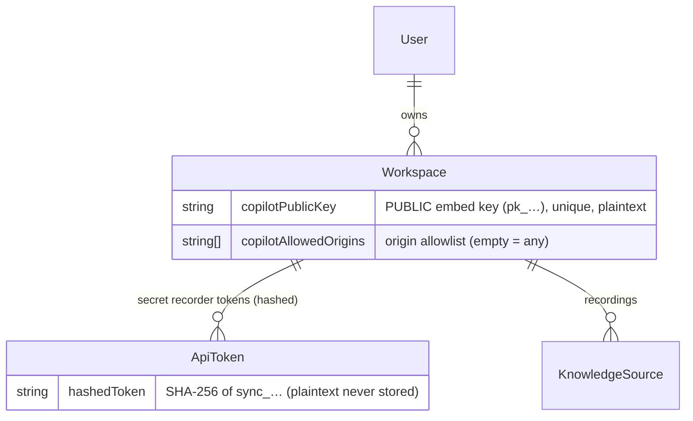
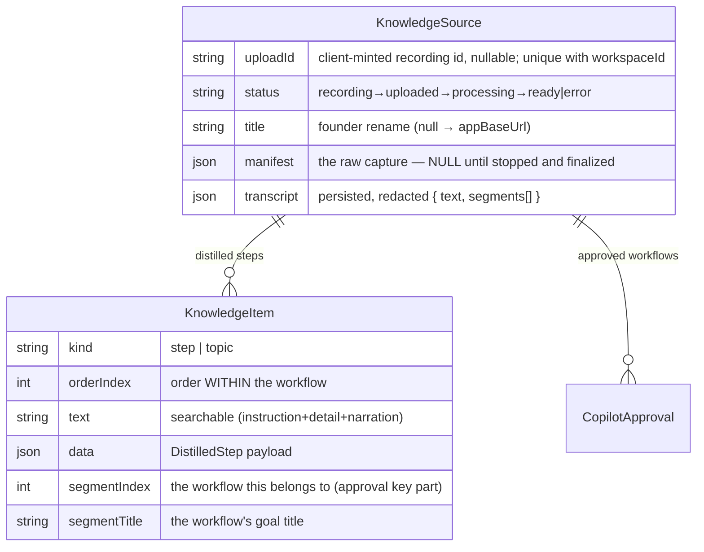

# Data — the model, and what gets written when

> **One doc, two axes.** Part 1 is the **substrate**: the stores, the schema by concern, the status
> machine, the storage layout, the queue. Part 2 is the **write path**: which of those tables a real
> action actually touches. They used to be two files describing the same facts from opposite
> directions, which meant every schema change had to be made twice.

---

# Part 1 — The substrate

## 1. The three stores

| Store | Tech | Holds | Written by | Read by |
|---|---|---|---|---|
| **Postgres** | Prisma client ([`schema.prisma`](../../packages/db/prisma/schema.prisma)) | All structured state: tenants, tokens, sources, KB items, approvals, queries, gaps | API, worker, Studio | everyone |
| **Object storage** | S3-compatible — **MinIO** (dev) / **Cloudflare R2** (prod) | Heavy binaries: screenshots, DOM snapshots, audio | **Recorder** (directly, presigned PUT, during recording) + API (leftovers at finalize) | worker (`ArtifactReader`) |
| **Redis** | BullMQ | The `synthesis` job queue (ephemeral) | API (producer) | worker (consumer) |

The split is deliberate: **Postgres for queryable truth, object storage for bulk bytes, Redis for the
async hand-off.** Postgres stores the manifest *JSON* but never the binaries it references.

---

## 2. The Postgres schema (by concern)

Full definitions in [`schema.prisma`](../../packages/db/prisma/schema.prisma). Grouped by what they're
for:

### 2.1 Auth.js (NextAuth) core

`User`, `Account`, `Session`, `VerificationToken` — standard NextAuth tables. `User.passwordHash`
backs the credentials provider. Used only by [Studio](studio.md).

### 2.2 Tenancy & keys



- **`Workspace`** is the tenant. It carries the two copilot-embed fields (`copilotPublicKey`,
  `copilotAllowedOrigins`) *and* owns the recorder tokens — i.e. **both API keys hang off the
  workspace**, which is how every credential resolves to a tenant ([connections.md](connections.md) §7).
- **`ApiToken`** stores only the **hash** of the secret recorder token; the public embed key is a
  plaintext column on `Workspace` (it's meant to be visible). The contrast is the whole security model
  in one schema diff.

### 2.3 Capture & Knowledge Base



- **`KnowledgeSource`** = one recording. The Prisma model is `KnowledgeSource` but the **table is kept
  as `RecSession`** via `@@map` so historical data survives the rename. `uploadId` is the
  **recorder's own id for the recording**, minted once when Record is pressed and stable across every
  retry; `@@unique([workspaceId, uploadId])` is what makes ingestion idempotent (nullable only so
  pre-existing rows stay valid, and scoped per workspace so a client-supplied value can never collide
  across tenants). `manifest` is the whole raw capture but is **nullable** — null while
  `status='recording'`, filled in when the recording is stopped and finalized;
  `transcript` is added by the worker; `status` is the lifecycle state machine; `title` is the
  founder's optional rename (null falls back to `appBaseUrl`), settable from the Recordings page.
- **`KnowledgeItem`** = one **distilled step**. `data` holds the
  [`DistilledStep`](../../packages/synthesis/src/distill.ts)
  (`instruction, detail, route, narration, screenshotFile, bbox` + `keyEventId` since 2026-07-08). `segmentIndex`/`segmentTitle` group
  items into workflows. The schema comment still mentions the old `{ event, narration }` shape — that's
  the **legacy pre-distillation** shape (old rows only); the live worker writes the distilled shape. Indexed on `workspaceId` and
  `sourceId`.

### 2.4 Copilot — gate, analytics, gaps

| Table | Purpose | Key detail |
|---|---|---|
| **`CopilotApproval`** | The trust gate — one row = one approved workflow. | **`@@unique([sourceId, segmentIndex])`** — keyed by the workflow *coordinate*, not item ids, so it **survives the worker's delete+recreate of items**. Absence = not approved. |
| **`CopilotQuery`** | Every end-user question (analytics + feedback target). | `answered` (covered vs. declined), `feedback` (`up`/`down`/null); P2 added the `sense*` localization-outcome columns + `reasonTrigger`/`reasonImage`. **2026-07-29 added how the answer was produced:** `mode` (the workspace setting) · `engine` (what actually ran — `chatbot`/`agent`/`reason`; NOT always what `mode` predicts, since the diagnostic path preempts the agent and the safety floor answers as chatbot without the mode changing) · `rounds` · `toolCalls`. All nullable, nothing back-filled — an older row honestly reads "unknown". |
| **`CopilotWalkthrough`** (P4-M0) | One row per guided-walkthrough RUN (a session, not a query; optional `queryId` joins the originating question). | `startStep`/`lastStep`/`totalSteps`, `autoAdvances` (detection-confirmed Nexts) vs `manualAdvances` (override Nexts), `outcome` `active\|completed\|aborted\|stalled` (+`stalledAtStep`); `active` past the widget's 30-min session TTL reads as abandoned — no sweeper by design. |
| **`CoverageGap`** | A question the KB couldn't cover → "record this next". | `source` = `copilot` (live) or `prompt` (historical — written by the removed article path; old rows only); `status` `open`/`resolved`. |

### 2.5 Phase-2 articles — REMOVED

The `Article` + `Step` tables (the retired article model) were **dropped** with the
workflows-as-articles decision: the **Version-2 portal track** renders **approved
distilled workflows** as help articles instead of maintaining a parallel article store. The
track's feature list: [`portal.md`](../build/portal.md).

---

## 3. The status state machine

`KnowledgeSource.status` is the single signal every surface uses to know where a recording is:

```
recording ──(stop + manifest)──▶ uploaded ──(worker picks up)──▶ processing ──(KB built)──▶ ready
    │                                │                                │
    └────────────────────────────────┴──────── error ◀────────────────┘   (message in .error)
```

`recording` = artifacts are still arriving. The row is upserted by `(workspaceId, uploadId)` on the
recorder's first signing call, so a capture is visible in Studio while it uploads; `manifest` is null
throughout and the worker skips any job whose row has no manifest yet. `{recording, uploaded, error}`
are the statuses a recording can still be uploaded into — `error` deliberately included, so a failed
build stays retryable.

**`recording` is also the only status a row can be *removed* from behind the founder's back.** Because
the row now exists before anyone commits to the recording, an abandoned capture has to be cleanable:
`DELETE /v1/uploads/:uploadId` deletes it (plus its objects) when the recorder throws a capture away,
and a server-side sweep deletes any `recording` row idle more than **12 hours**. Every later status is
the founder's — a discard against one answers `409` and points at Studio. See
[ingestion-api.md](ingestion-api.md) §4.6.

(`done` is a tolerated legacy value for pre-KB-layer rows.) Defined as `RecSessionStatus` in
[`@flowbuddy/shared/jobs.ts`](../../packages/shared/src/jobs.ts). `ready` means *KB built + segmented,
workflows available to approve* — there are no articles in the copilot-first product.

---

## 4. Object storage layout

One bucket (`flowbuddy-artifacts` by default). Keys are **workspace- and session-prefixed**:

```
workspaces/<workspaceId>/sessions/<sessionId>/<relative-path>
                                              ├── shots/<eventId>.jpg
                                              ├── shots/<eventId>-post.jpg
                                              ├── dom/<eventId>.html
                                              ├── dom/<eventId>-post.html
                                              └── audio.webm
```

- Written **by the [recorder itself](recorder-capture.md)** — screenshots and DOM snapshots during the
  capture, `audio.webm` at Stop — over single-object 900 s presigned PUT URLs the API mints
  (`signPutUrl`). The API writes only what storage never confirmed, at finalize (`putObjectStream` +
  `sessionKey`), and on a healthy connection that is nothing. Either way the relative path is
  **validated against an allowlist** — `shots/<name>.jpg|.jpeg|.png`, `dom/<name>.html`, `audio.webm`
  — before it becomes a key; `sessionKey`'s `..` strip is a backstop, not the control (it is
  defeatable via `....//`).
- **Deleted** by `deleteSessionPrefix(ws, id)` — the whole prefix at once — from three places: Studio
  when the founder deletes a recording, and the API's two cleanup paths for recordings that were never
  finished (§3). Nothing else ever expires: a `ready` recording's artifacts live until it is deleted.
- Read by the [worker](knowledge-base.md) through an **`ArtifactReader`** —
  `sessionArtifactReader(ws, id)` returns a `(relPath) => Promise<Buffer|null>` bound to one session;
  a miss returns `null` (the pipeline tolerates missing artifacts).
- `screenshotFile` on a `DistilledStep` is a **relative path** (e.g. `shots/<id>.jpg`); resolving it to
  a URL/object means re-applying the `workspaces/<ws>/sessions/<id>/` prefix.

The workspace prefix is the storage-level expression of tenancy — one customer's bytes are never under
another's prefix.

---

## 5. Redis / the queue

A single BullMQ queue, name **`synthesis`** (`SYNTHESIS_QUEUE` in
[`@flowbuddy/shared/jobs.ts`](../../packages/shared/src/jobs.ts)). Job body:
`{ sessionId, workspaceId }` — pointers only ([connections.md](connections.md) Seam C). The
[API](ingestion-api.md) is the producer; the [worker](knowledge-base.md) is the consumer
(**`concurrency: 1`** — both run in one process on one small instance, and a synthesis job holds whole
screenshots in memory for the vision calls). The connection is built from `REDIS_URL` (TLS
auto-enabled for `rediss:`) — as **two** objects, because the same process is producer *and* consumer
and they need opposite settings: the consumer's must stay bare so BullMQ can own
`maxRetriesPerRequest: null`, while the producer's adds connect timeouts and capped retries so a sick
Redis fails fast instead of buffering forever. Redis holds **no durable app state** — only
in-flight/queued jobs, and losing them costs a re-process, not a recording.

---

## 6. The three identities, in schema terms

| Identity | Column / table | Stored as | Resolves to |
|---|---|---|---|
| Recorder token (secret) | `ApiToken.hashedToken` | SHA-256 hash | `workspaceId` |
| Embed key (public) | `Workspace.copilotPublicKey` | plaintext, unique | `workspaceId` |
| Studio session | `Session` / `User` (NextAuth) | session token | `User` → owned `Workspace` |

All three converge on a `workspaceId`, which scopes every query. This is the whole tenancy model — see
[connections.md](connections.md) §7.

---

## 7. Migrations (the schema's history)

Prisma migrations in [`packages/db/prisma/migrations/`](../../packages/db/prisma/migrations) — the
early milestones, in order: `init` → `add_step_highlight` → `kb_layer` (the `KnowledgeSource`/`KnowledgeItem` split) →
`kb_item_segment` (segmentation tags) → `article_segment_link` → `coverage_gap` →
`copilot_approval` (the trust gate) → `copilot_embed_key` (public key + allowlist) →
`copilot_query` (analytics); later waves include `pgvector_hybrid_retrieval` (P1-M3),
`drop_phase2_article_step_tables` (workflows-as-articles), `sense_in_context_help` (P2),
`reason_diagnostic` + `reason_image_default_on` (P2-M5), `walkthrough_guided` (P4-M0), and
`upload_identity` (2026-07-27 — `RecSession.uploadId` + `@@unique([workspaceId, uploadId])`,
`manifest` made nullable) — **see the migrations folder for the full history**. Each migration name maps cleanly to a module milestone.

Commands: `pnpm db:migrate` (apply), `pnpm db:generate` (regen client), `pnpm db:validate`,
`pnpm --filter @flowbuddy/db exec prisma studio` (browse). See [`dev-setup.md`](../ops/dev-setup.md).

---


---

# Part 2 — What a real action writes

The moments below are the ones where the write path is non-obvious. The rest are one line each:

| Action | Writes |
|---|---|
| Sign up | A `User` row and a `Workspace` row — the only moment a workspace is created. |
| Verify email / reset password | One token row consumed and deleted. Single-use by construction. |
| Sign in | **Nothing.** A session cookie is minted; no row is written. |
| Connect the recorder | One `ApiToken` row per click. Only the **hash** is stored; the plaintext is shown once and never again. |
| Configure the copilot | `Workspace` columns only — no new tables. Appearance, mode, the ability switches, the embed key and its origin allowlist all live there. |
| Drop the `<script>` on a site | **Nothing**, until someone actually loads the page. |
| The widget loads | One column — a throttled `widgetLastSeenAt`/`Origin` heartbeat. This is what makes "is it embedded?" a real answer rather than a guess from query counts. |
| Thumbs up / down | One column on the existing `CopilotQuery` row. |
| "Walk me through it" | One `CopilotWalkthrough` row per run, updated as the user advances. |

## 5. Recording a workflow → **a row + artifacts start landing while you record**

While the founder records, most of the recording is **already on its way to us**. After every captured
step the recorder asks the API to sign short-lived (900 s) PUT URLs (`POST /v1/uploads/sign`) and
pushes that step's screenshot + page HTML **straight to object storage** — the API never touches those
bytes. The first signing call also creates the recording's row in Postgres with `status: "recording"`,
so Studio shows the capture while it is still being made. Everything is still buffered in Chrome as
well, and anything storage never confirmed simply rides the Stop bundle exactly as it used to:

| Browser store | What's in it |
|---|---|
| `chrome.storage.local` | The API token, the backend URL, connected email/org, the recorder `phase`, a coarse upload marker (in flight / accepted — there is no percentage any more), last upload result |
| `chrome.storage.session` | The active recording's live state |
| **IndexedDB** (`flowbuddy-recorder`) | **The recording itself** — every captured event, every screenshot, every page HTML snapshot, the audio. Buffered here so a crash or a tab close doesn't lose the session. |

**What gets captured per user action** ([`shared/src/capture.ts`](../../packages/shared/src/capture.ts)):
the event type (click/input/submit/nav/scroll/hover), a timestamp, the target element's
role/name/text/tag/attributes + a **ranked list of ways to find it again** (test-id → id → aria →
name → placeholder → text → css → xpath), its on-screen box, the page URL/path/title, a JPEG
screenshot, and a snapshot of the page HTML (scripts and styles stripped, capped at 400 KB).

**The first privacy line is here, before anything leaves the browser:** typed values in password
fields, fields matching sensitive patterns, and anything the host app marks `data-flowbuddy-redact`
are replaced with `••••••` at capture time
([`extension/src/content.ts:428`](../../packages/extension/src/content.ts#L428)).

**What if the recording is never finished?** Writing before Stop means a row and its objects can
outlive a capture nobody wanted, so both are removed again. The recorder asks the server to **discard**
them (`DELETE /v1/uploads/:uploadId`) whenever a capture is thrown away — "Start fresh", or simply
starting a new recording while an old unsent one is still buffered. Anything that never gets that call
(browser closed for good) is caught by a **server-side sweep of `recording` rows idle more than 12
hours**, which runs fire-and-forget whenever some other recording in the workspace finalizes. The
threshold is deliberately generous: a *paused* capture looks identical from the server's side, and a
false positive costs only a re-upload — the recorder's local buffer is never cleared until an upload
actually succeeds. Only rows still at `status: "recording"` are eligible; once a recording finalizes,
deleting it is the founder's decision in Studio.

---

## 6. Stop → finalize → **3 stores written, in this order**

The founder hits stop. The extension does one last artifact flush — **which now includes the narration
audio**, over the same signed-URL path as everything else — then POSTs to `/v1/sessions`
([`api/src/server.ts`](../../packages/api/src/server.ts)) **only what storage has not already
confirmed**, which on a healthy connection is **nothing: the manifest and no files at all**. It
carries the recording's stable identity in an `X-FlowBuddy-Upload-Id` header (the request is rejected
with `400` without it), and that header is what makes a retry land on the same recording instead of
creating a second one. The old all-in-one multipart bundle still works and is still the fallback: a
browser that can't reach object storage directly sends every artifact here, exactly as before.

**Order matters** — each step only happens if the one before it succeeded:

| # | Store | What's written |
|---|---|---|
| 1 | **Object storage** | Whatever did **not** already upload directly — normally nothing — **streamed** (never held in memory) under the key `workspaces/<workspaceId>/sessions/<sessionId>/…`. Caps: 300 MB per file, 500 MB per finalize request; note these caps cover only the leftovers, not the artifacts that came in over signed URLs. |
| 2 | **`KnowledgeSource`** (table name in the DB is still `RecSession`) | The row already exists (created at the first signed artifact with `uploadId`, `status: "recording"`, `manifest: null`). Finalize **updates** it: `status: "uploaded"`, `appBaseUrl`, `error: null`, and **`manifest`** — the entire raw capture JSON: every event, every target fingerprint, every file reference, the markers, the browser/viewport metadata |
| 3 | **Redis** | One BullMQ job: `{ sessionId, workspaceId }` — **best-effort**, given 5 seconds and then stepped over. The recording is already safe in the two stores above, so an unreachable Redis must not turn a delivered recording into a failed upload; the job is recovered from Studio's "Stalled → Re-process". |

**If finalize fails, nothing is deleted** — and that reversal is deliberate. Artifacts uploaded during
recording live under that prefix and the recorder cannot re-send them, so wiping the prefix on a bad
manifest would destroy the recording. The retry re-uses the same `uploadId`, overwrites the same keys,
and updates the same row.

📌 **The `manifest` column is the biggest single thing we store, and it is permanent.** It holds the
complete raw capture forever — not just what the KB later distills from it. That's deliberate (it's
what makes re-processing possible, and it's the raw material Phase 3 replay and the acting agent will
need), but it means a recording's full event trail lives in Postgres indefinitely.

---

## 7. The worker builds the knowledge base → **2 tables, 4 writes**

The worker picks up the job ([`api/src/worker.ts`](../../packages/api/src/worker.ts)) and runs:
transcribe the audio → align narration to events → clean → segment into workflows → distill each step.

The writes, in order:

| # | When | Table | What's written |
|---|---|---|---|
| 1 | Immediately on pickup | `KnowledgeSource` | `status: "processing"` |
| 2 | After transcription | `KnowledgeSource` | **`transcript`** — the full narration text + timed segments (**PII-scrubbed** first) |
| 3 | After distillation | `KnowledgeItem` | **Delete every existing row for this recording, then insert the fresh ones** |
| 4 | After embedding | `KnowledgeItem.embedding` | A 1536-dimension vector per row, written via raw SQL |
| 5 | Finally | `KnowledgeSource` | `status: "ready"` (+ an `error` string if the build was *degraded* but succeeded) |

**One `KnowledgeItem` row = one step of one workflow:**

| Column | Holds |
|---|---|
| `segmentIndex` / `segmentTitle` | **Which workflow** this step belongs to, and its name |
| `orderIndex` | The step's position *within* that workflow |
| `text` | The searchable blob: instruction + detail + narration, folded into one string |
| `data` | The step itself — the `DistilledStep` shape, defined once in [`distill.ts`](../../packages/synthesis/src/distill.ts). Do not re-list the fields here; this copy had already lost `keyEventId`. |
| `embedding` | The vector for semantic search (nullable — a failed embed just means keyword-only) |

**The second privacy line is here.** Before this text is stored, `redactText` scrubs high-confidence
structured PII — emails, US SSNs, Luhn-valid card numbers, phone numbers — replacing them with typed
placeholders like `[redacted-email]` ([`synthesis/src/redact.ts`](../../packages/synthesis/src/redact.ts)).
Prices, dates, order IDs and version numbers are deliberately left alone.

⚠️ **What is *not* scrubbed:** the screenshots and the DOM HTML in object storage. Those are raw. If
the founder's product showed a real customer's email on screen during recording, that pixel and that
HTML are stored as-is. (Screenshot/DOM redaction is a known deferred item.)

**Two behaviours worth internalising:**
- **Re-processing is destructive and idempotent.** Step 3 deletes and recreates. Anything attached to
  a *step row* would be lost on every reprocess — which is exactly why approval is **not** stored on
  the step (see next section).
- **A degraded build still lands `ready`.** If transcription or embedding failed, the recording is
  usable and the reason goes in the `error` column as a *notice*, not a failure.

---

## 8. Review and approve in Studio → **1 tiny table, and it's the whole trust model**

The founder browses the built workflows and flips **Approve**
([`web/lib/copilot-actions.ts:30`](../../packages/web/lib/copilot-actions.ts#L30)).

| Table | What's stored |
|---|---|
| **`CopilotApproval`** | `workspaceId`, `sourceId`, `segmentIndex`, `segmentTitle` (a snapshot at approval time), `approvedById`, `createdAt` |

**This is the single most important row in the product.** Four things about it:

1. **Absence = not approved.** There is no `approved: false`. Un-approving **deletes** the row.
2. **It is keyed by `(recording, workflow)` — not by step.** That's why it survives the delete-and-
   recreate of step 7. A founder's approvals don't evaporate when they reprocess a recording.
3. **Every read path filters through it.** Retrieval, the sense plan, walkthrough logging — all of
   them re-check approval server-side. Nothing the browser claims is trusted.
4. **The stored `segmentTitle` is the display truth.** When the widget sends a workflow title over the
   wire, the server ignores it and uses this snapshot instead.

**Other Studio actions on this screen:**

| Action | Table | What changes |
|---|---|---|
| Rename a recording | `KnowledgeSource` | `title` (capped at 120 chars; empty clears it) |
| Re-process | `KnowledgeSource` | `status → "uploaded"`, `error → null`, then a new Redis job |
| Delete a recording | Object storage **first**, then `KnowledgeSource` | The row delete **cascades** to all its `KnowledgeItem` and `CopilotApproval` rows |

---

## 12. An end-user asks a question → **the busiest moment in the system**

`POST /v1/copilot/answer` ([`api/src/server.ts:546`](../../packages/api/src/server.ts#L546)).

**What the widget *sends* us (and what happens to it):**

| Sent | Stored? |
|---|---|
| The question text | ✅ **Yes** — `CopilotQuery.question` |
| The page path (e.g. `/settings`) | ✅ Yes — `CopilotQuery.contextPath`, capped at 512 chars |
| Where it thinks the user is (workflow + step guesses) | ⚠️ **Partly** — the *outcome* is stored, the raw guesses are not |
| The previous answer's cited workflows | ❌ No — used to bias retrieval, then discarded |
| The chat history | ❌ **No** — used in the prompt, never persisted server-side |
| Page state for diagnosis (masked field structure) | ❌ **No** — only a *flag* saying diagnosis ran |
| A rendered image of the page | ❌ **No** — only a `true`/`false` that one rode along |

**What gets written, in order:**

| # | Table | When | What |
|---|---|---|---|
| 1 | `Workspace` | Every answer | The `widgetLastSeenAt` heartbeat (same 5-min throttle) |
| 2 | **`CopilotQuery`** | Always (one row per question) | See the breakdown below |
| 3 | **`QueryCitation`** | Only on a grounded answer | **One row per cited workflow** — `sourceId`, `segmentIndex`, `segmentTitle` snapshot. Created in the same call, nested under the query. |
| 4 | **`CoverageGap`** | Only on a decline | `prompt` = the question, `reason` = why it declined, `source: "copilot"`, `status: "open"` — **deduped**: if an open gap with the identical question exists, no new row |

**Inside one `CopilotQuery` row:**

| Column | Holds |
|---|---|
| `question` | The end-user's question, **PII-scrubbed before it is written** (§19) |
| `answered` | `true` = grounded answer given, `false` = declined |
| `contextPath` | The page they were on |
| `feedback` | `null` for now — filled in by step 13 |
| `senseSourceId` / `senseSegmentIndex` / `senseStep` / `senseConfidence` | **Where we located the user** — workflow, step number, confidence |
| `senseUsed` | `used` (the answer was about that position) \| `ignored` (we located them, answered about something else) \| `none` (we looked, found nothing) \| `null` (never looked) |
| `reasonTrigger` | Why diagnosis fired: `intent` (they used diagnostic words) \| `blocked` (the step's button was disabled) \| `escalation` (the fast path declined, the widget retried with evidence) |
| `reasonImage` | Whether a page image rode along |
| `mode` | The workspace's setting when they asked — `chatbot` \| `copilot` \| `agent` |
| `engine` | **Which engine actually answered** — `chatbot` \| `agent` \| `reason`. Not always what `mode` predicts |
| `rounds` | Model calls made (1 = answered straight from retrieval) |
| `toolCalls` | Tool invocations the model asked for, including ones the loop refused |

**Three behaviours that trip people up:**

1. **The Studio preview writes nothing.** A founder testing their own copilot sends `preview: true` —
   same engine, same answer, but **zero** analytics writes and no `queryId` (so no thumbs).
2. **An escalation writes nothing on the first pass — and only a SINGLE-CALL answer escalates now.** When the fast path declines and the widget is
   about to retry with page evidence, we return `escalate: true` and log *nothing* — the retry logs
   the real outcome, so one question never becomes two rows or a phantom coverage gap.
3. **"No approved content at all" is logged as a decline but not as a gap.** An un-provisioned copilot
   isn't a knowledge gap, so `CopilotQuery` gets a row and `CoverageGap` doesn't.

**In the end-user's browser**, meanwhile: the conversation is written to `sessionStorage` so it
survives a full-page navigation — **max 20 messages, 30-minute TTL, tab-scoped, gone when the tab
closes** ([`widget/src/session.ts`](../../packages/widget/src/session.ts)). An **allowlist of message
kinds** decides what may be persisted; anything not on the list (future sensitive-value messages) is
never written, by construction.

---

## 15. The founder reads Analytics → **nothing written, and this is the payoff**

Everything in step 12 exists **for this moment**. Storing the questions isn't bookkeeping — *"what are
my users actually stuck on?"* is one of the things the founder is buying. Analytics is entirely reads
over `CopilotQuery`, `QueryCitation`, `CoverageGap`, and `CopilotWalkthrough`. The one write:
dismissing a gap sets `CoverageGap.status = "resolved"` (the row is kept, never deleted).

**What the founder actually sees, and which stored data it comes from:**

| Where in Studio | What it shows | Reads |
|---|---|---|
| **Home** | The **last 5 questions**, verbatim, answered or not | `CopilotQuery` |
| **Copilot** tab | The **last 8 questions**, verbatim | `CopilotQuery` |
| **Analytics → Questions** (`/dashboard/analytics/questions`) | **The full log** — every question ever asked, newest first: search (question text *or* page path), filter (all / answered / declined / 👍 / 👎), range incl. **all time**, 25 per page. Each row shows the question, answered-or-declined, the workflows it cited, the page, the thumbs, and when. | `CopilotQuery` + `QueryCitation` |
| **Analytics** → *Questions & answer rate* | Answered vs declined per day over 7/30/90 days | `CopilotQuery.answered` + `createdAt` |
| **Analytics** → *Resolved without a human* | "≈ N questions your team didn't have to touch" | `CopilotQuery.answered` |
| **Analytics** → **Coverage gaps — record this next** | Unanswered questions **ranked by how often they were asked** ("asked 14×"), with the copilot's reason for declining, and a dismiss button | `CoverageGap` joined to a count of matching declined `CopilotQuery` rows |
| **Analytics** → *Recent declines* | The last 5 questions we couldn't answer **+ the page they were asked on** | `CopilotQuery` where `answered = false` |
| **Analytics** → **Where users get stuck** | Ranked *(workflow, step)* pairs — the exact step people ask for help at, with that step's instruction | `CopilotQuery.senseSourceId/senseSegmentIndex/senseStep` where `senseUsed = 'used'` |
| **Analytics** → *Top workflows by citations* | Which approved recordings are carrying the answers | `QueryCitation` grouped by workflow |
| **KB** → a workflow's detail page | That workflow's all-time cited count, last-cited date, and 👍/👎 tally | `QueryCitation` + the parent query's `feedback` |

**The two "record this next" signals are the product's feedback loop**, and they're different questions:

- **Coverage gaps** = *"you have no content for this at all"* → go record it.
- **Where users get stuck** = *"you have content, and people still need help at step 4"* → that step
  is unclear, or the product is.

**Still not surfaced:** there's no CSV/API export — the log is a reading surface only. Deliberate for
now; the in-UI search was the actual need.

**Fixed 2026-07-27 — `QueryCitation` used to count one row per cited STEP, not per workflow.** The
answer engine dedupes citations by `KnowledgeItem` id (right for grounding — an answer built from
six steps legitimately cites six items), and that list was persisted one-to-one, so **six rows all
named the same workflow**. Every reader counted rows, so *"Top workflows by citations"* ranked
workflows by **how many steps they have rather than how often they were used**, and one 👍 on a
six-step answer added **six** to that workflow's helpful score. The end-user never saw it — the
widget dedupes citation titles before rendering the "Source" pill, which is why it survived.

The fix has two halves, because a writer fix alone would leave every existing row wrong:
- **Writer** (`api` `citationRows`) collapses to one row per `(sourceId, segmentIndex)`, so the
  stored shape finally matches this table's own schema comment.
- **Readers** (`web/lib/analytics.ts`) count **distinct `queryId`**, not rows — which is the metric
  the cards actually mean ("how many questions did this workflow answer?") and is correct for the
  old duplicated rows and the new clean ones alike. **No backfill, nothing deleted.** On the dev
  workspace this took the count from an inflated **43 → 11**, matching the real question count.

> **If you add a reader of `QueryCitation`: count distinct questions, not rows.**

---
---

# Part 3 — Reference

## 17. Cheat sheet — every table, one line each

| Table | Written when | Written by | Rows per… |
|---|---|---|---|
| **`User`** | Sign up; password reset; email verify | Studio | 1 per person |
| **`Workspace`** | Sign up (auto); every settings change; widget heartbeat | Studio + API | 1 per person |
| **`Account`** | **Never** | — | Always empty (JWT sessions) |
| **`Session`** | **Never** | — | Always empty (JWT sessions) |
| **`VerificationToken`** | Verify-email + password-reset requests | Studio | 1 per pending request, deleted on use |
| **`ApiToken`** | Every click of "Connect extension" | Studio | 1 per click (never revoked) |
| **`KnowledgeSource`** | Upload; then 4 status updates during the build; rename/reprocess | API + worker | 1 per recording |
| **`KnowledgeItem`** | KB build — **wiped and recreated** every process | Worker | 1 per step of every workflow |
| **`CopilotApproval`** | Founder approves (deleted on un-approve) | Studio | 1 per approved workflow |
| **`CopilotQuery`** | Every end-user question (except Studio preview) | API | 1 per question |
| **`QueryCitation`** | Alongside a grounded answer | API | 1 per cited workflow per answer |
| **`CoverageGap`** | A decline (deduped) or a Studio prompt-to-article miss | API + Studio | 1 per distinct unanswered question |
| **`CopilotWalkthrough`** | A guided run starts, then updated per step | API | 1 per run |

---

## 18. What we deliberately **don't** store

Worth knowing as clearly as what we do:

| Not stored | Where it exists instead |
|---|---|
| Plaintext passwords | Only bcrypt hashes |
| Plaintext recorder tokens | Only SHA-256 hashes; the real one lives in the founder's extension |
| Plaintext email verify/reset tokens | Only SHA-256 hashes; the real one lives in the email |
| Login sessions | A signed JWT cookie in the browser |
| The end-user's chat history | Their own tab's `sessionStorage`, 30 min, then gone |
| The diagnostic page-state capture | Sent at ask time, used in the prompt, dropped — only a trigger label survives |
| The rendered page image | Same — only a `true`/`false` survives |
| Sensitive typed values from recordings | Masked to `••••••` in the founder's browser before upload |
| Rate-limit counters, heartbeat throttles, sense-plan cache | In memory in the API process; reset on restart |

---

## 19. Known gaps in what we store

1. **Screenshots and DOM snapshots in object storage are unredacted.** The masking ladder covers typed
   values and text, not pixels or raw HTML. A recording made against real customer data stores that
   data as-is. *(This is the live one.)*

Two former gaps are closed, each leaving a residual worth knowing:

- **`CopilotQuery.question` scrubbing** — storage only, so retrieval and the model still
  see the raw question and answer quality is unchanged. Rows written earlier were **not** back-filled.
  **Residual:** the phone pattern needs a 3-digit area group, so international formats like
  `+91 98765-43210` are *not* caught — deliberate (false-negatives over false-positives), but real.
- **Answer provenance** — `mode`, `engine`, `rounds` and `toolCalls` are now recorded.
  `engine` and `mode` are stored separately because they disagree in both directions. All four are
  `null` on earlier rows. **Residual:** nothing in Studio reads them yet.
