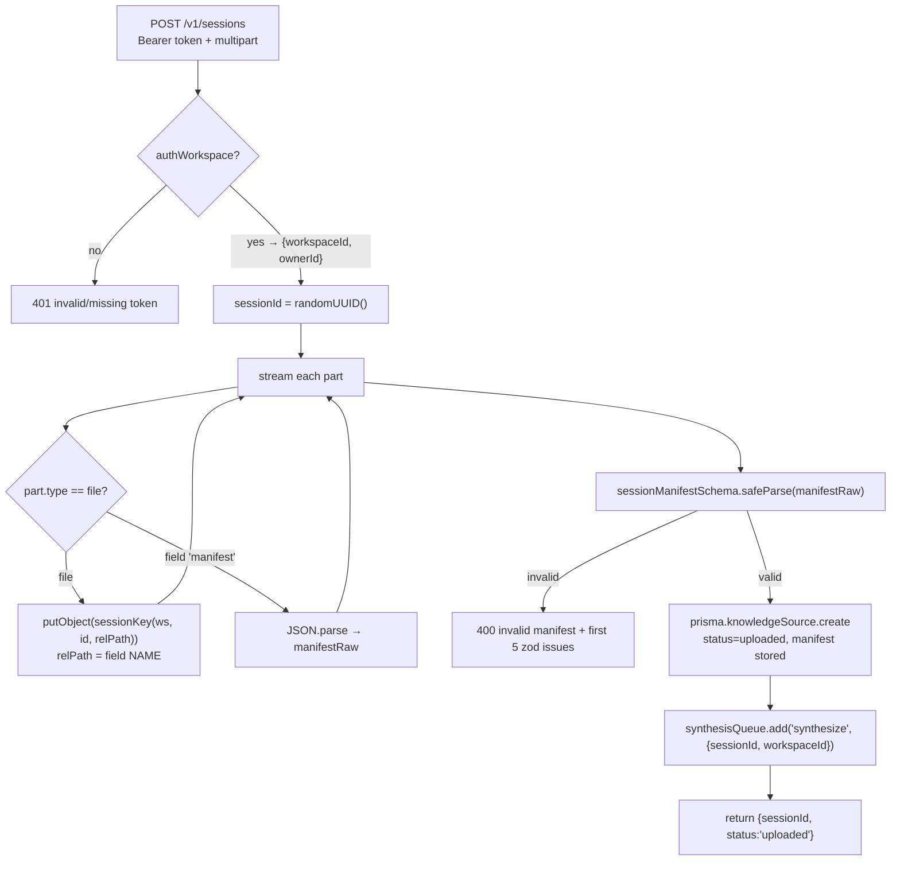

# Ingestion API — internals

> **Module:** the upload boundary of the Fastify service in
> [`packages/api/`](../../packages/api/). **Role:** the gate between [capture](recorder-capture.md)
> and the [Knowledge Base](knowledge-base.md). It accepts a bundle, stores the artifacts, persists a
> source record, and enqueues the build — then returns immediately. It does **no** AI work.

> The same Fastify process also serves the **copilot** routes; those are a different module, covered
> in [copilot.md](copilot.md). This doc is only the **ingestion** half.

---

## 1. Purpose

Receive a capture bundle over HTTP, durably land the heavy binaries in object storage, validate that
the manifest is well-formed, write one `KnowledgeSource` row that represents the recording, and put a
job on the queue so the worker can process it out of band. The design goal is a **fast, dumb accept**:
everything expensive is deferred to the [worker](knowledge-base.md).

---

## 2. Where it lives

| File | Role |
|---|---|
| [`server.ts`](../../packages/api/src/server.ts) | The Fastify app: CORS, multipart, the `/v1/sessions` routes (+ the copilot routes). |
| [`auth.ts`](../../packages/api/src/auth.ts) | Resolve a Bearer recorder token → workspace (by SHA-256 hash). |
| [`storage.ts`](../../packages/api/src/storage.ts) | The S3-compatible client, bucket bootstrap, key layout, and the `ArtifactReader` the worker uses. |
| [`queue.ts`](../../packages/api/src/queue.ts) | The BullMQ producer (`synthesisQueue`) + the Redis connection options. |
| [`config.ts`](../../packages/api/src/config.ts) | Env config (port, Redis URL, OpenAI key/models, R2/MinIO creds). |

Runs as `pnpm --filter @sync/api dev` on **`:8787`**.

---

## 3. Inputs / Outputs

- **`POST /v1/sessions`** — *the* ingestion route.
  - **In:** `multipart/form-data` (≤300 MB): a `manifest` field + N artifact files; `Authorization:
    Bearer <recorder token>`.
  - **Out:** `{ sessionId, status: "uploaded" }`. Side effects: artifacts in object storage, a
    `KnowledgeSource` row, a queued job.
- **`GET /v1/sessions/:id`** — status poll for a recording. Returns `{ id, status, error }`, scoped to
  the caller's workspace.
- **`GET /healthz`** — liveness.

---

## 4. Internal mechanics

### 4.1 CORS & multipart setup

A global `onRequest` hook sets permissive CORS (`Access-Control-Allow-Origin: *`, allowed headers
include `Authorization`, `Content-Type`, `X-Sync-Key`) and short-circuits `OPTIONS` preflights with
`204`. This is required because the caller origin is `chrome-extension://…` (recorder) or a customer's
domain (widget). Multipart is registered with generous limits: `fileSize: 300 MB`, `files: 10000`,
`fieldSize: 100 MB` — a long recording can have thousands of screenshots/DOM files.

### 4.2 The upload pipeline (`/v1/sessions`)

Key mechanics worth understanding:

- **Streaming, not buffering-all.** Parts are consumed with `for await (const part of req.parts())`.
  File parts are streamed straight to object storage one at a time (`part.toBuffer()` →
  `putObject`), so a 300 MB bundle never has to fit in one allocation.
- **The field-name-is-the-path trick.** `const rel = part.fieldname || part.filename`. The recorder
  put the relative path (`shots/<id>.jpg`) on the field *name* precisely because multipart strips
  directories from filenames. The server uses it verbatim (after sanitization) as the object key
  suffix. This is the matching half of the recorder's upload step.
- **Validation happens after storage.** Artifacts are written as they stream; the manifest is parsed
  from its field, then validated with the **zod** `sessionManifestSchema`
  ([`schemas.ts`](../../packages/shared/src/schemas.ts)). An invalid manifest returns `400` with the
  first five issues. *(Orphaned artifacts from a rejected manifest are harmless — they're never
  referenced by a row and could be GC'd later.)*
- **The `KnowledgeSource` row is the recording's identity.** It stores the **whole manifest as JSON**
  (`manifest` column), `appBaseUrl`, `status: "uploaded"`, and the owning workspace/user. The worker
  re-reads the manifest from here, not from the upload.
- **Enqueue carries only pointers.** `{ sessionId, workspaceId }` — see [connections.md](connections.md)
  Seam C. The job body is intentionally tiny; the worker rehydrates everything from Postgres + object
  storage.

### 4.3 Authentication (`authWorkspace`)

[`auth.ts`](../../packages/api/src/auth.ts) takes the `Authorization` header, strips `Bearer `,
**SHA-256-hashes** the token, and looks up `ApiToken.hashedToken` (unique), returning
`{ workspaceId, ownerId }`. Two consequences:

- The plaintext token is **never stored** — a DB leak yields only hashes, which can't be replayed.
- The token *is* the workspace scope. Everything the upload creates is keyed to the resolved
  `workspaceId`, so a token can only ever write into its own tenant.

### 4.4 Object storage (`storage.ts`)

One S3-compatible client points at **MinIO in dev** and **Cloudflare R2 in prod** — identical code,
different `R2_ENDPOINT`. `forcePathStyle: true` is set (MinIO requires it, R2 tolerates it).

- `ensureBucket()` runs at boot — `HeadBucket`, and `CreateBucket` if missing.
- `sessionKey(workspaceId, sessionId, rel)` builds
  `workspaces/<ws>/sessions/<id>/<rel>` after **sanitizing** `rel` (backslashes → `/`, `..` segments
  stripped) so a malicious field name can't escape the prefix.
- `sessionArtifactReader(ws, id)` returns an **`ArtifactReader`** — a `(relPath) => Promise<Buffer|null>`
  bound to one session. This is the exact function the [worker](knowledge-base.md) calls to fetch the
  audio (and any screenshot it needs); a miss returns `null` rather than throwing.

### 4.5 The queue producer (`queue.ts`)

A single BullMQ `Queue` named `synthesis` (the `SYNTHESIS_QUEUE` constant shared with the worker via
[`@sync/shared/jobs`](../../packages/shared/src/jobs.ts)). The Redis **connection options** (host/port/
user/pass, TLS for `rediss:`) are passed — not a pre-built client — so BullMQ can apply the settings
workers need. The producer (API) and consumer ([worker](knowledge-base.md)) share only this queue
name and the `{ sessionId, workspaceId }` shape.

### 4.6 Status polling (`GET /v1/sessions/:id`)

Re-auths the token, fetches the source **scoped to the caller's workspace** (`findFirst({ id,
workspaceId })`), and returns `{ id, status, error }`. This is how a caller learns when processing
moves `uploaded → processing → ready | error`. Studio shows the same status by reading the row
directly.

---

## 5. Data it reads / writes

| Store | Reads | Writes |
|---|---|---|
| **Postgres** | `ApiToken` (auth), `KnowledgeSource` (status poll) | `KnowledgeSource` (create, `status=uploaded`, full manifest) |
| **Object storage** | — | every uploaded artifact under `workspaces/<ws>/sessions/<id>/...` |
| **Redis** | — | one `synthesis` job per upload |

---

## 6. Failure modes & edge cases

- **Bad/missing token** → `401`, nothing stored or enqueued.
- **Malformed manifest** → `400` with zod issues; **no row, no job** (but streamed artifacts may have
  landed — orphaned, harmless).
- **Object-storage write fails mid-stream** → the request throws and 500s; no row/job, so the recorder
  treats it as a failed upload and keeps its buffer for retry (R2).
- **OpenAI / processing problems** are **not** this module's concern — it returns success the moment
  the row + job exist. Processing failures surface later as `status=error` on the source.
- **Crash between row-create and enqueue** (rare) would leave a source stuck in `uploaded`. There's no
  reaper today; a re-upload or manual re-enqueue is the recovery.

---

## 7. Connections

- **Accepts from ←** [Recorder](recorder-capture.md) (Seam A).
- **Lands artifacts in →** object storage; **persists** the `KnowledgeSource`; **enqueues** the job
  (Seams B & C in [connections.md](connections.md)).
- **Hands off to →** the [Knowledge Base worker](knowledge-base.md), which consumes the job and reads
  back the manifest + artifacts.
- **Shares its process with →** the [Copilot endpoints](copilot.md) (different routes, same Fastify
  app, same `config`/`storage`).
- **Schema reference →** the row shapes are in [data-model-and-storage.md](data-model-and-storage.md).
