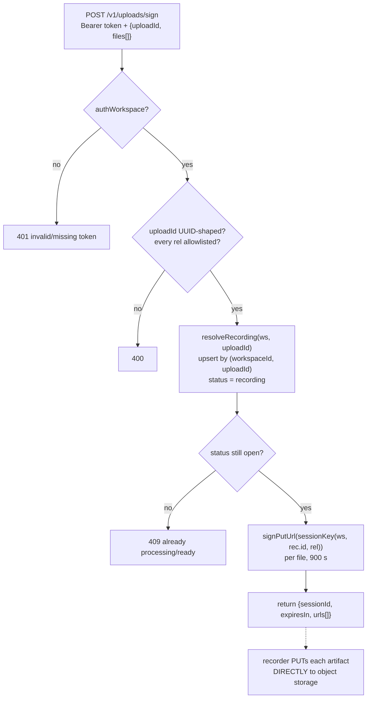
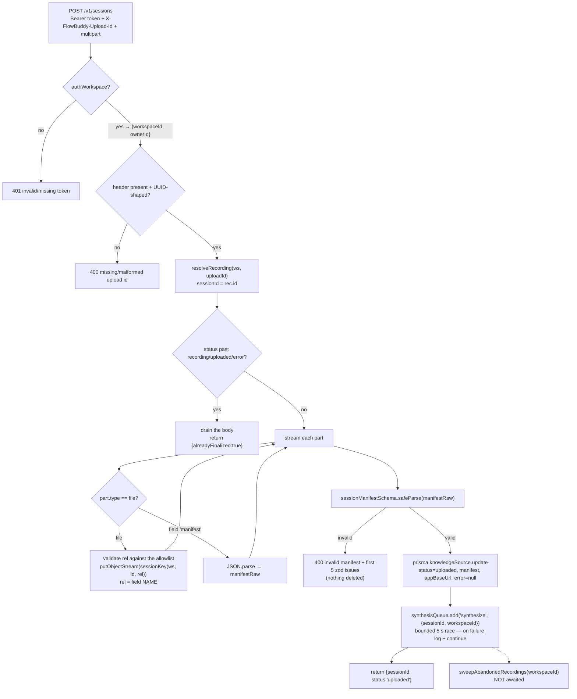

# Ingestion API — internals

> **Module:** the upload boundary of the Fastify service in
> [`packages/api/`](../../packages/api/). **Role:** the gate between [capture](recorder-capture.md)
> and the [Knowledge Base](knowledge-base.md). It hands the recorder short-lived signed URLs so
> artifacts land in object storage **directly, while recording** — narration included — then accepts a
> finalize request that on a healthy connection carries **the manifest and nothing else**, persists the
> source record, and enqueues the build — returning immediately. The upload routes are **idempotent on
> the recorder's `uploadId`**, so a retry can never create a second recording, and a third route plus a
> server-side sweep **clean up recordings that were never finished**. It does **no** AI work.

> The same Fastify process also serves the **copilot** routes; those are a different module, covered
> in [copilot.md](copilot.md). This doc is only the **ingestion** half.

---

## 1. Purpose

Authorize the heavy binaries into object storage (the recorder PUTs them there itself, one signed key
at a time, while it records), then receive the manifest, validate that it is well-formed, fill in the
one `KnowledgeSource` row that represents the recording, and put a job on the queue so the worker can
process it out of band. The design goal is a **fast, dumb accept**: everything expensive is deferred
to the [worker](knowledge-base.md), and the bytes are deferred to storage itself.

A second, quieter responsibility comes with that design: because bytes land **before** anyone commits
to a recording, the API also has to **take them away again** when the recording is abandoned — one
explicit discard route plus a background sweep (§4.6).

---

## 2. Where it lives

| File | Role |
|---|---|
| [`server.ts`](../../packages/api/src/server.ts) | The Fastify app: CORS, multipart, `/v1/uploads/sign` + the `/v1/sessions` routes + `DELETE /v1/uploads/:uploadId` and the abandoned-recording sweep (+ the copilot routes). |
| [`auth.ts`](../../packages/api/src/auth.ts) | Resolve a Bearer recorder token → workspace (by SHA-256 hash). |
| [`storage.ts`](../../packages/api/src/storage.ts) | The S3-compatible clients (one for reads/writes, one for presigning), bucket bootstrap, key layout, `signPutUrl`, `deleteSessionPrefix` (used by both cleanup paths), and the `ArtifactReader` the worker uses. |
| [`queue.ts`](../../packages/api/src/queue.ts) | The BullMQ producer (`synthesisQueue`) + **two** Redis connection objects — a bare one for the worker, a fail-fast one for the producer. |
| [`config.ts`](../../packages/api/src/config.ts) | Env config (port, Redis URL, OpenAI key/models, R2/MinIO creds). |

Runs as `pnpm --filter @flowbuddy/api dev` on **`:8787`**.

---

## 3. Inputs / Outputs

- **`POST /v1/uploads/sign`** — mint short-lived (900 s) presigned PUT URLs so the recorder uploads
  artifacts **directly** to object storage while recording.
  - **In:** JSON `{ uploadId, files: [{ rel }] }` (1–100 entries, each `rel` allowlisted to
    `shots/*.jpg|jpeg|png`, `dom/*.html`, `audio.webm`); `Authorization: Bearer <recorder token>`.
  - **Out:** `{ sessionId, expiresIn, urls: [{ rel, url }] }`. Side effect: upserts the
    `KnowledgeSource` row by `(workspaceId, uploadId)` with `status: "recording"`. `409` if the
    recording is already past the open statuses. **The API never touches these bytes.**
- **`POST /v1/sessions`** — *finalize*: the manifest plus whatever did not upload directly.
  - **In:** `multipart/form-data`: a `manifest` field + the leftover artifact files; `Authorization:
    Bearer <recorder token>` **and a required `X-FlowBuddy-Upload-Id: <uuid>` header** (`400` without
    it). Every file part's field name is validated against the same artifact allowlist (`400`
    otherwise). **On a healthy connection there are no files at all** — narration goes up over signed
    URLs like everything else, so this request is normally just the manifest field.
  - **Out:** `{ sessionId, status: "uploaded" }` and a queued job — or
    `{ sessionId, status, alreadyFinalized: true }` when a retry arrives for a recording that was
    already built (the body is drained, nothing is overwritten).
- **`DELETE /v1/uploads/:uploadId`** — *discard*: throw away an unfinished recording **and the
  artifacts it already uploaded**. The recorder calls it when a capture is abandoned rather than
  stopped (§4.6).
  - **In:** `Authorization: Bearer <recorder token>`; the `uploadId` in the path (`400` if it isn't
    UUID-shaped).
  - **Out:** `{ discarded: true }` after the storage prefix and the row are gone ·
    `{ discarded: false, reason: "not found" }` for an id we have never seen (a clean no-op — nothing
    was uploaded, so there is nothing to remove) · `409` if the recording is past `recording`, with
    the message *"delete it in Studio"*.
- **`GET /v1/sessions/:id`** — status poll for a recording. Returns `{ id, status, error }`, scoped to
  the caller's workspace.
- **`GET /healthz`** — liveness.

---

## 4. Internal mechanics

### 4.1 CORS & multipart setup

A global `onRequest` hook sets permissive CORS (`Access-Control-Allow-Origin: *`, allowed headers
include `Authorization`, `Content-Type`, `X-FlowBuddy-Key`, `X-FlowBuddy-Upload-Id`) and short-circuits
`OPTIONS` preflights with `204`. This is required because the caller origin is
`chrome-extension://…` (recorder) or a customer's
domain (widget). Multipart is registered with generous limits: `fileSize: 300 MB`, `files: 10000`,
`fieldSize: 100 MB` — a long recording can have thousands of screenshots/DOM files.

### 4.2 The upload pipeline (`/v1/uploads/sign` → `/v1/sessions`)

**While the recording runs** — the recorder asks for keys and writes the bytes itself:

```mermaid
flowchart TD
    S["POST /v1/uploads/sign<br/>Bearer token + {uploadId, files[]}"] --> S1{authWorkspace?}
    S1 -- no --> S401["401 invalid/missing token"]
    S1 -- yes --> S2{"uploadId UUID-shaped?<br/>every rel allowlisted?"}
    S2 -- no --> S400["400"]
    S2 -- yes --> S3["resolveRecording(ws, uploadId)<br/>upsert by (workspaceId, uploadId)<br/>status = recording"]
    S3 --> S4{"status still open?"}
    S4 -- no --> S409["409 already processing/ready"]
    S4 -- yes --> S5["signPutUrl(sessionKey(ws, rec.id, rel))<br/>per file, 900 s"]
    S5 --> S6["return {sessionId, expiresIn, urls[]}"]
    S6 -.-> S7["recorder PUTs each artifact<br/>DIRECTLY to object storage"]
```

**At Stop** — finalize, resolved to that same row:

```mermaid
flowchart TD
    A["POST /v1/sessions<br/>Bearer token + X-FlowBuddy-Upload-Id + multipart"] --> B{authWorkspace?}
    B -- no --> B401["401 invalid/missing token"]
    B -- "yes → {workspaceId, ownerId}" --> B2{"header present + UUID-shaped?"}
    B2 -- no --> B400["400 missing/malformed upload id"]
    B2 -- yes --> C["resolveRecording(ws, uploadId)<br/>sessionId = rec.id"]
    C --> C2{"status past recording/uploaded/error?"}
    C2 -- yes --> C3["drain the body<br/>return {alreadyFinalized:true}"]
    C2 -- no --> D["stream each part"]
    D --> E{"part.type == file?"}
    E -- file --> F["validate rel against the allowlist<br/>putObjectStream(sessionKey(ws, id, rel))<br/>rel = field NAME"]
    E -- "field 'manifest'" --> G["JSON.parse → manifestRaw"]
    F --> D
    G --> D
    D --> H["sessionManifestSchema.safeParse(manifestRaw)"]
    H -- invalid --> H400["400 invalid manifest + first 5 zod issues<br/>(nothing deleted)"]
    H -- valid --> I["prisma.knowledgeSource.update<br/>status=uploaded, manifest, appBaseUrl, error=null"]
    I --> J["synthesisQueue.add('synthesize', {sessionId, workspaceId})<br/>bounded 5 s race — on failure log + continue"]
    J --> K["return {sessionId, status:'uploaded'}"]
    J -.-> S8["sweepAbandonedRecordings(workspaceId)<br/>NOT awaited"]
```

Key mechanics worth understanding:

- **True streaming, no per-file buffering.** Parts are consumed with `for await (const part of
  req.parts())` and each file part is **piped** to object storage (`part.file` → `putObjectStream`,
  an `@aws-sdk/lib-storage` multipart `Upload` behind a byte-counting `Transform`), so no file is
  ever materialized in RAM — this process also serves the public copilot on a 512 MB instance.
  A **500 MB total cap** on the finalize request (checked between files, per-file `fileSize` limit
  still applies) and a per-file truncation check return `413`; a rejected/failed finalize
  **deliberately deletes nothing**: artifacts that already uploaded directly live under that prefix
  and cannot be re-sent, so the prefix must survive a bad manifest. Idempotency (same `uploadId` →
  same row, same keys) is what makes the retry safe instead. Note that these caps now bound only the
  leftovers — **the signed-URL path has no size ceiling, deferred by decision** (the reasoning and the
  eventual fix are in [`../roadmap.md`](../roadmap.md) §9, not repeated here).
- **The finalize request is small now — but the code still assumes it might not be.** Narration was
  the last thing that always rode this request; it goes over a signed URL too, so a healthy recording
  finalizes with a manifest field and zero files. The streaming parse, the caps, and the recorder's
  generous deadline all remain for the **fallback** case: if direct upload was unavailable for a whole
  recording, every artifact arrives here in one request, exactly as it did before signed URLs existed.
- **The field-name-is-the-path trick.** `const rel = part.fieldname || part.filename`. The recorder
  put the relative path (`shots/<id>.jpg`) on the field *name* precisely because multipart strips
  directories from filenames. The server **validates** it against a strict artifact allowlist
  (`shots/<name>.jpg|.jpeg|.png`, `dom/<name>.html`, `audio.webm`) and rejects anything else with
  `400` — the same allowlist the signing route enforces. Sanitization alone is not relied on:
  `sessionKey`'s `..` strip is defeatable (`....//`), so the key is validated before it is built, not
  cleaned afterwards. This is the matching half of the recorder's upload step.
- **Validation happens after storage — and now WITHOUT cleanup.** Artifacts are written as they
  stream; the manifest is parsed from its field, then validated with the **zod**
  `sessionManifestSchema` ([`schemas.ts`](../../packages/shared/src/schemas.ts)). An invalid manifest
  returns `400` with the first five issues and **leaves everything in place** — the row stays at
  `recording` and the retry, carrying the same `uploadId`, resolves to it.
- **The `KnowledgeSource` row is the recording's identity, and it exists early.** The first signing
  call upserts it by `(workspaceId, uploadId)` at `status: "recording"` with a null `manifest`;
  finalize **updates** the same row with the **whole manifest as JSON** (`manifest` column),
  `appBaseUrl`, `status: "uploaded"`, and clears `error`. The worker re-reads the manifest from here,
  not from the upload — and skips any job whose row has no manifest yet.
- **`uploadId` is the recorder's, not the server's.** It is minted in the extension when Record is
  pressed and is stable across every retry; `@@unique([workspaceId, uploadId])` is what makes both
  routes idempotent. The server no longer mints a UUID per request — that was how one slow upload
  plus one Retry used to become two recordings.
- **Enqueue carries only pointers.** `{ sessionId, workspaceId }` — see [connections.md](connections.md)
  Seam C. The job body is intentionally tiny; the worker rehydrates everything from Postgres + object
  storage.

### 4.3 Authentication (`authWorkspace`)

[`auth.ts`](../../packages/api/src/auth.ts) takes the `Authorization` header, strips `Bearer `,
**SHA-256-hashes** the token, and looks up `ApiToken.hashedToken` (unique), returning
`{ workspaceId, ownerId }`. Two consequences:

- The plaintext token is **never stored** — a DB leak yields only hashes, which can't be replayed.
- The token *is* the workspace scope. Everything the upload creates is keyed to the resolved
  `workspaceId`, so a token can only ever write into its own tenant.

### 4.4 Object storage (`storage.ts`)

**Two** S3-compatible clients point at **MinIO in dev** and **Cloudflare R2 in prod** — identical
code, different `R2_ENDPOINT`. `forcePathStyle: true` is set (MinIO requires it, R2 tolerates it).
The shared `s3` client does the reads/writes. A **second client exists only for presigning**,
identical except `requestChecksumCalculation: 'WHEN_REQUIRED'`: with the SDK default the signer bakes
`x-amz-checksum-crc32` of an **empty body** into the signed query string, which MinIO ignores and
**R2 enforces** — so a URL signed by the default client passes local dev and fails only in
production. That failure mode is why the split exists, and the split is now **verified against the
real thing**: R2 + CORS on a browser-issued presigned PUT was exercised end-to-end on dev/Render
(2026-07-28). Local MinIO is the permissive side, so it proves nothing on its own — R2 does.

- `ensureBucket()` runs at boot — `HeadBucket`, and `CreateBucket` if missing.
- `signPutUrl(key, contentType)` mints a single-object, 900 s PUT URL (`UPLOAD_URL_TTL_SECONDS`).
  The URL is the whole credential: it is scoped to exactly one key and cannot list, read, or touch
  anything else.
- `sessionKey(workspaceId, sessionId, rel)` builds
  `workspaces/<ws>/sessions/<id>/<rel>` after **sanitizing** `rel` (backslashes → `/`, `..` segments
  stripped). The sanitizer is a backstop, not the control — both routes allowlist `rel` before it
  ever reaches here.
- `sessionArtifactReader(ws, id)` returns an **`ArtifactReader`** — a `(relPath) => Promise<Buffer|null>`
  bound to one session. This is the exact function the [worker](knowledge-base.md) calls to fetch the
  audio (and any screenshot it needs); a miss returns `null` rather than throwing.
- `deleteSessionPrefix(ws, id)` removes every object under one recording's prefix. Studio has always
  used it when a founder deletes a recording; both cleanup paths in §4.6 now use it too.

### 4.5 The queue producer (`queue.ts`)

A single BullMQ `Queue` named `synthesis` (the `SYNTHESIS_QUEUE` constant shared with the worker via
[`@flowbuddy/shared/jobs`](../../packages/shared/src/jobs.ts)). The Redis **connection options** (host/port/
user/pass, TLS for `rediss:`) are passed — not a pre-built client — so BullMQ can apply the settings
workers need. The producer (API) and consumer ([worker](knowledge-base.md)) share only this queue
name and the `{ sessionId, workspaceId }` shape.

**Two connection objects, and the difference matters** (2026-07-28). The exported `connection` is
deliberately **bare** — BullMQ has to own a blocking consumer's settings (notably
`maxRetriesPerRequest: null`), and a worker that gives up on a Redis command instead of blocking stops
consuming jobs. So producer-style fail-fast options can never be added there. The queue is instead
constructed on a separate `producerConnection` that spreads `connection` and adds
`connectTimeout: 4000`, `maxRetriesPerRequest: 2`, and a capped-backoff `retryStrategy`. Studio's
producer ([`web/lib/queue.ts`](../../packages/web/lib/queue.ts)) has had these settings since it was
written and got away with putting them on its only connection **because Studio is never a consumer**;
the API is both, in one process, which is why it needs two.

**The enqueue itself is best-effort and bounded.** By the time finalize reaches this line the
recording is already safe — the row is in Postgres and the bytes are in object storage — so the
`add()` is raced against a 5 s timer and any failure is logged and stepped over. Left unbounded, an
unreachable Redis buffering commands forever looks exactly like the upload hanging, and would send the
recorder to its Retry screen for a recording that actually arrived. The recovery path when this does
drop a job is Studio's **"Stalled → Re-process"** (§6).

Hardening (2026-07-06, review §2.1–2.3 — mirrored by the Studio producer
[`web/lib/queue.ts`](../../packages/web/lib/queue.ts)):

- **`defaultJobOptions`:** `attempts: 3` with exponential backoff (5 s base) — transient
  OpenAI/storage failures retry instead of permanently failing the recording (the worker is
  idempotent) — and bounded retention (`removeOnComplete: 100`, `removeOnFail: 500`) so finished
  jobs can't fill Redis (25 MB on the free tier).
- **A throttled `on('error')` listener** (one log line / 30 s) — an emitted `'error'` with no
  listener is an unhandled EventEmitter throw that could take down the process serving the public
  copilot.
- **Graceful shutdown:** SIGTERM/SIGINT close the Fastify app, the queue's Redis connection, and
  the Prisma pool, then let the process drain (unref'd failsafe exit); the worker's own handler
  waits for the in-flight job. Safe when both run in one process (`all.ts`).

### 4.6 Abandoned-recording cleanup (the cost of uploading early)

Uploading during the capture buys a fast Stop, but it moves the moment of commitment: bytes and a row
exist **before** anyone has decided the recording is worth keeping. A capture that is thrown away —
the founder starts over, closes the browser, loses the tab — would otherwise leave a `recording` row
and its objects behind permanently. Two mechanisms remove them, one precise and one for everything the
first one misses.

**1. Explicit discard — `DELETE /v1/uploads/:uploadId`.** The recorder calls it in two places: on
**"Start fresh"** from the interrupted screen, and **when a new recording starts while an old unsent
buffer is still present** — a buffer still holding its `meta` means the previous recording never
uploaded successfully, so starting a new one abandons it. Both calls happen *before* the local buffer
is wiped, because the `uploadId` lives in that buffer; wipe first and the server row is orphaned with
no client left that knows its id. The route's rules:

| Situation | Response | Why |
|---|---|---|
| Row exists at `status = recording` | `deleteSessionPrefix` → delete the row → `{ discarded: true }` | Storage first, so a failure mid-way leaves a row the sweep can retry. |
| Row exists at any later status | `409 recording is already <status> — delete it in Studio` | Once a recording finalizes it is the founder's, and deleting it is Studio's job, not the recorder's. This is what stops a stray discard from destroying a recording that actually made it. |
| No such row | `200 { discarded: false, reason: 'not found' }` | Nothing was ever uploaded. A clean no-op, not an error — the recorder must not be blocked from starting over. |

The recorder treats the whole call as best-effort (deadlined, failures swallowed): being offline must
never prevent someone from starting a new recording.

**2. The sweep — `recording` rows idle more than 12 hours.** `sweepAbandonedRecordings(workspaceId)`
finds up to 20 `recording` rows whose `updatedAt` is older than `ABANDONED_AFTER_MS`, deletes each
prefix then each row, and rides **fire-and-forget on finalize** — a finished recording being the
cheapest reliable signal that this workspace is active. It is `void`-called and wrapped in a
`try/catch`: cleanup may never delay or fail the request that delivers a recording. There is no cron
and no separate service.

**Why 12 hours, which sounds enormous.** A *paused* capture signs nothing either, so idle time is not
proof of abandonment, and deleting a recording someone is still making is far worse than carrying a
few orphaned objects for a day. The generous threshold is also cheap insurance, because a false
positive **self-heals**: upload markers are scoped to the row's id, so if a swept recording resumes,
the next signing call creates a fresh row and every artifact re-uploads from the recorder's local
buffer — which is never cleared until an upload actually succeeds.

### 4.7 Status polling (`GET /v1/sessions/:id`)

Re-auths the token, fetches the source **scoped to the caller's workspace** (`findFirst({ id,
workspaceId })`), and returns `{ id, status, error }`. This is how a caller learns when processing
moves `recording → uploaded → processing → ready | error`. Studio shows the same status by reading
the row directly.

---

## 5. Data it reads / writes

| Store | Reads | Writes |
|---|---|---|
| **Postgres** | `ApiToken` (auth), `KnowledgeSource` (status poll, idempotency lookup, the sweep's stale-row scan) | `KnowledgeSource` — **upsert** by `(workspaceId, uploadId)` at `status=recording` (first signed artifact), then **update** to `status=uploaded` + full manifest + `appBaseUrl` at finalize; **deletes** `recording` rows on discard or sweep |
| **Object storage** | — | the **leftover** artifacts streamed at finalize, under `workspaces/<ws>/sessions/<id>/...`; plus **presigned PUT URLs** it mints for keys the *recorder* writes directly; and **prefix deletes** for discarded/swept recordings |
| **Redis** | — | one `synthesis` job per finalized recording (best-effort, 5 s bound) |

---

## 6. Failure modes & edge cases

- **Bad/missing token** → `401`, nothing stored or enqueued.
- **Missing/malformed `X-FlowBuddy-Upload-Id`** → `400`; nothing is read, stored, or enqueued.
- **Malformed manifest** → `400` with zod issues; **no job**, but the row stays at `status=recording`
  and the artifacts stay in storage (the retry needs them).
- **Oversized leftover / truncated file** → `413`; nothing cleaned up, no job; the recorder keeps its
  buffer for retry (R2).
- **Object-storage write fails mid-stream** → the request 500s; nothing cleaned up, no job, so the
  recorder treats it as a failed upload and retries into the same recording (R2).
- **Retry after a lost success response** → the same `uploadId` resolves to the same row; if it is
  already past `{recording, uploaded, error}` the body is drained and `{ alreadyFinalized: true }` is
  returned — nothing is rebuilt and no second recording is created. `error` is deliberately *in* the
  open set so a failed build stays retryable.
- **A recording started and never stopped** → the recorder discards it explicitly the next time it is
  asked to start fresh or start over; anything that never gets that call (browser closed for good) is
  removed by the 12-hour sweep on the next finalize in that workspace. §4.6.
- **A discard arrives for a recording that finalized** → `409`, nothing touched. Deleting a real
  recording is Studio's job.
- **The sweep deletes a paused recording someone resumes** → the next signing call mints a fresh row
  and the artifacts re-upload from the recorder's still-intact local buffer. Wasteful, not lossy.
- **Redis is down at finalize** → the enqueue times out after 5 s, the failure is logged, and the
  recording still returns `uploaded`. It sits without a job until Studio's **"Stalled → Re-process"**.
- **Signed URLs have no size ceiling** — `MAX_BUNDLE_BYTES` bounds only the finalize request, not the
  direct-upload path. **Deferred by decision**, with the reasoning and the eventual fix in
  [`../roadmap.md`](../roadmap.md) §9.
- **An old recorder build** (store v0.6.0) sends no identity header and gets a flat `400` — see the
  deploy-ordering warning at the end of this section.
- **OpenAI / processing problems** are **not** this module's concern — it returns success the moment
  the row + job exist. Processing failures retry (attempts: 3) and only then surface as
  `status=error` on the source.
- **Crash between row-create and enqueue** (rare) would leave a source stuck in `uploaded`. The
  Recordings UI now surfaces this: >15 min without progress renders as **"Stalled — re-process"**
  (driven by `KnowledgeSource.updatedAt`), and the existing re-process action recovers it.

> ⚠️ **Deploy ordering.** This route rejects a finalize without `X-FlowBuddy-Upload-Id`, and the
> extension build previously live on the Chrome Web Store (v0.6.0) does not send one. **The newer
> recorder has to reach users before this API reaches an environment they use.** Recorder **v0.7.0**
> carries the header and is cut for the store alongside this change, which ships to production — see
> [`../extension-releases.md`](../extension-releases.md) for the release itself.

---

## 7. Connections

- **Accepts from ←** [Recorder](recorder-capture.md) (Seam A).
- **Authorizes / lands artifacts in →** object storage (the recorder writes most of them itself with
  URLs this module signs); **persists** the `KnowledgeSource`; **enqueues** the job
  (Seams B & C in [connections.md](connections.md)).
- **Hands off to →** the [Knowledge Base worker](knowledge-base.md), which consumes the job and reads
  back the manifest + artifacts.
- **Shares its process with →** the [Copilot endpoints](copilot.md) (different routes, same Fastify
  app, same `config`/`storage`) **and, in production, with the synthesis
  [worker](knowledge-base.md)** — `start:all` runs both on one 512 MB Render instance. That is why the
  service sets `NODE_OPTIONS=--max-old-space-size=400` (cap the heap below the container limit so V8
  collects instead of the container being OOM-killed) and why the worker runs at `concurrency: 1`: an
  OOM caused by synthesis takes the public copilot down with it. Render also health-checks
  **`/healthz`** rather than only probing that the port is open, which a wedged process passes.
- **Schema reference →** the row shapes are in [data-model-and-storage.md](data-model-and-storage.md).
