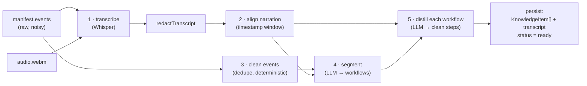

# Knowledge Base build — internals

> **Module:** the BullMQ **worker** ([`packages/api/src/worker.ts`](../../packages/api/src/worker.ts))
> driving the **synthesis** pipeline ([`packages/synthesis/`](../../packages/synthesis/)).
> **Role:** Module 2 of the 3-module model — turn a raw capture bundle into **clean, queryable,
> per-workflow knowledge**. This is the deepest, most AI-heavy module, and the heart of the product.
>
> Companion design doc: [`../kb-step-distillation.md`](../kb-step-distillation.md) (the *why* behind
> the cleanup/segment/distill design). This doc is the *how it runs*.

---

## 1. Purpose

A raw recording is a noisy log: dozens of low-level DOM events, double-clicks, focus-then-type pairs,
stray clicks while narrating, a continuous audio track, and screenshots. None of that is usable as
help content. The KB build collapses that into a **short list of clean, imperative steps**, **grouped
into the distinct workflows** the recording documents, each step carrying one curated screenshot, the
spoken "why", and the route it happened on. The output is the substrate the [copilot](copilot.md)
grounds on.

The crucial property (from the architecture doc): **once knowledge is in the KB, downstream stops
caring how it was captured.** A step item is just retrievable knowledge.

---

## 2. Where it lives

| File | Stage / role |
|---|---|
| [`worker.ts`](../../packages/api/src/worker.ts) | The BullMQ consumer. Orchestrates one job: load source → `buildWorkflowKB` → persist. |
| [`synthesis/index.ts`](../../packages/synthesis/src/index.ts) | `buildWorkflowKB` — the pipeline orchestrator + the persistence-helper types. |
| [`synthesis/transcribe.ts`](../../packages/synthesis/src/transcribe.ts) | Audio → timestamped transcript (Whisper). |
| [`synthesis/align.ts`](../../packages/synthesis/src/align.ts) | Attach narration to events by timestamp window. |
| [`synthesis/clean.ts`](../../packages/synthesis/src/clean.ts) | Deterministic event de-duplication ("B"). |
| [`synthesis/segment.ts`](../../packages/synthesis/src/segment.ts) | LLM split into workflows (terminal-state driven). |
| [`synthesis/distill.ts`](../../packages/synthesis/src/distill.ts) | LLM per-workflow → clean steps ("A"). |
| [`synthesis/redact.ts`](../../packages/synthesis/src/redact.ts) | Server-side PII backstop (Cut 1). |

Runs as `pnpm --filter @sync/api worker`, `concurrency: 2`.

---

## 3. Inputs / Outputs

- **Input:** a job `{ sessionId, workspaceId }`. From it the worker rehydrates the
  [`SessionManifest`](../../packages/shared/src/capture.ts) (from `KnowledgeSource.manifest`) and an
  `ArtifactReader` (bound to object storage) to fetch the audio.
- **Output (written to Postgres):**
  - `KnowledgeSource.transcript` — the persisted, redacted transcript.
  - `KnowledgeItem[]` — one row per **distilled step**, grouped by workflow via `segmentIndex` /
    `segmentTitle`.
  - `KnowledgeSource.status = ready` (or `error`).

The shape persisted into each `KnowledgeItem.data` is a
[`DistilledStep`](../../packages/synthesis/src/distill.ts):
`{ instruction, detail?, route, narration, screenshotFile, bbox }`. **Raw events are not persisted as
items** — they remain only inside `KnowledgeSource.manifest`.

---

## 4. Internal mechanics — the pipeline

`buildWorkflowKB` runs five stages in order. Think of it as **noise → meaning**: each stage removes
ambiguity the next stage would otherwise have to cope with.

### Stage 1 — Transcribe ([`transcribe.ts`](../../packages/synthesis/src/transcribe.ts))

The audio artifact is fetched via the `ArtifactReader` and sent to **Whisper** (`whisper-1`,
configurable) with `response_format: 'verbose_json'`, which returns **segment-level timestamps**. The
result is normalized to `{ text, segments: [{ start, end, text }] }` with times **in milliseconds**.
No audio → `{ text:'', segments:[] }` (silent recordings still produce a step list, just without
narration).

The transcript is then run through **`redactTranscript`** *before* anything else uses it, so every
narration span derived from it is already PII-clean (see §5).

### Stage 2 — Align narration ([`align.ts`](../../packages/synthesis/src/align.ts))

People narrate *around* the action they're describing — usually slightly before, sometimes during. So
for each event, alignment collects every transcript segment whose `start` falls in the window
**`[event.t − 4000 ms, event.t + 1500 ms]`** (`LEAD_MS`/`TRAIL_MS`) and joins their text. The result
is a `Map<eventId, narration>`: "the words spoken around this click". This map threads through both
segmentation and distillation as the **intent signal**.

> This is why the single session clock (§4.1 of [recorder-capture.md](recorder-capture.md)) matters —
> alignment is pure timestamp arithmetic against it.

### Stage 3 — Clean ([`clean.ts`](../../packages/synthesis/src/clean.ts)) — deterministic, no LLM

`cleanEvents` collapses **mechanical** noise the recorder unavoidably emits, *without making semantic
judgments* (that's the distiller's job, because it needs narration context). Three rules, order
preserved:

1. **Redundant focus-click** — a `click` on a field that also received an `input` event is just
   focusing it; keep the value-bearing `input`, drop the click.
2. **Button-click + form-submit** — a `submit` within 4 s (`SUBMIT_MERGE_MS`) after the `click` that
   triggered it is the same action; keep the labeled button click, drop the form-level `submit`.
3. **Consecutive identical** — repeated same-`(type,target)` events within 5 s (`DEDUP_MS`) — double
   clicks, jittered re-clicks — collapse to the first.

"Same target" is decided by `targetKey`: prefer `cssPath`/`xpath`, fall back to a semantic composite,
and finally the event id (which never collides, so unrelated events never merge). The module also
exports `isLikelyInteractiveTarget` (real control vs. page chrome) for the distiller to *weigh* stray
clicks — but `cleanEvents` deliberately does **not** drop on it (too aggressive without narration).

### Stage 4 — Segment ([`segment.ts`](../../packages/synthesis/src/segment.ts)) — LLM, one task = one workflow

One recording often documents several tasks ("create an account", "log in", "create a project"). The
segmenter splits the cleaned events into those distinct **workflows** in a **single event-aware LLM
pass** (temperature 0, JSON-schema output). The model is told that boundaries come primarily from
**goal completion / terminal states** visible in the event stream:

- a success confirmation/toast, landing on a newly created resource, a redirect/return to a
  dashboard/home, a **route reset**, a sign-out, or a long pause —
- with **narration** ("now let's…", or an up-front enumeration of tasks) and **user markers** (the
  recorder's "new workflow" hotkey) as *supporting* signals.

The prompt builds a **timeline** that surfaces, per event, its label, any **route transition**
(`route.path -> postAction.route.path` — the terminal-state tell), and the aligned narration; plus the
markers and the full transcript (so the model can tell "one task across many steps" from "several
tasks"). It's biased to **split at the clearest terminal state when uncertain**, because a human editor
merges a false split in one click, whereas an un-split workflow buried inside another is far harder to
recover.

**The carry-forward guard (no silent loss):** after the model returns, the code verifies **every**
event id was assigned to some workflow. Any the model omitted **inherit the preceding event's
workflow**, and each workflow's `eventIds` are rebuilt in true global order. If the model returns
nothing usable, it falls back to a single "Recorded workflow" containing all events. **Nothing is ever
dropped.**

### Stage 5 — Distill ([`distill.ts`](../../packages/synthesis/src/distill.ts)) — LLM, per workflow

Each workflow's cleaned events + narration go to a second LLM call (temperature 0, JSON-schema) that
produces the **minimal sequence of user-facing steps**. The model is instructed to:

- **DROP** orienting/stray actions that don't advance the goal (clicking the logo, a chat widget,
  "this is the landing page" narration).
- **MERGE** low-level interactions into one step (focus + type = "Enter your email"; click that
  submits a form = one step).
- Write each `instruction` imperatively and concretely; put extra context in `detail`.

**Anti-hallucination is structural, not hoped-for.** The schema forces every step to list
`sourceEventIds` (the real events it's built from) and a `keyEventId` (the representative event). After
the call, the code **validates** that those ids are real:

- a step whose `sourceEventIds` contain **no known id is dropped** (it was hallucinated);
- `keyEventId` is snapped to a real id if the model picked a bad one.

Then each model step is *resolved* into the persisted `DistilledStep`:

| `DistilledStep` field | Resolved from |
|---|---|
| `instruction`, `detail` | model output, **redacted** |
| `route` | model's `route`, else the key event's `route.path` |
| `narration` | the **unique** narration across the step's source events, joined + redacted (`stepNarration`) |
| `screenshotFile` | **frame rule C** — the key event's *action* screenshot by default; the **post/result** screenshot for the workflow's **last (outcome) step** ("you landed here") |
| `bbox` | the key event's element rect — powers the element highlight on the screenshot (**rendered in Studio's KB detail page** as a lightbox overlay, scaled to viewport fractions) |

**Fallbacks & guards:** if the model returns zero steps, distillation falls back to **one step per
cleaned event** (never lose a workflow). Observability logs warn when a workflow sheds most of its
events (`≥10 events → <30% kept` ⇒ a possibly mis-scoped segment), so quality regressions are visible
in the worker log rather than silent.

### Assembly into workflows (`buildWorkflowKB`)

The orchestrator loops the segments, distills each, and pushes
`{ segmentIndex: workflows.length, title, steps }`. **`segmentIndex` is assigned densely (0..n) as
workflows are accepted** — skipping empties keeps it contiguous. **This index is the approval key**
(see §6) — its stability across rebuilds is what lets approvals survive.

---

## 5. PII redaction (server backstop, Cut 1) ([`redact.ts`](../../packages/synthesis/src/redact.ts))

The recorder masks sensitive *form values* client-side. The KB build adds a **second line** that
scrubs high-confidence **structured** PII from everything the copilot will later read — the
transcript, each step's `narration`, each step's searchable `text`, and the `instruction`/`detail`.
`redactText` replaces matches with **typed placeholders** (`[redacted-email]`, `[redacted-phone]`,
`[redacted-card]`, `[redacted-ssn]`) so the sentence stays coherent for the LLM.

It is deliberately **high-precision** (favor false-negatives over false-positives, to avoid answer-
quality regressions): emails need a real TLD, SSNs need the `3-2-4` dash form, **cards are
Luhn-validated**, phones require a separator. So prices, dates, order ids, versions, and bare numbers
are **not** touched. It's **idempotent** — re-running on already-redacted text is a no-op (safe across
reprocess). Screenshot OCR / pixel redaction (PII *displayed* on a page) is **Cut 2, deferred to
Phase 2**.

The copilot's system prompt is told to treat the placeholders as opaque and never reproduce them — see
[copilot.md](copilot.md).

---

## 6. Persistence — how the worker writes the KB ([`worker.ts`](../../packages/api/src/worker.ts))

After `buildWorkflowKB` returns, the worker, in one job:

1. Sets `status = processing` at the start (so Studio shows progress).
2. Saves `KnowledgeSource.transcript`.
3. **Idempotent rebuild:** `deleteMany({ sourceId })` then `createMany` of all step rows. Each row:
   - `kind: 'step'`, `orderIndex` = order **within** the workflow,
   - `text` = `distilledStepText(step)` (instruction + detail + narration, joined — the searchable
     field),
   - `segmentIndex` / `segmentTitle` = the workflow coordinate + goal title,
   - `data` = the full `DistilledStep` (instruction, detail, route, narration, screenshotFile, bbox).
4. Sets `status = ready, error = null`.

On any thrown error the whole thing is caught: `status = error` with the message, and the job re-throws
so BullMQ records the failure.

> **Why delete-and-recreate?** It makes reprocessing a recording a clean, deterministic rebuild — no
> diffing, no stale rows. The cost is that a per-item flag would be wiped, which is exactly why
> **approval is stored separately** (next section).

### The approval-key contract (the most important downstream detail)

Because items are wiped and rebuilt, **approval cannot live on them.** It lives in a separate
`CopilotApproval` row keyed by **`(sourceId, segmentIndex)`** — the stable coordinate of a *workflow*.
As long as the segmenter assigns the same dense `segmentIndex` to "the login workflow" across rebuilds,
its approval (and the copilot's access to it) survives. This is the seam between this module, the
[approval gate](studio.md), and the [copilot](copilot.md). Detailed in [connections.md](connections.md)
§5.

---

## 7. Data it reads / writes

| Store | Reads | Writes |
|---|---|---|
| **Postgres** | `KnowledgeSource` (manifest, to rehydrate) | `KnowledgeSource.status`/`transcript`; `KnowledgeItem[]` (delete + recreate) |
| **Object storage** | the session's `audio.webm` (via `ArtifactReader`); screenshots are referenced by file name, not re-read here | — |
| **OpenAI** | Whisper (transcribe) + the chat model (segment, distill) | — |

---

## 8. Failure modes & edge cases

- **No audio / silent recording** → empty transcript; steps still build from events (no narration).
- **LLM returns malformed/empty JSON** → segmentation falls back to one workflow; distillation falls
  back to 1 step/event. The pipeline always yields *something* rather than failing.
- **Model omits events** (segmentation) → carry-forward guard re-assigns them; the worker logs the
  count.
- **Mis-scoped segment** (distiller prunes a whole sub-task) → not auto-corrected, but **logged as a
  warning** for human review; the editor can re-segment.
- **OpenAI/network error** → the job throws → `status = error` with the message; BullMQ marks it
  failed. Re-enqueuing reprocesses cleanly (idempotent).
- **Reprocess of an already-built source** → safe; items are wiped and rebuilt, approvals (keyed
  separately) persist.

---

## 9. The parked Phase-2 path (don't confuse it with the live one)

The synthesis package still contains an **older, raw-event path** used by the parked article engine:
`buildKB` (creates `KnowledgeItem`s 1:1 from raw events, `data = { event, narration }`),
`segmentItems`, and `generateArticleForSegment`. **The worker does not run these** — it runs only
`buildWorkflowKB` (distilled). The parked path reads `data.event`, which the distilled path no longer
stores, so resuming Phase 2 means re-sourcing events from the manifest. See
[`../phase-2-portal.md`](../phase-2-portal.md) §6 and the note in
[`../kb-step-distillation.md`](../kb-step-distillation.md).

---

## 10. Connections

- **Consumes ←** the job from the [Ingestion API](ingestion-api.md) (Seam C) and the manifest/artifacts
  it wrote (Seam B).
- **Produces →** the `KnowledgeItem[]` + transcript that [Studio](studio.md) browses and the
  [Copilot](copilot.md) grounds on (Seam D).
- **Hands the approval key to →** the gate in [studio.md](studio.md) and the enforcement in
  [copilot.md](copilot.md), via `(sourceId, segmentIndex)`.
- **Row shapes →** [data-model-and-storage.md](data-model-and-storage.md).
