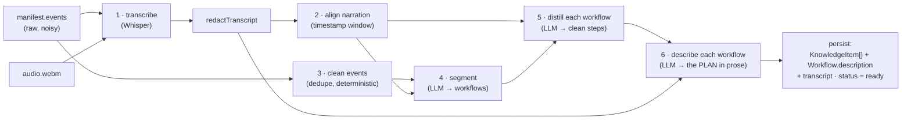

# Knowledge Base build — internals

> **Module:** the BullMQ **worker** ([`packages/api/src/worker.ts`](../../packages/api/src/worker.ts))
> driving the **synthesis** pipeline ([`packages/synthesis/`](../../packages/synthesis)).
> **Role:** Module 2 of the 3-module model — turn a raw capture bundle into **clean, queryable,
> per-workflow knowledge**. This is the deepest, most AI-heavy module, and the heart of the product.
>
> Companion design doc: [`kb-step-distillation.md`](../build/kb-step-distillation.md) (the *why* behind
> the cleanup/segment/distill design). This doc is the *how it runs*.

---

## 1. Purpose

A raw recording is a noisy log: dozens of low-level DOM events, double-clicks, focus-then-type pairs,
stray clicks while narrating, a continuous audio track, and screenshots. None of that is usable as
help content. The KB build collapses that into a **short list of clean, imperative steps**, **grouped
into the distinct workflows** the recording documents, each step carrying one curated screenshot, the
spoken "why", and the route it happened on. The output is the substrate the [copilot](copilot.md)
grounds on.

The crucial property (from the architecture doc): **once knowledge is in the KB, downstream stops
caring how it was captured.** A step item is just retrievable knowledge.

---

## 2. Where it lives

Paths are in `CLAUDE.md` and the source tree. This doc covers what those files *guarantee*, not where
they sit.

---

## 3. Inputs / Outputs

- **Input:** a job `{ sessionId, workspaceId }`. From it the worker rehydrates the
  [`SessionManifest`](../../packages/shared/src/capture.ts) (from `KnowledgeSource.manifest`) and an
  `ArtifactReader` (bound to object storage) to fetch the audio.
- **Output (written to Postgres):**
  - `KnowledgeSource.transcript` — the persisted, redacted transcript.
  - `KnowledgeItem[]` — one row per **distilled step**, grouped by workflow via `segmentIndex` /
    `segmentTitle`.
  - `KnowledgeItem.embedding` (P1-M3) — after `createMany`, the worker batch-embeds each
    item's `text` (`embedTexts`, 60s timeout) and writes the `vector(1536)` via raw SQL. **Strictly
    best-effort:** a failed embed call still lands the build `ready`, but the failure **surfaces as
    a degraded-build notice** in `KnowledgeSource.error` (the §3.3 mechanism — "semantic search
    unavailable… until re-processed"), not just a log line; those items ride the keyword half of
    hybrid retrieval until the next (re)process (delete+recreate ⇒ automatic re-embed).
  - `Workflow.description` — the workflow's PLAN in prose (§4 stage 6). Best-effort: `null` leaves
    behaviour exactly as it was before the stage existed.
  - the compiled **execution plan** (refresh only, for workflows with acting enabled) — the step list
    and its consent-pin hash re-derived from the new content, with **appearance markers** re-diffed
    from the recording's before/after DOM snapshots for the last step and every destructive step.
    Best-effort per step: an unreadable snapshot compiles that step bare, and absence changes nothing
    — presence tightens verification.
  - `KnowledgeSource.status = ready` (or `error`).

The shape persisted into each `KnowledgeItem.data` is a
[`DistilledStep`](../../packages/synthesis/src/distill.ts):
`{ instruction, detail?, route, screenshotFile, bbox, keyEventId? }` — **raw narration retired
2026-08-21**: it was the one field neither curated nor founder-editable, and the alignment window
smeared one spoken sentence across neighbouring steps (a deleted step kept being taught by its
neighbours). Its value now arrives curated — per-step context lands in `detail` under the
distiller's ATTRIBUTION rule, plan-level choices in the workflow description, and the demo-video
talk-track re-derives narration from the transcript at render time. Legacy rows keep `narration`
in `data` and their stored `text` until their recording is rebuilt; retrieval no longer serves it
either way. (`keyEventId`
persisted since 2026-07-08 — Sense locator recovery). **Raw events are not persisted as
items** — they remain only inside `KnowledgeSource.manifest`.

---

## 4. Internal mechanics — the pipeline

`buildWorkflowKB` runs six stages in order. Think of it as **noise → meaning**: each stage removes
ambiguity the next stage would otherwise have to cope with.

```mermaid
flowchart LR
    M["manifest.events<br/>(raw, noisy)"] --> T
    AUD["audio.webm"] --> T["1 · transcribe<br/>(Whisper)"]
    T --> RT["redactTranscript"]
    RT --> AL["2 · align narration<br/>(timestamp window)"]
    M --> CL["3 · clean events<br/>(dedupe, deterministic)"]
    CL --> SG["4 · segment<br/>(LLM → workflows)"]
    AL --> SG
    AL --> DS
    SG --> DS["5 · distill each workflow<br/>(LLM → clean steps)"]
    DS --> DE["6 · describe each workflow<br/>(LLM → the PLAN in prose)"]
    RT --> DE
    DE --> P["persist:<br/>KnowledgeItem[] + Workflow.description<br/>+ transcript · status = ready"]
```

### Stage 1 — Transcribe ([`transcribe.ts`](../../packages/synthesis/src/transcribe.ts))

The audio artifact is fetched via the `ArtifactReader` and sent to **Whisper** (`whisper-1`,
configurable) with `response_format: 'verbose_json'`, which returns **segment-level timestamps**. The
result is normalized to `{ text, segments: [{ start, end, text }] }` with times **in milliseconds**.

**No narration is reported, not returned empty.** Three paths produce no words without anything
throwing, and each returns a distinct `gap` alongside the empty transcript rather than one "no
narration" flag — because **a recording with no narration lands `ready` looking perfectly healthy**
while everything downstream of it goes quiet at once, and the founder's next move differs per case.
The three cases and their three moves are enumerated in `transcribe.ts`. Note the deliberate
non-case: text that arrives *without* segment timings is NOT a gap — the describer falls back to the
whole transcript, so that narration is still used.

The transcript is then run through **`redactTranscript`** *before* anything else uses it, so every
narration span derived from it is already PII-clean (see §5).

**Degradation (review §3.3):** a transcription **failure** (Whisper rejects files
> 25 MB — roughly 25–40 min of narration — or a transient API error) no longer kills the job.
`buildWorkflowKB` catches it, builds **transcript-less** (steps from captured actions, no narration
attribution), and returns a `warning` string; the worker persists it on the source (see §6) so the
recording lands `ready` with a visible notice instead of `error` discarding good capture. **The three
`gap` cases above take the same route** — same `warning` field, same banner — so a build with no
narration is as visible as one whose transcription threw. Each carries wording that names what was
lost as well as what failed, because the loss is the half the founder cannot see.

### Stage 2 — Align narration ([`align.ts`](../../packages/synthesis/src/align.ts))

People narrate *around* the action they're describing — usually slightly before, sometimes during. So
for each event, alignment collects every transcript segment whose `start` falls in the window
**`[event.t − 4000 ms, event.t + 1500 ms]`** (`LEAD_MS`/`TRAIL_MS`) and joins their text. The result
is a `Map<eventId, narration>`: "the words spoken around this click". This map threads through both
segmentation and distillation as the **intent signal**.

> This is why the single session clock (§4.1 of [recorder-capture.md](recorder-capture.md)) matters —
> alignment is pure timestamp arithmetic against it.

### Stage 3 — Clean ([`clean.ts`](../../packages/synthesis/src/clean.ts)) — deterministic, no LLM

`cleanEvents` collapses **mechanical** noise the recorder unavoidably emits, *without making semantic
judgments* (that's the distiller's job, because it needs narration context). Three rules, order
preserved:

1. **Redundant focus-click** — a `click` on a field that also received an `input` event is just
   focusing it; keep the value-bearing `input`, drop the click.
2. **Button-click + form-submit** — a `submit` within 4 s (`SUBMIT_MERGE_MS`) after the `click` that
   triggered it is the same action; keep the labeled button click, drop the form-level `submit`.
3. **Consecutive identical** — repeated same-`(type,target)` events within 5 s (`DEDUP_MS`) — double
   clicks, jittered re-clicks — collapse to the first.

"Same target" is decided by `targetKey`: prefer `cssPath`/`xpath`, fall back to a semantic composite,
and finally the event id (which never collides, so unrelated events never merge). The module also
exports `isLikelyInteractiveTarget` (real control vs. page chrome) for the distiller to *weigh* stray
clicks — but `cleanEvents` deliberately does **not** drop on it (too aggressive without narration).

### Stage 4 — Segment ([`segment.ts`](../../packages/synthesis/src/segment.ts)) — LLM, one task = one workflow

One recording often documents several tasks ("create an account", "log in", "create a project").
**User markers** (the recorder's "new workflow" button) are **hard cut points, consumed before any
model call**: the cleaned events are partitioned at each marker and each span gets its **own**
event-aware LLM pass, so a workflow structurally cannot merge across a marker — the events on either
side are never in the same prompt. (They used to be prompt lines under "supporting signals", which
the model could — and under sampling drift, did — overrule.) **Founder corrections also TEACH (item 5 — boundary learning)**: every Reorganize save derives
signatures of its boundary moments (`KnowledgeSource.boundarySignatures`, mechanics in
`boundary-learning.ts`), and **so does a pressed Mark** — the worker derives lessons from a
recording's marker cuts on its first successful processing (starts ONLY: markers are not
exhaustive, so unmarked moments never generate negatives; and never re-derived on reprocess, so a
revived timestamp can't out-vote a founder's later contradiction). On any OTHER recording of the
workspace a matching event becomes a hard cut point exactly like a pressed marker — the model
still segments within spans. A later exhaustive save that contradicts a lesson retires it
(targeted not-start, newest wins). Precision-first: unlabeled controls, unknown routes and
self-ambiguous signatures teach nothing; matching requires the exact screen through the one shared
route matcher.

**Founder-drawn boundaries override everything**: the Reorganize surface stores the complete list
of workflow-start event ids on the recording (`KnowledgeSource.boundaryOverrides` — the column
comment owns the value semantics). When present, segmentation is **exhaustive** — events are
partitioned at exactly those ids, each span IS one workflow, the per-span model call survives only
to *name* it, and record-time markers are superseded (the founder's later judgment wins). A stored
id the cleaned timeline no longer contains is skipped and surfaced in the recording's notice.
Otherwise — automatic segmentation: within a span, the segmenter splits the
events into distinct **workflows** (JSON-schema output; sampling is the model's default — see
`architecture.md` §Provider API for why an explicit temperature is no longer possible, and what that
costs). The model is told that boundaries come primarily from
**goal completion / terminal states** visible in the event stream:

- a success confirmation/toast, landing on a newly created resource, a redirect/return to a
  dashboard/home, a **route reset**, a sign-out, or a long pause —
- with **narration** ("now let's…", or an up-front enumeration of tasks) as the *supporting* signal.

The prompt builds a **timeline** that surfaces, per event, its **timestamp**, its label, any **route
transition** (`route.path -> postAction.route.path` — the terminal-state tell), and the aligned
narration; plus the full transcript (so the model can tell "one task across many steps" from "several
tasks"). The timestamp is what keeps a **long pause** — a documented boundary signal — visible to the
model at all. It's biased to **split at the clearest
terminal state when uncertain**, because a human editor
merges a false split in one click, whereas an un-split workflow buried inside another is far harder to
recover.

**The carry-forward guard (no silent loss):** after the model returns, the code verifies **every**
event id was assigned to some workflow. Any the model omitted **inherit the preceding event's
workflow**, and each workflow's `eventIds` are rebuilt in true global order. If the model returns
nothing usable, it falls back to a single "Recorded workflow" containing all events. **Nothing is ever
dropped.**

### Stage 5 — Distill ([`distill.ts`](../../packages/synthesis/src/distill.ts)) — LLM, per workflow

Each workflow's cleaned events + narration go to a second LLM call (JSON-schema) that
produces the **minimal sequence of user-facing steps**. The model is instructed to:

- **DROP** orienting/stray actions that don't advance the goal (clicking the logo, a chat widget,
  "this is the landing page" narration).
- **MERGE** low-level interactions into one step (focus + type = "Enter your email"; click that
  submits a form = one step).
- Write each `instruction` imperatively and concretely; put extra context in `detail`.

**The recorder's own data never becomes the reader's instruction.** The timeline the model sees
describes what was done to each element, never what was typed into it: a free-text value is reduced
to its shape (`entered: <text>`, `<a .pdf file>`, `<a web address>`), while a value the PRODUCT
offered — a `select` option, a slider position — is passed through, because naming it is not
inventing. Unrecognised controls fail safe to "content".

Why it is structural rather than a prompt rule: values used to be passed verbatim beside an
instruction reading *"NEVER invent values"*, so the model dutifully baked the recorder's sample data
into the steps — *Enter "Test 123" in the project name field* — and the copilot read it to the
customer as the task. Client masking is by field type ([recorder-capture.md](recorder-capture.md)
§4.4), so a real person's name in a plain text field reached the KB.

Two consequences that look like bugs and are not. **Checkboxes report `toggled` with no position**,
because their state is genuinely not captured (§4.4) — a step that states one took it from the
narration, and where the narration marks the setting as the reader's own choice the step must present
the DECISION, not the recorder's position. And **a placeholder is labelled as a placeholder**
(`input placeholder "My Website Chatbot"`), never rendered as if it were the field's name: two
adjacent fields whose only DOM text is example content are otherwise indistinguishable, and the
distiller merged them — losing a required field's step entirely — the moment the sample values that
had been telling them apart were removed.

**Anti-hallucination is structural, not hoped-for.** The schema forces every step to list
`sourceEventIds` (the real events it's built from) and a `keyEventId` (the representative event). After
the call, the code **validates** that those ids are real:

- a step whose `sourceEventIds` contain **no known id is dropped** (it was hallucinated);
- `keyEventId` is snapped to a real id if the model picked a bad one.

Then each model step is *resolved* into the persisted `DistilledStep`:

| `DistilledStep` field | Resolved from |
|---|---|
| `instruction`, `detail` | model output, **redacted** |
| `route` | the key event's `route.path` — **never the model's**. This was the one field that escaped the id-grounding above: the prompt says copy it from the key event, and a plausible rewrite (`/project/` for `/projects/`) was persisted as though anchored, then fed the sense probe, retrieval's route boost, the walkthrough and `displayRoute`. The model still emits `route` (strict schema); it is advisory only. |
| `narration` | the **unique** narration across the step's source events, joined + redacted (`stepNarration`) |
| `screenshotFile` | **frame rule C** — the key event's *action* screenshot by default; the **post/result** screenshot for the workflow's **last (outcome) step** ("you landed here") |
| `bbox` | the key event's element rect — powers the element highlight on the screenshot (**rendered in Studio's KB detail page** as a lightbox overlay). The overlay is expressed as **viewport fractions** (`bbox / manifest.app.viewport`), which makes it **DPR-independent and needs no coordinate calibration**. That fraction math is implemented once, in the KB page's own render layer — the only implementation in the tree. |

**Fallbacks & guards:** if the model returns zero steps, distillation falls back to **one step per
cleaned event** (never lose a workflow). The worker also **warns when a workflow sheds most of its
events** — a possibly mis-scoped segment — so quality regressions are visible in the log rather than
silent; the thresholds are in `distill.ts`.

### Stage 6 — Describe ([`describe.ts`](../../packages/synthesis/src/describe.ts)) — LLM, per workflow

Writes the workflow's **plan** in prose: what the task achieves, what is OPTIONAL, what is a CHOICE
between alternatives, what must be true before starting.

**Why it cannot be part of distillation.** A recording is a list of actions, so distilled steps can
only say what to click, in the order it was clicked. They structurally cannot express *"you only need
one of these"* — that is not a gap in the distiller's prompt but in the shape it emits. The plan
exists solely in what the founder SAID. (Live symptom before this: a workflow whose middle three
steps were alternatives answered as ten mandatory steps in order.)

**Why a separate call, after distillation.** It sees the FINAL steps, so it cannot describe a step
that was dropped or drift from settled wording; and it gets narration rather than steps, because that
is where the plan is. Running it inside the distiller would also divide that call's attention on the
thing it is already good at.

**Why the narration is windowed, not the whole tape.** This stage reads a fixed slice of whatever
transcript it is handed. Given the whole recording's, workflow 1 is described from workflow 1's
narration and so is every workflow after it — the plans for a long tour get written from its opening
minutes. The prompt forbids inventing, so the model's only remaining move is a bland one-line
summary: **the failure reads as vagueness, never as an error, and it deepens the more a founder
invests in one long recording.** That is a failure mode with no alarm attached, which is the reason
to know it exists.

**The rule: narration belongs to the workflow that owns the NEXT event after it** — a workflow's
material is its whole *run-up*, because talking without clicking is set-up for what is about to
happen. The rule, the three cases that fall out of it, and why the run-up is trimmed from the FRONT
rather than the back all live with the windowing code in `align.ts` and `describe.ts`.

Falls back to the whole transcript when there are no segments to window (a degraded transcription),
which is the pre-window behaviour. Only this stage is windowed: segmentation and the two
recording-level reads are about the tour as a whole and legitimately take all of it — so the concept
explanation in a long preamble is not lost when it lands on a workflow, it is *also* read by the
recording description and the product-page extractor, which is where product knowledge belongs.

**The one rule that matters:** the description must never restate a click target — no overlap is what
makes it impossible for the plan and the steps to contradict each other, which is why there is no
precedence rule anywhere downstream. Enforced in the prompt, not at runtime; stated on the column in
`schema.prisma` and in the describer's own header.

**Best-effort, unlike the rest of the pipeline.** Every failure path returns `null`, and a workflow
without a description behaves exactly as it did before this stage existed. That is the opposite of
segmentation and distillation, where a silent failure writes a *wrong* KB and therefore throws.

Stored on `Workflow.description` — the durable row, so it survives the delete-and-recreate of steps.

⚠️ **It is MODEL OUTPUT entering approved knowledge**, unlike steps, which are anchored to real
captured events. Studio must show it wherever a workflow is approved, or approval quietly stops
covering everything the copilot may say.

### Assembly into workflows (`buildWorkflowKB`)

The orchestrator loops the segments, distills each, and pushes
`{ segmentIndex: workflows.length, title, steps }`. **`segmentIndex` is assigned densely (0..n) as
workflows are accepted** — skipping empties keeps it contiguous. **This index is the approval key**
(see §6) — its stability across rebuilds is what lets approvals survive.

---

## 5. PII redaction (server backstop, Cut 1) ([`redact.ts`](../../packages/synthesis/src/redact.ts))

The recorder masks sensitive *form values* client-side. The KB build adds a **second line** that
scrubs high-confidence **structured** PII from everything the copilot will later read — the
transcript, each step's `narration`, each step's searchable `text`, and the `instruction`/`detail`.
`redactText` replaces matches with **typed placeholders** (`[redacted-email]`, `[redacted-phone]`,
`[redacted-card]`, `[redacted-ssn]`) so the sentence stays coherent for the LLM.

It is deliberately **high-precision** (favor false-negatives over false-positives, to avoid answer-
quality regressions): emails need a real TLD, SSNs need the `3-2-4` dash form, **cards are
Luhn-validated**, phones require a separator. So prices, dates, order ids, versions, and bare numbers
are **not** touched. It's **idempotent** — re-running on already-redacted text is a no-op (safe across
reprocess). Screenshot OCR / pixel redaction (PII *displayed* on a page) is **Cut 2, deferred to
the Version-2 portal track**.

The copilot's system prompt is told to treat the placeholders as opaque and never reproduce them — see
[copilot.md](copilot.md).

---

## 6. Persistence — how the worker writes the KB ([`worker.ts`](../../packages/api/src/worker.ts))

After `buildWorkflowKB` returns, the worker, in one job:

1. Sets `status = processing` at the start (so Studio shows progress).
2. Saves `KnowledgeSource.transcript`.
3. **Idempotent rebuild — one transaction** covering the identity writes below, the `deleteMany({ sourceId })`
   / `createMany` of all step rows, and the vector writes. Each row:
   - `kind: 'step'`, `orderIndex` = order **within** the workflow,
   - `text` = `distilledStepText(step)` (instruction + detail + narration, joined — the searchable
     field),
   - `segmentIndex` / `segmentTitle` = the workflow coordinate + goal title,
   - `data` = the full `DistilledStep` (instruction, detail, route, narration, screenshotFile, bbox).
4. Sets `status = ready` — with `error = null` on a clean build, or `error = <warning>` when the
   build **degraded** (e.g. narration failed to transcribe, §3.3): the recording is still usable,
   and the Studio detail page renders the warning as an amber "Processed with a warning" notice,
   not a failure.

On any thrown error the whole thing is caught and the job re-throws so BullMQ records the failure —
but since jobs run with `attempts: 3` (exponential backoff), the worker marks `status = error` **only
on the final attempt** (`attemptsMade + 1 < opts.attempts` = a retry is coming; the source stays
`processing` so the UI doesn't flash Failed→Ready across a retry).

> **Why delete-and-recreate?** It makes reprocessing a recording a clean, deterministic rebuild — no
> diffing, no stale rows. The cost is that a per-item flag would be wiped, which is exactly why
> **approval is stored separately** (next section).

### The approval-key contract (the most important downstream detail)

Because items are wiped and rebuilt, **approval cannot live on them.** It lives in a separate
`CopilotApproval` row that names a **`Workflow`** — a durable identity that outlives both the items
and the recording slot it currently occupies. This is the seam between this module, the
[approval gate](studio.md), and the [copilot](copilot.md). Detailed in [connections.md](connections.md)
§5.

**It used to be keyed on `(sourceId, segmentIndex)` — a POSITION — and that was the bug.** The
position worked as an identity only while re-segmentation was deterministic. Once it wasn't, a
re-split could put a different workflow at index 2 and the approval followed the index onto content
nobody had reviewed. **An approval no longer carries a position at all** — the columns are dropped,
so there is nothing left to key on by accident, and Studio's mutations name a workflow too. A
workflow's `sourceId`/`segmentIndex` live on the `Workflow` row as mutable facts *about* it, updated
by the matcher below.

A step still carries `segmentIndex`/`segmentTitle`, and that is deliberate: it is a denormalized copy
of its workflow's, written in the same pass from the same value (like the `workspaceId` beside it),
so it cannot drift. A duplicated **key** is a hazard; a duplicated **fact** is a cache.

### Identity across a reprocess — matched on content, never on position

The worker fingerprints every stored workflow **before** deleting its steps (afterwards the evidence
is gone), embeds the freshly distilled workflows, and matches the two sets on the same two signals
duplicate detection uses — overall similarity *and* where each workflow ends.

Both kinds of no-match are meaningful, and both fail closed:

| Outcome | What it means | What happens |
|---|---|---|
| incoming matched | still the same workflow | keeps its identity, position and title updated; **approval survives** |
| incoming unmatched | genuinely new | new identity, **born unapproved** |
| existing unmatched | its content is gone | **detached** (`segmentIndex` → NULL), approval → `needs_review` |

**Founder edits survive the rebuild — by stamp and by anchor.** A founder can rewrite a workflow's
title, its description, any step's instruction/detail, and which of the recording's own captured
frames a step shows (never an upload — the pick is validated against the manifest, and the highlight
box follows the picture: the picked action frame's own target rect, or cleared for an "after"
frame); a rebuild must not revert any of it to model output. The founder also controls which
captured moments are steps AT ALL: a deleted step stays deleted and a restored step — built from a
pruned captured event with the founder's own instruction, its anchor/screenshot/evidence resolved
from the real event — stays restored, both recorded by anchor on the recording
(`KnowledgeSource.stepInclusions`); a restoration whose event left the cleaned timeline is reported
in the recording's notice, never guessed at. Two mechanisms, matching the two shapes of the data: a **stamped field is
human-owned** (`titleEditedAt` / `descriptionEditedAt` on the workflow row — the reuse update keeps
the stored value and refreshes only the unstamped one), and a **step edit rides its anchor** — it is
re-attached to the new step carrying the same `data.keyEventId`, *before* embedding, so the item
text, its vector, the identity fingerprints and the plan refresh all see the founder's words rather
than a patched copy. An edit whose anchor no longer keys any step is **lost by design** and counted
into the recording's notice — re-homing it would be guessing. The write side of the same rule lives
in Studio: a text edit moves text, `data` and the vector together or not at all (an image swap
leaves `text` alone, so no embedding call), and only the founder's layer is ever editable — never
the event citation that makes a step evidence. `data.editedFields` records which parts (`text` ·
`image`) so the next rebuild carries exactly those.

**A second question on the same pass — is it still eligible to RUN?** Only workflows the founder
enabled acting for are touched. One whose new content recompiles clean gets its plan and consent-pin
hash refreshed silently, and its appearance markers re-diffed from the new recording's snapshots. One
that no longer compiles clean — or that lost its content entirely — drops to needs-review and stops
being runnable until a human looks. Fail closed, the same posture as identity itself, with one
asymmetry worth knowing: a parked flag is **never** silently re-enabled by a later clean compile. The
founder's gate stands until they flip it, and the enable action recompiles for itself anyway.

**An embedding failure during a reprocess is fatal, on purpose.** Without vectors identity cannot be
verified, and both alternatives are worse: guessing by position is the bug this replaced, and
detaching everything would unapprove an entire KB over a transient API blip. Throwing leaves the
existing KB and every approval untouched, because nothing has been deleted at that point. **Once
deleting starts, a transaction holds that same guarantee** — the evidence identity is matched from
lives in the very rows being deleted, so a death between the delete and the last vector write would
leave the BullMQ retry reading zero fingerprints, matching nothing, and suspending every approval in
the workspace: the identical blast radius, reached through a side door. A *first* process has no
identity to protect and still degrades to keyword-only.

### Liveness — approval is not a boolean

An approval row can be **retired** without being deleted: `inactiveReason` is `"superseded"` (the
founder replaced this telling with a re-recording) or `"needs_review"` (a reprocess could not confirm
the content is still what they approved). Nothing is deleted, so the recording, the steps and the
analytics history all survive and every decision is reversible.

**`inactiveReason IS NULL` is the single test for "may this answer?"** — everywhere, without
exception. Anything new that takes a workflow out of *answering* service becomes another *value*,
never another column. `executeState` is not a counterexample: it answers a different question — *may
it also RUN?* — on top of a liveness test it never replaces.

**The enforcement is a filter, and it is repeated in every reader — approvals are not read through
one function.** This is the list, and it is deliberately a LIST rather than a number: a count goes
stale silently, and it also hides its own scope. These are the readers on the copilot's answer and
act path:

| Reader | Also requires the acting flag? |
|---|:---:|
| Retrieval (the ranking seam) | — |
| The sense plan | — |
| Sense-hypothesis validation | — |
| Continuity (topic-memory) keys | — |
| The agent's by-key `get_workflow` | — |
| Walkthrough start | — |
| The runnable-offer set | ✅ |
| Execution-plan serving | ✅ |
| Run start (the consent moment) | ✅ |

Studio's own approval reads and the product-page gate are further live-only readers that this list
does not cover, because they are not on that path — which is exactly the scope a bare integer hides.

**The three acting readers ask a second question on top of liveness** — the acting flag — so a
workflow may ANSWER without being RUNNABLE, never the reverse. That asymmetry is deliberate: acting
presupposes approval, so retiring a workflow stops it acting through the same single column that
stops it answering. **A reader that forgets the filter silently serves retired content**, and the
by-key fetch is the worst of them: it bypasses ranking entirely, so a retired workflow could be
pulled whole. Any new reader of `CopilotApproval` must decide, explicitly, whether it wants live-only
(almost always yes) or every approval ever granted (Studio's "Not answering" view).

That repetition is exactly why liveness is **one column**. Two *liveness* flags would be two chances
for a reader to check only the first — which is also why the acting flag was made a second question
rather than a second way of being retired.

### Overlap detection — how a duplicate is noticed

Two signals, both from vectors the KB already wrote, so detection costs no model call:

1. the **mean** of a workflow's step embeddings — "broadly the same material";
2. the **last step's** embedding — "ends in the same place".

Both must clear their gate. The second is what makes it work: a workflow's identity is its
*destination*, and averaging lets shared navigation ("Click Home") outvote the goal in a short
workflow. Never collapse it back to one score — the measured separation between the two signals is
in the detector's header. It runs **on
demand, never cached**, because what counts as a duplicate depends on what is approved *right now* —
and a RETIRED workflow leaves both sides of the comparison, not just the live side, or it pairs with
the workflow that replaced it and the warning the founder just resolved returns. Workflows from the
SAME recording are compared too: doing a task twice while recording is an ordinary way to create a
duplicate.
It is advisory: every failure path yields no warnings rather than blocking approval. Thresholds, their
calibration and the measured margins live in the detector's header comment; the product decisions live
in [`build/workflow-identity.md`](../build/workflow-identity.md).

---

## 7. Data it reads / writes

| Store | Reads | Writes |
|---|---|---|
| **Postgres** | `KnowledgeSource` (manifest, to rehydrate); the `Workflow` rows (identity matching); the approvals (which workflows have acting enabled) | `KnowledgeSource.status`/`transcript`; `KnowledgeItem[]` (delete + recreate); the refreshed **execution plan** (when re-matched content still compiles clean) and the **parked acting flag** (when it does not) |
| **Object storage** | the session's audio, plus the before/after **DOM snapshots** of marker-bearing steps when refreshing an execution plan; screenshots are referenced by file name, not re-read here | — |
| **OpenAI** | Whisper (transcribe) + the chat model (segment, distill) | — |

---

## 8. Failure modes & edge cases

- **No audio / silent recording** → empty transcript; steps still build from events (no narration).
- **LLM returns malformed/empty JSON** → segmentation falls back to one workflow; distillation falls
  back to 1 step/event. The pipeline always yields *something* rather than failing.
- **Model omits events** (segmentation) → carry-forward guard re-assigns them; the worker logs the
  count.
- **Mis-scoped segment** (distiller prunes a whole sub-task) → not auto-corrected, but **logged as a
  warning** for human review; the editor can re-segment.
- **OpenAI/network error** → the job throws → `status = error` with the message; BullMQ marks it
  failed. Re-enqueuing reprocesses cleanly (idempotent).
- **Reprocess of an already-built source** → safe; items are wiped and rebuilt, approvals (keyed
  separately) persist.

---

## 9. The old Phase-2 path — REMOVED

The synthesis package used to carry an **older, raw-event path** for the retired article engine
(`buildKB` — 1:1 raw items with `data = { event, narration }` —, `segmentItems`,
`generateArticleForSegment`). It was **removed 2026-07-07** with the workflows-as-articles decision;
the worker's `buildWorkflowKB` (distilled) is now the **only** KB build path. The Version-2 portal
track renders approved workflows instead: [`portal.md`](../build/portal.md).

---

## 10. Connections

- **Consumes ←** the job from the [Ingestion API](ingestion-api.md) (Seam C) and the manifest/artifacts
  it wrote (Seam B).
- **Produces →** the `KnowledgeItem[]` + transcript that [Studio](studio.md) browses and the
  [Copilot](copilot.md) grounds on (Seam D).
- **Hands the approval key to →** the gate in [studio.md](studio.md) and the enforcement in
  [copilot.md](copilot.md), via the durable **workflow identity** (§6).
- **Row shapes →** [data.md](data.md).
