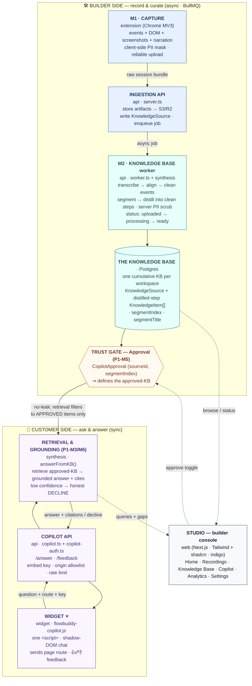

# FlowBuddy — Phase 1 Modules Map (visual)

> **The end-to-end picture of the Phase 1 system.** Capture raw signal → turn it into a Knowledge Base → gate it with approval → answer customers from it. Everything connects through **one cumulative KB per workspace**. For the canonical 3-module model see [`architecture.md`](architecture.md); for the per-module build/as-built record see [`phase-1-copilot.md`](phase-1-copilot.md).

There are **two halves joined by the KB**:

1. **Builder side** (record → process → approve) — asynchronous (BullMQ): `extension → api ingestion → worker + synthesis → KB → approval`.
2. **Customer side** (ask → answer) — synchronous: `widget → copilot API → answerFromKB → approved-KB`.

The **approval gate** is the seam between them — a customer can only ever get answers from knowledge the founder explicitly approved (the **no-leak** guarantee). `synthesis` is the shared brain: the *same* package builds the KB on the way in and grounds the answers on the way out.

---

## End-to-end flow

> The boxes below are an **overview** — each one's full detail (key files, responsibilities, P1-M number) is in the [package map](#how-the-pieces-map-to-packages) and [cross-reference](#module--p1-m-number-cross-reference) tables further down.

---

## How the pieces map to packages

| Module / role | Package(s) | Key files | Responsible for |
|---|---|---|---|
| **M1 · Capture** | `extension` | `content.ts`, `background.ts`, `offscreen.ts`, `controlbar.ts`, `idb.ts` | Record the session bundle (events + DOM + screenshots + audio), client-side PII mask, on-page control bar, reliable upload |
| **Ingestion** | `api` | `server.ts`, `storage.ts`, `queue.ts` | Receive upload → store artifacts (S3/R2) → write `KnowledgeSource` → enqueue worker job |
| **M2 · Knowledge Base** | `api` (worker) + `synthesis` | `worker.ts`; `index.ts` (`buildWorkflowKB`), `transcribe.ts`, `align.ts`, `clean.ts`, `segment.ts`, `distill.ts`, `embeddings.ts`, `redact.ts` | Transcribe → align → **clean** events → segment into workflows → **distill** clean steps → server PII scrub → embed → `ready` |
| **The KB store** | `db` | `schema.prisma` | One cumulative KB per workspace; `KnowledgeSource` + `KnowledgeItem` + index |
| **Approval gate (P1-M5)** | `api` + `web` | `CopilotApproval`; Studio toggle | Per-workflow "approve for copilot" → defines **approved-KB** (the trust gate) |
| **M3 · Retrieval & grounding (P1-M3/M6)** | `synthesis` | `retrieval.ts` (the single no-leak seam — hybrid keyword∪pgvector RRF) + `embeddings.ts` → `copilot.ts` `answerFromKB()` | Retrieve approved-KB → grounded answer + citations, or honest decline → `CoverageGap` |
| **Copilot API (P1-M6/M8/M9)** | `api` | `copilot.ts`, `copilot-auth.ts` | `/v1/copilot/answer` + `/feedback`; embed key auth, origin allowlist, rate limit, route-bias |
| **Widget (P1-M7/M10)** | `widget` | `index.ts`, `styles.ts` | One `<script>` shadow-DOM chat; renders answers/citations; 👍/👎 feedback |
| **Studio (P1-M10 + console)** | `web` | `app/dashboard/*` | Builder UI: KB browser, approve toggle, embed snippet, activity + coverage gaps |
| **Shared contracts** | `shared` | capture contract + zod schemas | The session-bundle shape every module agrees on |

---

## Module → P1-M number cross-reference

| Build module | Where it lives in this map |
|---|---|
| **P1-M0** Monorepo, infra & auth | the substrate under everything (`api`, `db`, `web`, docker-compose) |
| **P1-M1** Recorder / capture | **M1 · Capture** (extension) |
| **P1-M2** Knowledge Base | **M2 · KB** (worker + synthesis) → the KB store |
| **P1-M3** Retrieval & grounding engine | **Retrieval & grounding engine** (`answerFromKB`) |
| **P1-M4** Cloud deploy | ✅ **deployed** — Render (api + worker + web) + R2; dev at `flowbuddy-dev-web.onrender.com` |
| **P1-M5** Approval gate | **Trust gate — Approval** |
| **P1-M6** Answer endpoint | **Copilot API** `/v1/copilot/answer` |
| **P1-M7** Widget & SDK | **Widget** |
| **P1-M8** Context API | route on the Widget → boost in the engine |
| **P1-M9** Embed auth & tenant scoping | **Copilot API** (`copilot-auth.ts`) |
| **P1-M10** Feedback loop & analytics | Widget 👍/👎 → Copilot API → Studio activity/gaps |
| **P1-M11** Capture reliability | hardening inside **M1 · Capture** |
| **P1-M12** PII redaction | client mask in **M1** + `redactText` server scrub in **M2** |

> **Note:** Module 3 (article creation) and the Help Portal are **Version 2 by-products** — decoupled from this copilot flow. See [`v2-portal.md`](v2-portal.md).
